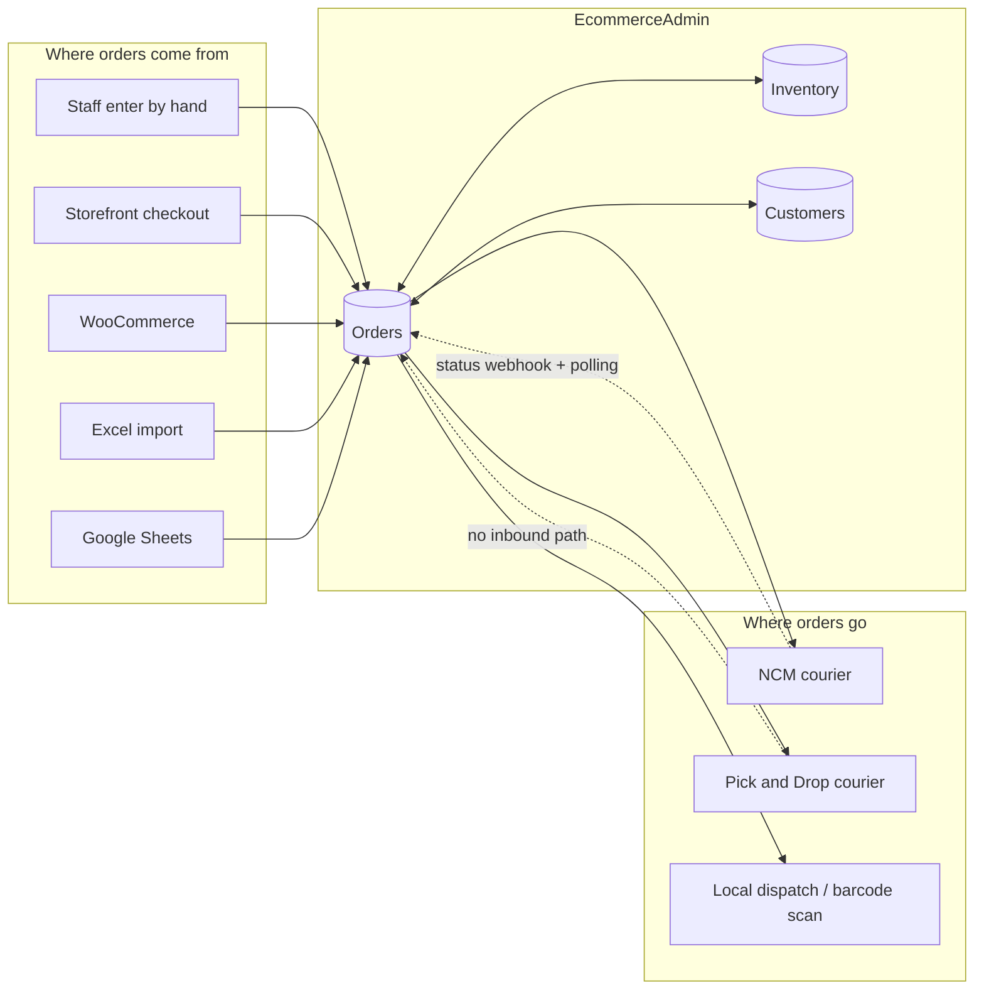
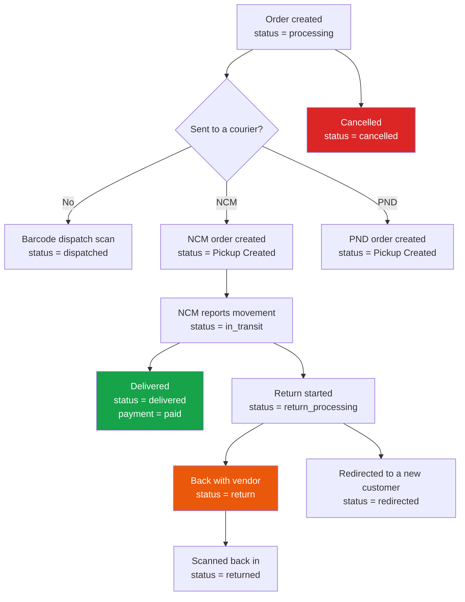

# 01 — System Overview

## What this system is

**EcommerceAdmin** is a single Django project that runs an entire Nepali e-commerce
operation: taking orders, handing them to couriers, tracking them back, managing stock,
handling returns, paying staff, and talking to customers.

It is a **monolith by design** — one database, one deployment, sixteen Django apps sharing
it. There is no microservice split and no JavaScript SPA; pages are server-rendered Django
templates that refresh themselves with small AJAX polls.

The dashed lines matter: **NCM sends status back, Pick and Drop does not.** That asymmetry
explains a lot of the design in chapters 09–13.

---

## The apps

| App | What it owns |
|---|---|
| **`dashboard`** | The core. Orders, products, customers, returns, RTV, dispatch, reports, purchases, follow-ups, settings. By far the largest app. |
| **`accounts`** | Users, roles, and 98 boolean permission flags. Custom user model. |
| **`ncm`** | Nepal Can Move integration: send, webhook, polling, the background scheduler. |
| **`pick_and_drop`** | Second courier. Send and cancel only. |
| **`inventory`** | Stock reservation, backorders, FIFO batch deduction, forecasting. No models of its own — it operates on `dashboard` models. |
| **`hrm`** | HR, attendance (incl. ZKTeco biometric devices), leave, payroll, payslips. |
| **`store`** | Customer-facing storefront. Separate from the admin dashboard. Sells product variations, prices its own quantity breaks, and never requires a shopper account. |
| **`trendycrm`** | Omnichannel customer messaging with an AI reply router (Facebook, Instagram, WhatsApp, TikTok). |
| **`bill_rewards`** | Receipt OCR → product matching → loyalty rewards. The only app using Celery. |
| **`google_sheets`** | Two-way Google Sheets import/sync. |
| **`integrations`** | WooCommerce order receiver (webhook + polling). |
| **`chat`** | Internal staff messaging. |
| **`todo`** | Internal task/ticket board. |
| **`resources`** | Internal knowledge base. |
| **`sentinel`** | "Sentinel Vault" — audit trail, session monitoring, security alerts. |
| **`services/`** | Not a Django app. Shared logic: NCM client, PND client, SMS, WooCommerce, manual status override. |

---

## The order lifecycle in one picture

This is the story the rest of the manual tells in detail.

Every arrow out of `Pickup Created` is driven by NCM, not by staff. Chapter
[07 — Order statuses](./07-order-statuses.md) documents exactly who writes each one.

---

## The three things that surprise people

**1. Status is written from seven directions.**
Staff UI, bulk actions, sending to a courier, the sync that runs when you open an order,
the background bulk sync, the NCM webhook, and repair commands all write order status. A
**manual hold** decides who wins when staff and NCM disagree. See
[07](./07-order-statuses.md).

**2. There is no cron job.**
This runs on cPanel shared hosting with no Celery beat and no crontab. The background NCM
sync is triggered by a heartbeat that every open browser tab pings. If nobody has a tab
open, nothing syncs — unless you configure `NCM_HEARTBEAT_TOKEN` and point an external
uptime pinger at it. See [12](./12-ncm-sync-and-scheduler.md).

**3. Status names are data, not code.**
`Order.status` is a plain `CharField` with **no `choices`**. The list of valid statuses
lives in the `Setup` database table, and rows get auto-created whenever code produces a
status name that isn't there yet. See [22](./22-settings-and-setup.md).

---

## Tech stack

| | |
|---|---|
| Framework | **Django 5.2** (`requirements.txt`). The `settings.py` docstring and README badge say 6.0.1 — they are stale, see [A4](./A4-appendix-known-quirks.md) |
| Database | MySQL, `utf8mb4`, `CONN_MAX_AGE=60`, connection health checks |
| Auth | `accounts.CustomUser` (`AUTH_USER_MODEL`), boolean permission flags — **not** Django's permission framework |
| Timezone | `Asia/Kathmandu` (UTC+5:45), `USE_TZ=True` |
| Frontend | Server-rendered Django templates + Alertify.js + AJAX polling. No build step. |
| Static files | WhiteNoise in production |
| Async | Celery + Redis — **only** for `bill_rewards` OCR |
| Sessions | Database-backed, 12-hour sliding window |
| Cache | `LocMemCache` (per-process; **not** shared between workers) |
| Hosting | cPanel / Apache with Passenger |

---

## Files that own this

- `myproject/settings.py` — all configuration
- `myproject/urls.py` — top-level URL mounting
- `CLAUDE.md` — the agent-oriented orientation file (partly outdated, see [A4](./A4-appendix-known-quirks.md))
