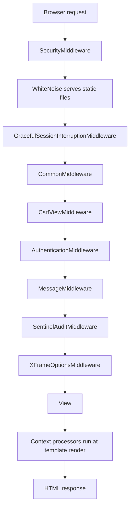

# 02 — Architecture & Conventions

Rules that apply everywhere. If you are about to write code in this project, read this
chapter first — most of these exist because something broke once.

---

## Request pipeline



Defined in `myproject/settings.py:81-94`. Two entries are custom:

**`GracefulSessionInterruptionMiddleware`** (`myproject/middleware.py`)
Subclasses Django's `SessionMiddleware`. Because `SESSION_SAVE_EVERY_REQUEST = True`, a
session deleted concurrently (admin revokes it, user logs out elsewhere) raises
`SessionInterrupted` on the way out. This catches it and answers appropriately:

- path starts with `/api/` or `/chat/api/`, or the request is XHR → JSON `401`
- otherwise → redirect to login

Either way it clears the session cookie. Without this, users saw a raw 500.

**`SentinelAuditMiddleware`** (`sentinel/middleware.py`)
Must sit **after** `AuthenticationMiddleware` (it needs `request.user`) **and after**
`MessageMiddleware` (it reads the `permission_denied` message tag that
`accounts/decorators.py` emits, to record access denials). Model diffs are collected in a
thread-local by signals and flushed here *after* the response, so a rolled-back request
leaves no phantom audit rows. See [29 — Sentinel Vault](./29-sentinel-audit.md).

---

## Context processors — what every page gets for free

Configured at `myproject/settings.py:104-115`. These run on **every** template render, so
keep them cheap.

| Processor | Provides | File |
|---|---|---|
| `company_setup` | Branding, theme colours, logo | `dashboard/context_processors.py:12` |
| `low_stock_notifications` | Low-stock alert badge | `dashboard/context_processors.py:76` |
| `maintenance_mode` | Maintenance banner / lockout | `dashboard/context_processors.py:188` |
| `incomplete_attendance_alert` | HRM incomplete-attendance nag | `dashboard/context_processors.py:231` |
| `expiry_notifications` | Expiring product batches | `dashboard/context_processors.py:283` |
| `unread_message_count` | Navbar chat badge | `chat/context_processors.py` |
| `store_context` | Storefront cart/wishlist counts | `store/context_processors.py` |

Theme colour values pass through `_safe_color()` (`dashboard/context_processors.py:7`)
before being interpolated into CSS — an admin-supplied colour string is untrusted input.

---

## Timezone — always convert, never use `datetime.now()`

`TIME_ZONE = 'Asia/Kathmandu'` (UTC **+5:45** — an offset with a 45-minute component, which
breaks naive assumptions), `USE_TZ = True`.

Use the helpers in `dashboard/timezone_utils.py`:

| Helper | Use for |
|---|---|
| `get_nepali_now()` | "now", in Nepal time |
| `convert_to_nepali(dt)` | Rendering a stored UTC datetime |
| `format_nepali_datetime(dt)` | Display strings |
| `parse_ncm_datetime(s)` | Parsing anything NCM sends (`dashboard/timezone_utils.py:154`) |

`parse_ncm_datetime` deserves a note: NCM sends ISO-8601 **with the Nepal offset**
(`2026-02-20T11:19:53.209447+05:45`), while its own webhook docs show a `Z` form. Aware
values are never re-localised; naive values are interpreted as **Nepal wall-clock**.
Out-of-range values return `None` rather than raising.

> **The trap.** MySQL's `CONVERT_TZ()` returns `NULL` unless the timezone tables are
> loaded, which they are not on this host. So Django's `__date` lookups silently match
> **nothing**. Every date filter in this codebase therefore builds explicit localized
> `__gte` / `__lt` bounds instead. See `dashboard/views.py:3163-3215` for the pattern.

---

## Decimal safety

Money and quantity columns have been corrupted in the past by oversized or malformed
values, and `decimal.InvalidOperation` is raised at *read* time — meaning one bad row could
500 an entire list page.

**Always parse money through `safe_decimal()`** (`dashboard/decimal_utils.py`). It clamps
rather than raises.

Supporting machinery:

| Thing | Purpose |
|---|---|
| `Order.save()` → `validate_decimal_fields()` | `dashboard/models.py:573` — sanitises on every save |
| `OrderQuerySet.safe_recent()` | `dashboard/models.py:335` — defers 10 decimal fields so a corrupt row can't break the dashboard |
| `fix_order_decimals(order)` | `dashboard/views.py:77` — repairs and **saves** a row on read |
| `manage.py diagnose_decimals` | Report corrupted rows |
| `manage.py fix_decimal_corruption` | Repair them |
| `manage.py cleanup_decimals` | Tidy up |

> **Consequence:** `orders_list` and `order_detail` write to the database on a **GET**
> request. This is deliberate but surprising. See [05](./05-orders-list.md) and
> [06](./06-order-detail.md).

---

## Logging

Per-subsystem rotating file handlers, configured at `myproject/settings.py:309-461`.
All are 10 MB × 5 backups (SMS is 5 MB × 3), DEBUG level, with the format
`[LEVEL] timestamp module.function:line message`.

| `logging.getLogger(...)` | Writes to | Used by |
|---|---|---|
| `'ncm'` | `logs/ncm_integration.log` | NCM client, sync, scheduler |
| `'webhook'` | `logs/ncm_webhooks.log` | NCM webhook handler |
| `'sms'` | `logs/ncm_sms.log` | SMS service |
| `'hrm.adms'` | `logs/adms.log` | ZKTeco biometric device traffic |
| `'integrations'` | `logs/integrations.log` | WooCommerce receiver |
| `'trendycrm'` | `logs/trendycrm.log` | CRM inbox, Meta sync, AI replies |
| `'sentinel'` | `logs/sentinel.log` | Sentinel's *own* failures only (the trail itself is in the DB) |
| `'django'`, `'django.request'`, `'django.db.backends'` | `logs/django_errors.log` | All 500s with full tracebacks |

**Use the matching logger name in matching modules**, or your entries land in the wrong file.

> `pick_and_drop/views.py` uses `getLogger('pick_and_drop')` and
> `services/pick_and_drop_service.py` uses `getLogger(__name__)` — **neither is configured**,
> so PND logs fall through to root. Noted in [A4](./A4-appendix-known-quirks.md).

---

## Caching

```python
CACHES = {'default': {'BACKEND': 'django.core.cache.backends.locmem.LocMemCache'}}
```

`myproject/settings.py:224-229`. **This is per-process.** Each Passenger worker has its own
copy. That means:

- Cache TTLs are kept short (seconds), so staleness is tolerable.
- **You cannot use the cache as a lock.** This is exactly why the NCM sync lock is a
  database compare-and-swap instead — see [12](./12-ncm-sync-and-scheduler.md).

`REDIS_URL` appears in `.env.example` for future use. There is **no Django Channels and no
ASGI routing** — `asgi.py` is the stock passthrough.

---

## Background work — the honest picture

| Mechanism | Status |
|---|---|
| Celery worker | Used, but **only** by `bill_rewards` OCR tasks |
| Celery Beat | **Not running** |
| crontab | **Not installed** |
| NCM background sync | Driven by a browser heartbeat ([12](./12-ncm-sync-and-scheduler.md)) |
| HRM attendance sync | Driven opportunistically on page visits |
| Retention pruning | `manage.py sentinel_prune`, run manually |

This constraint (cPanel shared hosting) is called out in comments across
`ncm/scheduler.py`, `ncm/bulk_sync.py`, `hrm/models.py`, and `dashboard/models.py:2112`.

---

## Frontend conventions

- Server-rendered Django templates. **No build step, no SPA.**
- Notifications use **Alertify.js** (`alertify.success(...)`, `alertify.error(...)`).
- Live updates are `setInterval` + `fetch`, not websockets.
- Two polling cadences exist and they are **not** the same thing:

| Poll | Interval setting | Cost |
|---|---|---|
| Repaint badges from the local DB | `APISettings.page_refresh_interval` (default 30s) | Free — one DB query |
| Background sync against NCM | `APISettings.order_sync_interval` (default 900s) | **Real NCM API calls** |

Both are editable at *Settings → API Sync Settings*, and open tabs pick up changes on the
next heartbeat without a reload.

**Template locations are inconsistent** — check before assuming:

| App | Templates live in |
|---|---|
| `dashboard` | mostly `dashboard/templates/` (flat), some under `dashboard/templates/dashboard/` |
| `accounts`, `hrm`, `store`, `trendycrm`, `bill_rewards`, `ncm`, `todo`, `chat`, `resources`, `sentinel` | `<app>/templates/<app>/` |
| `google_sheets` | project-level `templates/google_sheets/` |
| Shared base and partials | project-level `templates/` |

---

## Environment variables

Read via `python-decouple` (`config(...)`) from `.env`. The ones that matter:

| Group | Variables |
|---|---|
| Core | `SECRET_KEY`, `DEBUG`, `ALLOWED_HOSTS`, `SITE_URL` |
| Database | `DB_NAME`, `DB_USER`, `DB_PASSWORD`, `DB_HOST`, `DB_PORT`, `DB_CONN_MAX_AGE` |
| NCM | `NCM_API_KEY`, `NCM_API_BASE_URL`, `NCM_API_BASE_URL_V2`, `NCM_WEBHOOK_SECRET`, `NCM_HEARTBEAT_TOKEN` |
| PND | `PND_API_KEY`, `PND_API_SECRET`, `PND_API_BASE_URL` |
| SMS | `SMS_PROVIDER` (`console`/`twilio`/`sparrow`/`atuha`), `SMS_ENABLED`, `SMS_API_KEY`, `SMS_SENDER_ID` |
| WooCommerce | `WOOCOMMERCE_SITE_URL`, `WOOCOMMERCE_CONSUMER_KEY`, `WOOCOMMERCE_CONSUMER_SECRET`, `WOOCOMMERCE_WEBHOOK_SECRET` |
| Meta / social | `META_PAGE_ACCESS_TOKEN`, `FACEBOOK_APP_ID`, `FACEBOOK_APP_SECRET`, `INSTAGRAM_APP_ID`, `INSTAGRAM_APP_SECRET`, `TIKTOK_CLIENT_ID`, `TIKTOK_CLIENT_SECRET`, `FACEBOOK_WEBHOOK_VERIFY_TOKEN` |
| Bill OCR | `BILL_OCR_PROVIDER`, `BILL_OCR_REVIEW_THRESHOLD`, `AWS_*`, `GOOGLE_DOCAI_*`, `OCR_SPACE_API_KEY` |
| Celery | `CELERY_BROKER_URL`, `CELERY_RESULT_BACKEND` |
| Security | `SESSION_COOKIE_SECURE`, `CSRF_COOKIE_SECURE` |

Sync cadence deliberately lives in the **database** (`dashboard.APISettings`), not in env
vars, so admins can change it without a deploy — see the comment at
`myproject/settings.py:291-302`.

---

## Testing convention

There is **no pytest or Django `TestCase` suite** — every app's `tests.py` is empty
boilerplate. Verification happens through **standalone root-level scripts** that call
`django.setup()` manually and exercise the real database:

```bash
python test_order_redirection.py
python test_ncm_status_history.py
python check_roles.py
```

There are ~90 of these at the repo root, alongside historical `debug_*.py`, `fix_*.py`
and `patch_*.py` one-offs. They are **artifacts, not a pipeline** — nothing runs them
automatically. When adding a test, follow the same pattern unless you deliberately want to
introduce a real harness.

---

## Files that own this

- `myproject/settings.py` — everything in this chapter
- `myproject/middleware.py` — graceful session handling
- `dashboard/timezone_utils.py` — timezone helpers
- `dashboard/decimal_utils.py` — `safe_decimal`
- `dashboard/context_processors.py` — global template context
- `sentinel/middleware.py` — audit capture
