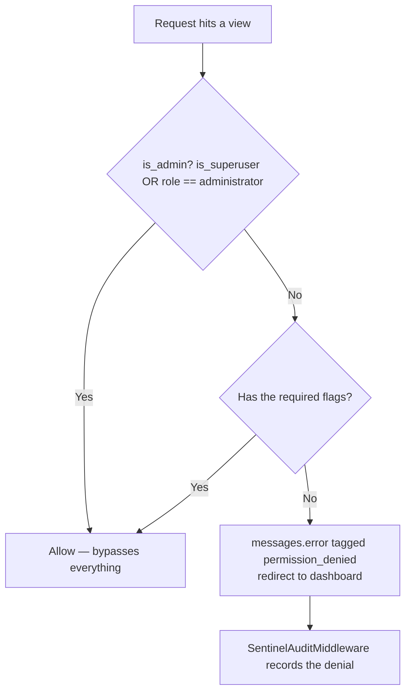

# 03 — Auth, Roles & Permissions

## The one thing to understand first

**This project does not use Django's permission framework.** No `Permission` objects, no
`user.has_perm()`, no groups in practice.

Instead, `CustomUser` carries **98 boolean columns** — `can_view_orders`,
`can_create_ncm_orders`, `can_view_hrm_payroll`, and so on. A decorator reads the boolean
directly with `getattr(user, 'can_do_thing', False)`.

---

## The models

### `Role` — `accounts/models.py:6`

A **template** for permissions, not an enforcement mechanism.

| Field | Purpose |
|---|---|
| `name` | Code name, e.g. `sales` |
| `display_name` | Shown in the UI |
| `description` | Free text |
| `default_permissions` | **JSONField** — the flag list this role grants |
| `is_system` | Protects built-in roles from deletion |
| `user_count` | Property, not a column |

Editing a role's permission matrix does **not** retroactively change existing users. It
only supplies defaults for `set_default_permissions_by_role()` when a user is created or
their role changes.

### `CustomUser` — `accounts/models.py:28`

`AUTH_USER_MODEL = 'accounts.CustomUser'`. Extends `AbstractUser`.

| Field | Notes |
|---|---|
| `role` | **A `CharField`, not a FK to `Role`.** Default `'sales'` |
| `email` | Unique |
| `phone` | |
| `profile_picture` | |
| `vendor_id` | Unique — used to attribute logistics API accounts |
| `max_discount_percent` | `Decimal` — the only non-boolean permission |
| `is_deleted`, `deleted_at`, `deleted_by` | Soft delete |
| `created_by` | Who created this user |
| 98 `can_*` booleans | The actual permission system |

Methods: `is_administrator`, `soft_delete()`, `restore()`,
`set_default_permissions_by_role()` — the last grants a hardcoded grant-all list for
`administrator`, and reads `Role.default_permissions['permissions']` for everyone else.

> Because `role` is a string and not a FK, a typo in the role name silently produces a user
> with no defaults. Only the literal string `'administrator'` triggers the bypass.

---

## The decorators — `accounts/decorators.py`

| Helper | Rule |
|---|---|
| `is_admin(user)` (`:6`) | `user.is_superuser or user.role == 'administrator'`. **The single definition of the bypass.** |
| `has_any_permission(user, *perms)` (`:15`) | Admin **or ANY** one of the listed flags |
| `@permission_required(*perms)` (`:30`) | Admin bypass, else requires **ALL** listed flags |
| `@admin_or_permission_required(*perms)` (`:56`) | Admin **or ANY** one flag |
| `@admin_only` (`:74`) | `is_admin` only |

Note the asymmetry: `permission_required` requires **all** flags, while
`admin_or_permission_required` requires **any**. Pick deliberately.

### Why JSON endpoints don't use the decorators

The decorators answer a refusal with a **redirect plus a queued Django message**. That is
right for a page and wrong for anything polled over AJAX:

- the caller receives HTML it cannot parse
- the queued message resurfaces as a stray error toast on whatever page loads next

So JSON endpoints check inline with `has_any_permission()` and return their own
`JsonResponse`. Examples: `ncm/views.py:595-603`, `ncm/realtime_api.py:431-433`.

### App-local variants

Several apps define their own equivalent rather than importing the shared one:

| Decorator | File | Rule |
|---|---|---|
| `administrator_required` | `accounts/views.py:28` | `user_passes_test`, redirects to `/admin/login/` |
| `ncm_permission_required(field)` | `ncm/views.py:43` | Admin or the named NCM flag |
| `pnd_permission_required(field)` | `pick_and_drop/views.py:26` | **Defined but not applied to any route** |
| `todo_access_required` | `todo/views.py:17` | Admin, `can_access_todo`, **or** any user with a task assigned/created |
| `resources_access_required` | `resources/views.py:16` | Admin, `can_view_resources`, or `can_create_resources` |
| `vault_access(*perms)` | `sentinel/access.py:32` | Defaults to `can_view_audit_trail`; pairs with `scope_to_visible()` which narrows querysets for users lacking `can_view_all_users_activity` |

---

## Where enforcement is weaker than it looks

Three things worth knowing before you rely on a flag:

**1. HRM has no view-level permission checks.**
Every `hrm` view carries only `@login_required`. The `can_view_hrm*` flags gate the
**sidebar links in `templates/base.html`**, not the views themselves. Anyone who knows the
URL can open an HRM page. The only in-view HRM checks are around incomplete attendance
(`hrm/views.py:3453, 3561, 3677, 3784-3797`).

**2. Some dashboard views check inline instead of by decorator.**
These read the flag inside the function body, which works but is easy to miss when
auditing: `city_management` (`views.py:11878`), `staff_performance_analytics` (`:17703`),
the `purchase_*` views (`:19256, 19317, 19390, 19695`), `manage_targets` (`:19865`),
`rtv_report` (`:25821`), `follow_up_report` and its three log APIs (`:26600, 27053, 27091,
27179`).

**3. A few endpoints are unguarded.**
`orders_bulk_pnd_send` (`dashboard/views.py:20492`) is routed at `/orders/bulk-pnd-send/`
with **no `@login_required`**. See [A4](./A4-appendix-known-quirks.md).

---

## Endpoints that are unauthenticated by design

These must stay open — do not "fix" them by adding auth:

| Endpoint | Why |
|---|---|
| `/ncm/webhook/` | NCM pushes here. CSRF-exempt by necessity. Optional `?token=` shared secret — see [11](./11-ncm-webhook.md) |
| `/api/integrations/woocommerce/orders/` | WooCommerce pushes here. **Real HMAC-SHA256** verification |
| `/trendy-crm/integrations/meta/webhook/` | Meta (Facebook/Instagram) verification + message ingestion |
| `/iclock/cdata`, `/iclock/getrequest`, `/iclock/devicecmd` | ZKTeco biometric devices push attendance here. Mounted at the project root because the devices post to a fixed path |
| All public `/store/` browse pages | Customer-facing storefront |

---

## Permission groups at a glance

Full list in [A3 — Permission flags](./A3-appendix-permission-flags.md). The groups:

| Group | Roughly covers |
|---|---|
| Orders | View, create, edit, delete, cancel, on-hold, export, offer price |
| Products | View, create, edit, delete |
| Customers | View, create, edit, delete |
| Dispatch | View, manage, delete, barcode scanning |
| Inventory | View, manage, adjust stock, cost visibility, price toggles |
| Stock valuation | By selling price, by cost price, toggle |
| Reports | Sales, daily sales, product sales, financial, orders-by-source, RTV, total revenue, export |
| Pricing | Cost price, edit prices, give discounts (+ `max_discount_percent`) |
| Returns | View, create, edit, delete, approve, process refunds |
| Targets | View all, set, edit, delete, view own |
| Purchases | View, create, manage suppliers, make payments |
| Staff | Staff performance |
| Cities | View, add, edit, delete |
| Content | Content management |
| Dashboard widgets | Each dashboard tile has its own flag |
| NCM | View, create, edit, delete, bulk logs, trash, sync, branches |
| HRM | HR management, assets, attendance, payroll (**sidebar only**) |
| Todo | Access |
| Follow-ups | Access, report, status setup |
| Resources | View, create |
| Sentinel | Audit trail, all-users activity, export, manage sessions, configure |

---

## Managing users and roles

All under `/accounts/`, all `administrator_required`.

### Roles

| Page | URL | Template |
|---|---|---|
| Role list | `/accounts/roles/` | `accounts/role_list.html` |
| Permission matrix editor | `/accounts/roles/<id>/permissions/` | `accounts/role_permissions.html` |

Plus `roles/create/` and `roles/<id>/delete/` as POST actions.

### Users

| Page | URL | Template |
|---|---|---|
| User list | `/accounts/users/` | `accounts/user_list.html` |
| Create user | `/accounts/users/create/` | `accounts/user_create.html` |
| Edit user (per-user permission checkboxes) | `/accounts/users/<id>/edit/` | `accounts/user_edit.html` |
| Trash | `/accounts/users/trash/` | `accounts/user_trash.html` |

Actions: `users/<id>/soft-delete/`, `users/<id>/toggle/`, `users/<id>/restore/`,
`users/<id>/hard-delete/`.

### Self-service

| Page | URL | Guard |
|---|---|---|
| Profile | `/accounts/profile/` | `@login_required` |
| Update profile | `/accounts/profile/update/` | `@login_required` |
| Change password | `/accounts/profile/change-password/` | `@login_required` |
| Password reset flow (4 URLs) | `/accounts/password-reset/…` | Public — Django's built-in CBVs, `PASSWORD_RESET_TIMEOUT = 3600` |

---

## Sessions

`myproject/settings.py:199-214`.

| Setting | Value | Meaning |
|---|---|---|
| `SESSION_ENGINE` | database | Sessions are rows, so they can be listed and revoked (Sentinel does this) |
| `SESSION_COOKIE_AGE` | 43200 | 12 hours |
| `SESSION_SAVE_EVERY_REQUEST` | `True` | Sliding window — activity extends the session |
| `SESSION_EXPIRE_AT_BROWSER_CLOSE` | `False` | Survives closing the browser |
| `SESSION_COOKIE_HTTPONLY` | `True` | No JS access |
| `SESSION_COOKIE_SAMESITE` | `Lax` | |
| `SESSION_COOKIE_SECURE` | env-driven | **Set `True` in production** |

`SECURE_PROXY_SSL_HEADER` is set for cPanel/Apache reverse-proxy SSL termination.

Login lands on `dashboard`; logout also lands on `dashboard` — which, for a logged-out
visitor, renders the public landing page (`myproject/settings.py:195-197`).

---

## Files that own this

- `accounts/models.py` — `Role`, `CustomUser`, all permission flags
- `accounts/decorators.py` — the enforcement helpers
- `accounts/views.py` — user and role management
- `accounts/urls.py` — the `/accounts/` routes
- `templates/base.html` — sidebar visibility (which is the *only* gate for HRM)
- `sentinel/access.py` — the vault's own scoped guard
