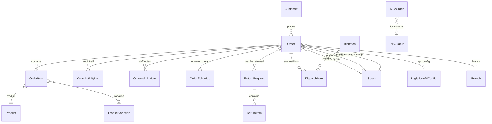

# 04 — Order Data Model

Everything the order domain stores. Read this before [05](./05-orders-list.md),
[06](./06-order-detail.md) or [07](./07-order-statuses.md).

---

## The shape of it



`RTVOrder` is deliberately **not** linked to `Order` by a foreign key — it keys on
`order_id`, which is the **NCM** order id. See [14 — RTV & redirection](./14-rtv-and-redirection.md).

---

## `Order` — `dashboard/models.py:360-580`

The central model. ~60 fields. Grouped by what they are for.

### Identity

| Field | Line | Notes |
|---|---|---|
| `order_number` | `:385` | **Unique.** Format `T001`, `T002`, … See "Order numbering" below |
| `barcode` | `:387` | For dispatch scanning |
| `created_at` / `updated_at` | `:449-450` | `auto_now_add` / `auto_now` |
| `created_by` | `:390` | FK → user, `related_name='created_orders'` |
| `order_from` | `:399` | Free-text source label |
| `is_deleted` / `deleted_at` | `:456-457` | Soft delete, `is_deleted` is indexed |

### Customer

| Field | Line | Notes |
|---|---|---|
| `customer` | `:391` | FK → `Customer`, nullable, `related_name='orders'` |
| `customer_name`, `customer_phone`, `customer_email` | `:393-395` | **Denormalised copies**, always populated |
| `shipping_address` | `:443` | |
| `landmark` | `:444` | Still sent to NCM, printed on the dispatch sheet and exported to CSV — but **the order form no longer draws a box for it** (VAT/PAN took the slot), so create/edit read the key with the stored value as its default. See [08](./08-order-create-edit-bulk.md) |
| `vat_pan` | `:449` | The **buyer's** own VAT/PAN, typed on the order form when they want a billable invoice. Blank on nearly every retail order. Printed by the `customer.vat_pan` invoice token, whose line hides itself when empty — [22](./22-settings-and-setup.md#invoice-customizer) |
| `branch_city` | `:370` | Destination city; used as the courier destination fallback |
| `branch` | `:392` | FK → `Branch` (our own branch), nullable |
| `in_out` | `:380` | `in` / `out` — inside or outside the Kathmandu valley. Default `in` |

> The denormalised name/phone/address are what actually get sent to couriers. Editing the
> `Customer` record does **not** retroactively change past orders.

### Status — the important block

| Field | Line | Type / default |
|---|---|---|
| `status` | `:383` | `CharField(50)`, default `'processing'`, **no `choices`** |
| `order_status` | `:400` | `CharField(50)`, default `'processing'`, **no `choices`** |
| `status_setup` | `:425-432` | FK → `Setup` (`setup_type='status'`) |
| `payment_status` | `:412` | `CharField(50)`, default `'pending'`, no `choices` |
| `payment_status_setup` | `:415-422` | FK → `Setup` (`setup_type='payment_status'`) |
| `payment_method` | `:411` | `CharField(50)`, no default |
| `payment_setup` | `:403-410` | FK → `Setup` (`setup_type='payment'`) |
| `ncm_status` | `:478` | `CharField(100)` — the **raw NCM string** |
| `pnd_status` | `:513` | `CharField(100)` — the **raw PND string** |
| `manual_status_override_at` | `:486-489` | When staff last hand-set the status |
| `manual_status_override_ncm_status` | `:490-493` | Raw courier status in force at that moment |

> **`status` and `order_status` are duplicates.** The model comment at `:383` says
> "Rename from order_status" — a rename that was started and never finished. Different code
> paths read different ones, which is why `apply_manual_status()` exists to write both.
> Full explanation in [07 — Order statuses](./07-order-statuses.md).

There is **no `delivery_status` field.** Delivery status is `ncm_status` / `pnd_status`.
(`last_delivery_status` appears in `dashboard/views.py` but that is a key in NCM's *API
response*, not a column.)

### Money

| Field | Line | Notes |
|---|---|---|
| `total_amount` | `:442` | The order total |
| `discount_amount` | `:437` | |
| `shipping_charge` | `:438` | What we charge the customer |
| `delivery_charge` | `:439` | What the **courier** charges us |
| `expense_amount` | `:440` | Other operational expense |
| `tax_percent` | `:441` | `max_digits=5` |
| `cod_collected` | `:435` | Amount actually collected as COD |
| `is_partial_payment` | `:452` | |
| `partial_amount_paid` | `:453` | Paid up front |
| `remaining_amount` | `:454` | Still owed — this is what the courier collects |

All are `DecimalField(max_digits=18, decimal_places=2)` except `tax_percent`. See
[02 — Decimal safety](./02-architecture-and-conventions.md#decimal-safety).

**`amount_due` property** (`:539-562`) — use this, never `total_amount`, whenever you need
"what will the courier collect":

```python
if not is_partial_payment:      return total_amount
else:                           return remaining_amount   # or total - paid, if null
# and never negative
```

Quoting `total_amount` for a partially-paid order bills the customer twice. Both the NCM
and PND send paths use `amount_due`.

### Logistics

| Field | Line | Notes |
|---|---|---|
| `logistics` | `:382` | `ncm` / `pick_and_drop` / `sundarijal` / `express` / `local` / `other` (`:361-368`) |
| `api_config` | `:519-526` | FK → `LogisticsAPIConfig` — **which courier account** this order belongs to |
| `tracking_number` | `:445` | Free text |
| `dispatch_date` | `:384` | |
| `delivered_at` | `:447` | Stamped once, when the order first becomes `delivered` |
| `package_weight` | `:509` | kg, default `1.0` |

**NCM-specific:**

| Field | Line | Notes |
|---|---|---|
| `ncm_order_id` | `:477` | `IntegerField`, **unique**, indexed |
| `ncm_created_at` | `:479` | |
| `ncm_from_branch` | `:496` | Default `'TINKUNE'` |
| `ncm_destination_branch` | `:497` | Branch **name**, not code |
| `ncm_delivery_type` | `:506` | `Door2Door` (default) / `Branch2Door` / `Door2Branch` / `Branch2Branch` (`:500-505`) |
| `ncm_exchange_cust_order`, `ncm_exchange_ven_order` | `:535-536` | Exchange order ids |
| `exchange_status` | `:537` | `''` / `pending` / `created` / `failed` (`:529-534`) |

**PND-specific:**

| Field | Line | Notes |
|---|---|---|
| `pnd_order_id` | `:512` | **`CharField`** — PND ids look like `"XGAD-8"` |
| `pnd_created_at` | `:514` | |
| `pnd_destination_branch` | `:515` | |
| `pnd_tracking_url` | `:516` | Returned by PND on create |

### Follow-up

| Field | Line |
|---|---|
| `next_followup_date` | `:459` |
| `followup_type` | `:466` — `call` / `whatsapp` / `email` / `visit` (`:460-465`) |
| `followup_assigned_to` | `:467-470` |
| `followup_done` | `:471` |

### Notes

| Field | Line |
|---|---|
| `notes` | `:443` — customer-facing; sent to NCM as `instruction` |
| `admin_notes` | `:446` — internal |

### Methods and Meta

| | Line | What |
|---|---|---|
| `amount_due` | `:539` | Property, above |
| `calculate_totals()` | `:564` | `subtotal − discount + tax + shipping` |
| `save()` | `:573` | Runs `validate_decimal_fields()` first |
| `Meta.ordering` | `:579` | `['-created_at']` |

### Custom manager

`OrderManager` / `OrderQuerySet` — `dashboard/models.py:332-357`, attached at `:378`.

`safe_recent(limit=6)` defers ten decimal fields so that a corrupted row cannot raise
`decimal.InvalidOperation` while rendering the dashboard's "recent orders" widget.

---

## Order numbering

`_get_next_order_number()` — `dashboard/views.py:212-227`.

```sql
MAX(CAST(SUBSTR(order_number, 2) AS int))  -- over rows matching ^T\d+$
```

Returns `T{n+1:03d}`, or `T001` if there are none. Because this is a read-then-write, it
races under concurrency — so `order_create` wraps creation in a retry loop of up to
**5 attempts**, each in its own savepoint, catching `IntegrityError` on the unique
constraint (`dashboard/views.py:3539-3587`).

---

## `OrderItem` — `dashboard/models.py:583-629`

| Field | Line | Notes |
|---|---|---|
| `order` | `:585` | FK, `related_name='items'` |
| `product` | `:586` | FK, `SET_NULL` |
| `product_variation` | `:587` | FK, nullable |
| `product_name`, `product_sku`, `variation_name` | | Denormalised snapshots |
| `quantity` | | Default 1 |
| `price`, `total` | | `total = price × quantity`, recomputed in `save()` (`:605-629`) via `safe_decimal` |
| `reserved_qty` | `:597` | Stock reserved for this line |
| `backordered_qty` | `:598` | Stock owed but unavailable |

`reserved_qty` / `backordered_qty` are managed by `inventory/services.py` — see
[17 — Inventory & stock](./17-inventory-and-stock.md).

---

## `OrderActivityLog` — `dashboard/models.py:737-795`

**This is the order's status history.** There is no separate `OrderStatusHistory` model.

| Field | Line | Notes |
|---|---|---|
| `order` | `:751` | FK, `related_name='activity_logs'` |
| `action_type` | `:752` | See below |
| `user` | `:755` | Nullable — sync and webhook entries have a system user or none |
| `field_name` | `:757` | e.g. `order_status`, `ncm_status`, `ncm_integration` |
| `old_value`, `new_value` | `:758-759` | |
| `description` | `:761` | Human-readable |
| `metadata` | `:765` | JSON — e.g. the old customer snapshot on a redirection |
| `created_at` | `:767` | **When we recorded it** |
| `event_at` | `:776-780` | **When the courier says it happened.** `NULL` for local actions. Indexed |
| `effective_at` | `:782-785` | Property: `event_at or created_at` |

Index `oal_order_created_idx` on `(order, -created_at)` (`:794`) — every read site filters
by order and sorts newest-first.

> **Why two timestamps.** NCM webhooks arrive late (sometimes days), and the RTV steps are
> pushed unreliably. "NCM marked this on Jul 20" and "we found out on Jul 30" are different
> facts, and the UI shows both. Always sort timelines by
> `Coalesce('event_at', 'created_at')`.

### `ACTION_TYPES` (`:739-749`)

`created`, `status_changed`, `payment_changed`, `tracking_added`, `tracking_updated`,
`notes_added`, `notes_updated`, `updated`, `redirected`.

> **Values written by code that are *not* in that list:** `deleted`, `restored`, `trashed`,
> `city_detected`. Since `action_type` is a `CharField` with `choices` but no DB
> constraint, these save fine and simply have no `get_action_type_display()`. Noted in
> [A4](./A4-appendix-known-quirks.md).

---

## `Setup` — where status names actually live — `dashboard/models.py:1583-1609`

| Field | Line | Notes |
|---|---|---|
| `setup_type` | `:1592` | `payment`, `status`, `payment_status`, `order_source`, `followup_status` (`:1584-1590`) |
| `name` | `:1593` | The human-readable name, e.g. `"Return Processing"` |
| `description` | `:1594` | |
| `color` | `:1595` | Hex code for badges |
| `is_active` | `:1596` | |
| `is_default` | `:1597` | Pre-selected in order forms |
| `sort_order` | `:1598` | Drag-and-drop ordering |

`unique_together = ('setup_type', 'name')`, ordered by `setup_type, sort_order, name`.

**Only two status rows are seeded by migration** — `"Return Processing"`
(`dashboard/migrations/0077_return_processing_status_setup.py`) and `"Return Arrived"`
(`0088_return_arrived_status_setup.py`). Everything else is either
created by an admin in Setup Management, or **auto-created by code** when a status name
appears that has no row yet. Three places do that:

- `sync_order_status_setup()` — `dashboard/views.py:148`
- `order_detail` — `dashboard/views.py:4118-4147`, `:4233`
- `NCMService._resolve_setup()` — `services/ncm_service.py:1082`

Consequence: the `Setup` table drifts toward whatever strings the code has ever produced.
See [22 — Settings & Setup](./22-settings-and-setup.md).

---

## `Customer` — `dashboard/models.py:302-329`

Standard contact record. `CUSTOMER_TYPES` = `retail` (default) / `wholesale` / `vip`
(`:303-307`). `related_name='orders'` back to `Order`. Matched on **phone number** during
order creation (`get_or_create(phone=...)`).

---

## `LogisticsAPIConfig` — `dashboard/models.py:1540-1579`

Lets the business run **multiple courier accounts**.

| Field | Line | Notes |
|---|---|---|
| `api_name` | `:1547` | Descriptive |
| `logistics_provider` | `:1548` | `ncm` / `pick_and_drop` / `other` |
| `api_key` | `:1549` | |
| `api_secret` | `:1550` | Required for PND only |
| `base_urls` | `:1551` | **JSON list.** `[0]` = v1 base, `[1]` = v2 base |
| `is_active` | `:1552` | |

`get_primary_base_url()` (`:1569`) → `base_urls[0]`, `get_base_url_v2()` (`:1575`) →
`base_urls[1]`.

> An `Order` remembers which account it was sent on via `api_config`. This matters because
> **NCM returns 404 for an order queried with the wrong account key** — so the sync layer
> sweeps every active account to find the right one and then writes the result back. See
> [09](./09-ncm-api-client.md).

---

## `APISettings` — the sync control panel — `dashboard/models.py:2083-2157`

A **singleton** pinned to `pk=1` (`save()` at `:2155`, `get_settings()` at `:2150`).

| Field | Default | Purpose |
|---|---|---|
| `order_sync_interval` | 900 | Seconds between background NCM syncs. **Costs real API calls** |
| `page_refresh_interval` | 30 | Seconds between local-DB badge repaints. Free |
| `ncm_api_timeout` | 30 | Per-request timeout |
| `bulk_sync_included_statuses` | `[]` | Which statuses the bulk sync covers. Empty = use the default exclusion list |
| `bulk_sync_fetch_event_times` | `True` | Fetch NCM's real event time for changed orders (one extra call each) |
| `last_bulk_sync_started_at` | — | Scheduler clock |
| `last_bulk_sync_finished_at` | — | Display only |
| `bulk_sync_running_since` | — | The **lock**. Non-null while a sync holds it |
| `last_bulk_sync_summary` | `{}` | Result of the last run |

The last four are written with `queryset.update()`, never `.save()`, so the claim is a
single atomic statement and `updated_at` keeps meaning "when an admin last edited these
settings" (`:2112-2118`). Full mechanics in
[12 — NCM sync & scheduler](./12-ncm-sync-and-scheduler.md).

---

## Other models in the order neighbourhood

| Model | Lines | Covered in |
|---|---|---|
| `OrderAdminNote` | `:798-811` | [06](./06-order-detail.md) |
| `OrderFollowUp` | `:1840-1875` | [19](./19-customers-and-followups.md) |
| `FollowUp`, `FollowUpLog`, `FollowUpPresence` | `:2423-2573` | [19](./19-customers-and-followups.md) |
| `ReturnRequest`, `ReturnItem`, `ReturnActivityLog` | `:912-1119` | [15](./15-returns.md) |
| `Dispatch`, `DispatchItem`, `DispatchLog` | `:1121-1538` | [16](./16-dispatch.md) |
| `RTVStatus`, `RTVOrder`, `RTVFollowUp` | `:2161-2330` | [14](./14-rtv-and-redirection.md) |
| `Product`, `ProductBatch`, `BundleComponent`, variations, images | `:48-736` | [18](./18-products-and-catalog.md) |
| `City` | `:882-909` | [22](./22-settings-and-setup.md) |
| `StaffPerformance`, `StaffTarget`, `StaffReport` | `:1612-1707`, `:2518` | [20](./20-reports-and-analytics.md) |
| `Supplier`, `Purchase`, `PurchaseItem`, `SupplierPayment` | `:1708-1838` | [21](./21-purchases-and-suppliers.md) |
| `CompanySetup`, `LandingPageSettings`, `MaintenanceMode`, `GlobalNotice` | `:1878-2081`, `:2334-2421` | [22](./22-settings-and-setup.md) |
| `MediaCategory`, `MediaAsset` | `:2575-2616` | [18](./18-products-and-catalog.md) |

---

## Signals

`dashboard/signals.py` contains exactly one receiver:

```python
@receiver(post_save, sender=Order)
def log_order_creation(sender, instance, created, **kwargs):
    # on created=True, writes an OrderActivityLog(action_type='created')
```

**No status is mutated by any signal.** Every status change is an explicit write in a view,
service, or sync path — which is what makes [07](./07-order-statuses.md) exhaustive rather
than approximate.

---

## Files that own this

- `dashboard/models.py` — every model in this chapter
- `dashboard/signals.py` — the single order signal
- `dashboard/decimal_utils.py` — `safe_decimal`, `validate_decimal_fields`
- `dashboard/migrations/0077_return_processing_status_setup.py`,
  `0088_return_arrived_status_setup.py` — the only seeded statuses
