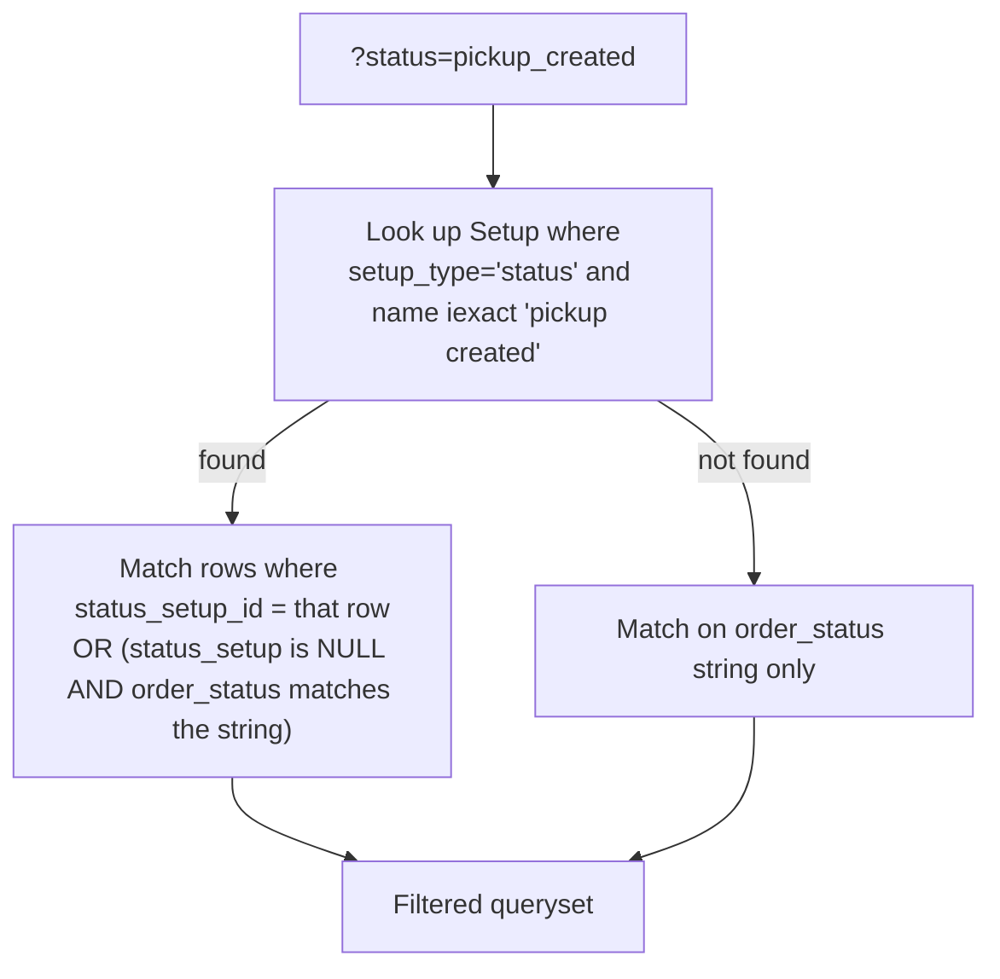
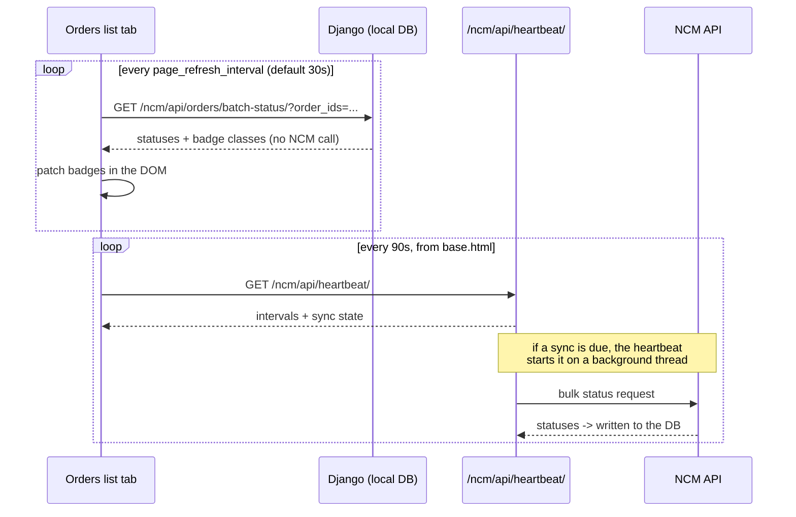

# 05 — Orders List Page

The main working screen. Everything staff do to orders in bulk starts here.

**Purpose** — Browse, filter, search and bulk-act on orders; send batches to a courier.
**URL** `/orders/` · **name** `orders_list` · **view** `dashboard/views.py:3061`
**Template** `dashboard/templates/orders_list.html` (2,818 lines)
**Permission** `@permission_required('can_view_orders_list')` (`views.py:3060`)

---

## Where the data comes from

### The base queryset — `views.py:3070-3075`

```python
Order.objects.filter(is_deleted=False)
    .select_related('customer', 'created_by', 'status_setup',
                    'payment_setup', 'payment_status_setup')
    .prefetch_related('items')
    .order_by('-created_at')
```

`select_related` covers the five FKs every row renders; `prefetch_related('items')` feeds
the product-name column. Without these the page issues a query per row.

### Everything on screen

| What's shown | Source | Line |
|---|---|---|
| Order rows | The queryset above, paginated | `:3070` |
| Product names per row | `order.items.all()`, joined as `"Name (Variation)"` | `:3297-3306` |
| Status badge | `order.status_setup` (FK) with `order_status` as fallback | template |
| Courier status badge | `order.ncm_status` / `order.pnd_status`, coloured by `logistics_badge_class` | `dashboard/logistics_status.py:41` |
| Status filter dropdown | `Setup(setup_type='status', is_active=True)` ordered by `sort_order, name` | `:3254` |
| Payment filter dropdown | `Setup(setup_type='payment_status', is_active=True)` | `:3255` |
| Product filter dropdown | Distinct `OrderItem.product_name` across all live orders | `:3271-3277` |
| Bulk "Mark as …" options | Built from the same Setup rows as `status_setup_<id>` / `payment_status_setup_<id>` | `:3281-3288` |
| NCM account picker | `LogisticsAPIConfig(logistics_provider='ncm', is_active=True)` | `:3340` |
| PND account picker | `LogisticsAPIConfig(logistics_provider='pick_and_drop', is_active=True)` | `:3341` |
| Poll interval | `APISettings.get_settings().page_refresh_interval` | `:3343` |
| The 5 KPI tiles | Aggregations over the **filtered** queryset — see below | `:3217-3231` |

---

## The KPI tiles — `views.py:3217-3231`

All five are computed over the **filtered** queryset, so they change with your filters.

| Tile | How it's computed |
|---|---|
| Total orders | `orders.count()` |
| Total revenue | `Sum('total_amount')` where `payment_status__iexact='paid'` |
| Pending | count where `order_status__iexact='pending'` |
| Confirmed | count where `order_status__iexact='confirmed'` |
| Dispatched | count where `order_status__iexact='dispatched'` |
| Delivered today | `order_status__iexact='delivered'` **and** `delivered_at` inside today's Nepal day |

Note these read **`order_status`**, not `status`, and match case-insensitively on the
literal string — they do not go through the `Setup` FK. An order whose `status_setup`
points at "Confirmed" but whose `order_status` string says something else will not be
counted. See [07](./07-order-statuses.md) for why the two can diverge.

---

## Filters and URL parameters

| Param | Effect | Default | Line |
|---|---|---|---|
| `search` | `icontains` across `order_number`, `customer_name`, `customer_phone`, `customer_email` | — | `:3090-3096` |
| `status` | Status filter — see resolution below | — | `:3099-3123` |
| `payment` | Payment-status filter, same pattern | — | `:3126-3146` |
| `product` | `items__product_name__iexact` + `.distinct()` | — | `:3149-3150` |
| `in_out` | `in` (inside valley) / `out` | — | `:3153-3154` |
| `logistics_status` | `sent` → has an `ncm_order_id`; `not_sent` → doesn't | — | `:3157-3160` |
| `date_range` | See the table below | **`last_2_days`** | `:3078`, `:3174-3215` |
| `start_date`, `end_date` | Used only when `date_range=custom`, format `YYYY-MM-DD` | — | `:3205-3213` |
| `product_sort` | `asc` / `desc` — sorts by first product name | — | `:3234-3241` |
| `per_page` | `50` / `100` / `200` / `500`; anything else falls back to 50 | `50` | `:3245-3248` |
| `page` | Page number | 1 | `:3249` |

### How the status filter resolves — `views.py:3099-3123`

It is not a plain string match. The filter value (`pickup_created`) is turned back into a
Setup name (`Pickup Created`) and looked up:



The `status_setup IS NULL` branch is what keeps legacy rows (written before the FK existed)
visible. The payment filter uses the identical pattern against `payment_status_setup`.

### Date ranges — `views.py:3174-3215`

| Value | Window |
|---|---|
| `last_24_hours` | Rolling 24 hours from now |
| `today` | Today, Nepal day boundaries |
| `yesterday` | Yesterday only |
| **`last_2_days`** | From the start of yesterday onwards — **the default** |
| `last_7_days` | From 7 days ago |
| `last_30_days` | From 30 days ago |
| `this_month` | From the 1st of this month |
| `last_month` | The whole of last month (bounded both ends) |
| `this_year` | From 1 January |
| `custom` | `start_date` → `end_date` inclusive |
| `all` | No date filter |

> **Why they look verbose.** Every one builds explicit `nepali_tz.localize(...)` bounds and
> uses `__gte` / `__lt`. Django's `__date` lookups compile to MySQL `CONVERT_TZ()`, which
> returns `NULL` on this host because the timezone tables are not installed — so `__date`
> filters silently match **nothing**. The comment at `:3163-3165` records this. Do not
> "simplify" these back to `__date`.

> **The default is `last_2_days`, not "all".** Staff regularly report "my order has
> vanished" when it is simply older than the default window.

---

## Pagination — `views.py:3243-3250`

Standard Django `Paginator`. Page size is user-selectable but constrained to
`50 | 100 | 200 | 500`; any other value silently becomes `50`.

---

## Per-row post-processing — `views.py:3290-3311`

For every order **on the current page**:

1. `fix_order_decimals(order)` — repairs corrupted decimals **and saves the row**
2. Builds the `order_products` dict of joined product names

> ⚠️ **This page writes to the database on a GET request.** `fix_order_decimals`
> (`views.py:77`) calls `order.save()`. It is bounded to the current page (max 500 rows),
> but it means opening the orders list is not a read-only operation. See
> [02 — Decimal safety](./02-architecture-and-conventions.md#decimal-safety).

---

## Actions on this page

| Action | Method | Endpoint | What it does |
|---|---|---|---|
| Bulk status / payment / delete | POST | `orders_bulk_action` → `/orders/bulk-action/` | See [08](./08-order-create-edit-bulk.md) |
| **Send selected to NCM** | POST | `orders_bulk_ncm_send` → `/orders/bulk-ncm-send/` | Creates an `NCMBulkLog` batch — [10](./10-ncm-sending.md) |
| **Send selected to PND** | POST | `orders_bulk_pnd_send` → `/orders/bulk-pnd-send/` | Creates a `PNDBulkLog` batch — [13](./13-pick-and-drop.md) |
| Sync NCM statuses | POST | `ncm:bulk_sync` → `/ncm/bulk-sync/` | Forces a sync of the selection — [12](./12-ncm-sync-and-scheduler.md) |
| Import orders from Excel | POST | `import_orders_excel` → `/orders/import/excel/` | [08](./08-order-create-edit-bulk.md) |
| Export selected | POST | `export_selected_orders_excel` → `/orders/export/selected/` | XLSX download |
| **Print invoices for the selection** | POST | `orders_bulk_invoice` → `/orders/bulk-invoice/` | Every selected order's invoice on one sheet — below |
| New order | link | `order_create` → `/orders/create/` | |
| Trash | link | `orders_trash` → `/orders/trash/` | |
| Row → View | link | `order_detail` → `/orders/<id>/` | [06](./06-order-detail.md) |
| Row → Edit | link | `order_edit` → `/orders/<id>/edit/` | |
| Row → Invoice | link | `order_invoice` → `/orders/<id>/invoice/` | Printable. Its whole layout is data-driven — see [22](./22-settings-and-setup.md#invoice-customizer) |

The bulk "Mark as …" dropdown is generated from `Setup` rows, so it always matches whatever
statuses the business has configured (`:3281-3288`).

---

## Bulk invoice printing

**URL** `/orders/bulk-invoice/` · **name** `orders_bulk_invoice`
**View** `dashboard/bulk_invoice_views.py` · **Template** `order_invoice_bulk.html`
**Permission** `@login_required` + `can_view_orders`

Tick any number of orders and press **Print Invoices** (the toolbar button, or the
`print_invoices` bulk action) to get every invoice on one sheet, instead of opening a tab per
order and pressing print in each. Added Sep 2026.

**It is not a second invoice design.** `order_invoice.html` was split into
`templates/invoice/_styles.html` and `templates/invoice/_document.html`; the single-order
invoice includes both, and the bulk sheet emits the stylesheet **once** and repeats the
document partial per order through the `` inclusion tag
(`dashboard/templatetags/dashboard_extras.py`). Setup → Invoice Customizer therefore drives
both surfaces without a second thought — see
[22](./22-settings-and-setup.md#invoice-customizer).

> An inclusion tag is the only way to spread a `build_invoice_context()` dictionary back into
> a template's namespace. `` would mean re-listing every key at the
> call site, so a key added to the context builder would render on the single-order invoice
> and silently vanish from the bulk sheet.

| Detail | Behaviour |
|---|---|
| Selection source | POSTed `order_ids` (a tick list can outgrow a URL), or `?ids=1,2,3` so a sheet stays re-openable |
| **Selection is not authorisation** | The ids arrive from the browser, so the queryset is re-filtered by the same rule `order_invoice` uses — a user who is not admin/manager/staff prints only their **own** orders — and the page says how many ticked orders it dropped |
| Cap | `MAX_INVOICES = 200`. The extras are dropped and the sheet says so, rather than building a page big enough to hang the print dialog |
| Layout | `page` (one invoice per sheet) or `flow` (continuous, with a cut line). The **last** invoice must not force a page break, or every run ends on a blank sheet |
| Per invoice | "Print this" and "Remove" |
| `custom_css` | Emitted by each caller after its own chrome rather than by the shared partial, so the shop's CSS keeps the last word |

A browser that did not run the page script falls back to the `print_invoices` branch of
`orders_bulk_action`, which redirects to the same sheet with `?ids=`.

Verified by `test_bulk_invoice_print.py` (41 checks).

---

## Live updates



**The badge poller** — `orders_list.html:2522-2542` (`fetchOrdersListStatus`), timer at
`:2630-2632`, interval from `ORDER_AUTO_SYNC_INTERVAL` (`:2499`).

- Calls `GET /ncm/api/orders/batch-status/?order_ids=1,2,3`
- Handler: `ncm/realtime_api.py:414` `api_get_orders_status_batch`
- **This reads the local database only.** It never calls NCM.
- Permission is checked inline against `ORDER_STATUS_VIEW_PERMISSIONS` — any one of
  `can_view_orders`, `can_view_orders_list`, `can_view_ncm_orders`
  (`ncm/realtime_api.py:43-45`), because three different pages share the endpoint.
- The response includes the computed badge CSS class, so the browser only has to assign it
  — the colour table is never duplicated in JavaScript.
- DOM patch at `orders_list.html:2547-2594`, toast messages at `:2600-2607`.

**Interval re-arming** — `orders_list.html:2650-2658`. The global heartbeat in
`templates/base.html:2771` dispatches an `ncm-sync-intervals` event; the list page listens
and restarts its timer. That is what makes changing the interval in Settings take effect in
already-open tabs without a reload.

**The actual NCM traffic** comes from the heartbeat (`templates/base.html:2723-2786`), not
from this page. See [12](./12-ncm-sync-and-scheduler.md).

---

## Related list pages

Several other screens are "the orders list, filtered differently":

| Page | URL | View | Shows |
|---|---|---|---|
| Orders trash | `/orders/trash/` | `orders_trash` | `is_deleted=True` |
| On-hold orders | `/orders/on-hold/` | `on_hold_orders_list` (`views.py:7477`) | Setup rows named "On Hold" + "Inquiry", matched by FK **or** string (`:7483-7503`) |
| Return orders | `/orders/returns/` | `return_orders_list` (`views.py:5084`) | `order_status IN ('return', 'return_arrived', 'return_processing')`, with a `stage` param of `processing` / `arrived` / `completed` |
| WooCommerce orders | `/orders/woocommerce/` | `woocommerce_orders` | Staged Woo orders — [27](./27-sheets-and-woocommerce.md) |
| Logistics orders | `/logistics/orders/` | `logistics_orders_list` (`views.py:21005`) | Courier-centric view, `?provider=ncm\|pnd` — [12](./12-ncm-sync-and-scheduler.md) |
| Possible redirection | `/orders/possible-redirection/` | `possible_redirection_list` | [14](./14-rtv-and-redirection.md) |
| Redirect orders | `/orders/redirect-orders/` | `redirect_orders_list` | [14](./14-rtv-and-redirection.md) |

---

## Gotchas

- **Default window is 2 days.** Add `?date_range=all` when hunting for an old order.
- **The page saves on GET** (`fix_order_decimals`).
- **KPI tiles read `order_status`, filters read `status_setup` first.** These can disagree
  if a status was written by a path that only updates one of them — see
  [07](./07-order-statuses.md).
- The product filter uses `iexact` on the denormalised `OrderItem.product_name`, so renaming
  a product does not retroactively change old orders' filter values.
- The `product_sort` annotation adds a `Min`/`Max` join; combined with the product filter it
  can produce duplicate rows without the `.distinct()` at `:3150`.
- `per_page=500` plus `fix_order_decimals` means up to 500 `UPDATE` statements on one page
  load. Prefer smaller pages on a slow connection.

---

## Files that own this

- `dashboard/views.py:3061-3346` — the view
- `dashboard/templates/orders_list.html` — the template and its polling JS
- `dashboard/urls.py:69` — the route
- `ncm/realtime_api.py:414` — `api_get_orders_status_batch`, the badge poller's backend
- `dashboard/logistics_status.py` — badge colour rules
- `templates/base.html:2723-2786` — the heartbeat that drives real NCM syncing
