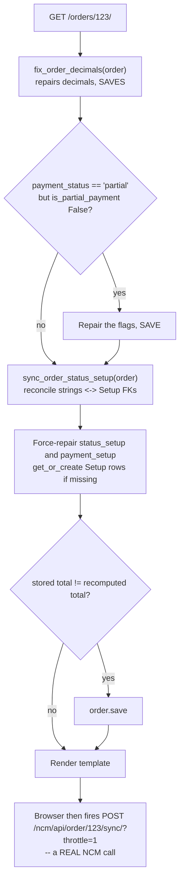
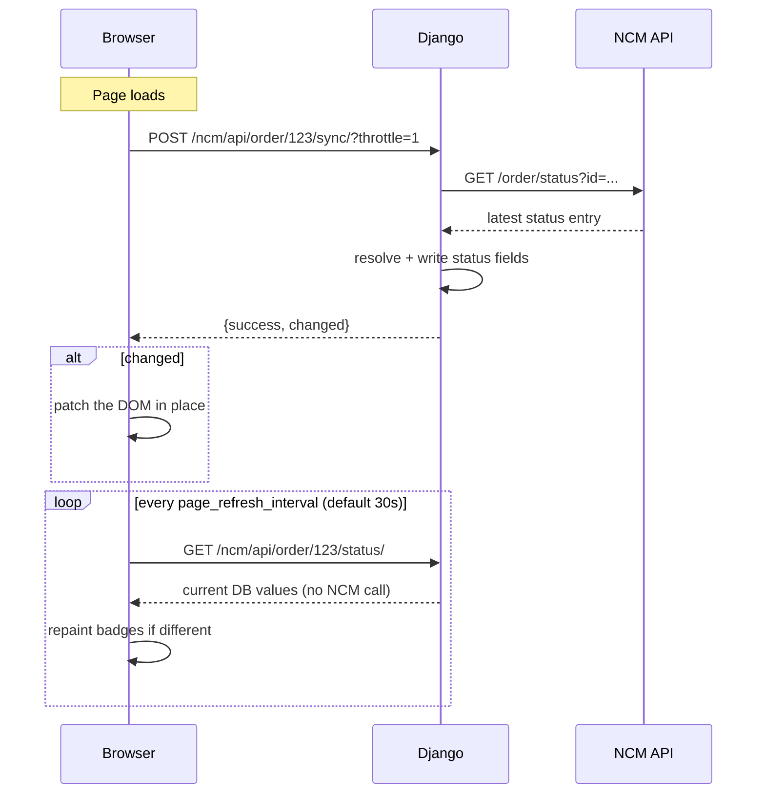

# 06 — Order Detail Page

The single-order screen. Also the place where an order's status is most often changed by
hand — and the place that pulls fresh status from NCM on every load.

**Purpose** — View one order in full; change its status, payment and tracking; send it to a
courier; read and write NCM comments; see its timeline.
**URL** `/orders/<int:order_id>/` · **name** `order_detail` · **view** `dashboard/views.py:3944`
**Template** `dashboard/templates/order_detail.html` (4,734 lines)
**Permission** `@permission_required('can_view_orders')` (`views.py:3943`)

This URL handles **both** `GET` (render) and `POST` (`action=update_status`).

---

## Where the data comes from

### The order itself — `views.py:3948-3958`

```python
get_object_or_404(
    Order.objects.select_related(
        'api_config', 'status_setup', 'payment_setup',
        'payment_status_setup', 'customer', 'created_by'),
    id=order_id)
```

Note it does **not** filter `is_deleted=False` — a trashed order is still viewable by direct
URL. It is re-fetched with the same `select_related` after the status-setup repair pass
(`:4255-4262`) so the template renders the corrected values.

### Everything on the page

| Section | Source | Line |
|---|---|---|
| Header badge | `order.status_setup` (the **FK**, not the string) | template |
| Items table | `order.items.select_related('product', 'product_variation').all()` | `:4265` |
| VAT / PAN line | `order.vat_pan`, in a tabular face; the row is **absent** when the order carries no number | template `:1061` |
| Money summary | Recomputed live: `subtotal`, `after_discount`, `tax_amount`, `calculated_total` | `:4291-4303` |
| Partial payment panel | `is_partial_payment`, `partial_amount_paid`, `remaining_amount`, `partial_payment_percentage` | `:4291-4303` |
| Status dropdowns | `Setup` rows for `status`, `payment`, `payment_status` | `:4286-4288` |
| Timeline | Last **20** `order.activity_logs`, sorted by `Coalesce(event_at, created_at)` desc | `:4270-4274` |
| Redirection snapshot | `_redirect_old_customer()` attached to each `redirected` log | `:4278-4283`, helper `:3765` |
| NCM panel | `order.ncm_*` fields + live API calls (below) | template |
| PND panel | `order.pnd_*` fields | template |
| Courier account picker | `LogisticsAPIConfig` filtered by provider, `is_active=True` | `:4340-4341` |
| Exchange button state | `exchange_is_delivered`, `is_rtv`, `can_exchange` | `:4348-4368` |
| Poll interval | `APISettings.page_refresh_interval` as `AUTO_SYNC_INTERVAL` | `:4345` |
| NCM status history | Fetched over AJAX from `/api/ncm-rtv/<ncm_id>/detail/` | template `:4090` |
| NCM comments | Fetched over AJAX from `/ncm/api/order/<id>/comments/` | template `:4552` |

### Exchange eligibility — `views.py:4348-4368`

`can_exchange` is true only when **all** of:

- the order has an `ncm_order_id`
- its status is `delivered` or `confirmed`
- it is **not** an RTV — checked via
  `RTVOrder.objects.filter(order_id=order.ncm_order_id, vendor_return=True).exists()`
- `exchange_status != 'created'`

---

## What happens on every page load (before rendering)

This is the part that surprises people. A `GET` on this page performs **five** write-capable
operations:



| Step | Line | Effect |
|---|---|---|
| `fix_order_decimals(order)` | `:3959` | Nulls → 0, recomputes total, **saves**, reconciles `is_partial_payment` with `payment_status` |
| Partial-payment repair | `:3962-3971` | Backfills `partial_amount_paid` / `remaining_amount`, **saves** |
| `sync_order_status_setup(order)` | `:4228` | Bidirectional: FK wins if set, otherwise `get_or_create` a Setup row from the string (`views.py:126-209`) |
| Forced FK repair | `:4230-4252` | Creates `Setup` rows for `status_setup` (`:4233`) and `payment_setup` (`:4245`) if still missing |
| Total re-save | `:4291-4303` | If the stored `total_amount` differs from the recomputation, it is overwritten |

> **Consequence.** Opening an order can create `Setup` rows and change stored money values.
> If a total "changed by itself", this is why — the recomputation from line items won.

---

## Changing status by hand — the `POST` handler

`views.py:3974-4222`, triggered by the form at `order_detail.html:459` with
`action=update_status`.

Accepted fields: `status_setup`, `payment_status_setup`, `payment_setup`,
`tracking_number`, `admin_notes`, `logistics`, `selected_api_config_id`.

### Status

```python
status_setup = Setup.objects.get(id=status_setup_id, setup_type='status')
if apply_manual_status(order, status_setup.name, status_setup=status_setup):
    changes_made.append('Order Status')
```
`views.py:4001-4011`.

`apply_manual_status()` (`services/status_override.py:64`) is the **only correct way to
hand-set a status**. It writes `status`, `order_status` **and** `status_setup` together, and
stamps the manual hold so the sync that fires moments later on the next page load does not
immediately undo it. Full explanation in [07 — Order statuses](./07-order-statuses.md).

It returns an empty list — writing nothing and stamping no hold — if the normalised status
is unchanged. That is deliberate: editing an order's address should not start shielding its
status from NCM.

### Side effects of a status change

| Condition | Action | Line |
|---|---|---|
| New status is `delivered` and `delivered_at` is unset | Stamp `delivered_at = now()` | `:4089-4091` |
| New status is `cancelled` / `canceled` | `release_order_reservations(order)` — frees reserved stock | `:4093-4100` |

### Payment status

`views.py:4014-4038`. Sets `payment_status_setup` and the normalised `payment_status`
string, and manages the partial-payment flags:

- moving **into** a `partial` status → `is_partial_payment = True`, backfill
  `partial_amount_paid` (0) and `remaining_amount` (`total_amount`)
- moving **out of** a partial status → `is_partial_payment = False`

### Everything else

Payment method (`:4041-4049`), tracking number (`:4052-4055`), admin note — created as an
`OrderAdminNote` row (`:4058`), logistics provider and API account.

Activity logs are written for status, payment status, payment method and logistics changes
(`:4151-4205`), then the view redirects back to itself (`PRG`).

---

## Actions on this page

| UI | Template line | Endpoint | Notes |
|---|---|---|---|
| Back to list | `:8` | `orders_list` | |
| Edit | `:57` | `order_edit` `/orders/<id>/edit/` | [08](./08-order-create-edit-bulk.md) |
| Invoice | `:63` | `order_invoice` `/orders/<id>/invoice/` | Printable |
| **Update Order Status** form | `:459` | `POST order_detail` with `action=update_status` | Above |
| **Sync Status** button | `:4029` | `POST /ncm/api/order/<id>/sync/` | **Real NCM call**, never throttled |
| Track on NCM | `:659` | `ncm:track_order` `/ncm/orders/<id>/track/` | |
| **Send to NCM** | `:749` | `POST ncm:create_shipment` `/ncm/orders/<id>/create/` | [10](./10-ncm-sending.md) |
| NCM branch list | `:795` / `:3879` | `ncm:branches` / `ncm:branches_json` | Populates the destination dropdown |
| **Send to PND** | `:919` | `POST pick_and_drop:create_shipment` | [13](./13-pick-and-drop.md) |
| PND sync | `:858` | `pick_and_drop:sync_status` | ⚠️ **A placeholder — does nothing** |
| PND cancel | `:862` | `POST pick_and_drop:cancel_order` | |
| Customer link | `:1001` | `customer_detail` | |
| Create exchange order | `:3833` | `POST /orders/<id>/exchange/` | `views.py:24010` |
| RTV detail modal | `:4090` | `GET /api/ncm-rtv/<ncm_order_id>/detail/` | `views.py:23661` |
| Load comments | `:4552` | `GET /ncm/api/order/<id>/comments/` | Merges local + NCM comments |
| Add comment | `:4669` | `POST /ncm/api/order/<id>/comments/add/` | Logged locally at once, pushed to NCM on a background thread |

---

## Live updates — two different timers, do not confuse them



### 1. The page-load sync — **costs an NCM call**

`order_detail.html:3991` `syncNCMStatusAJAX(orderId, silent)`.

- Endpoint `POST /ncm/api/order/<id>/sync/`, handler `ncm/realtime_api.py:195`.
- On page load it is called with `silent=true`, which appends **`?throttle=1`**.
  That makes rapid refreshes reuse the last result instead of hitting NCM each time —
  `SYNC_THROTTLE_SECONDS = 20` (`ncm/realtime_api.py:38`).
- The **Sync Status button** calls it without `throttle`, so a deliberate click always
  goes to NCM.
- Concurrent calls join the in-flight promise rather than starting a second request
  (`:4004-4013`).
- If the page has no CSRF token the sync is skipped quietly rather than throwing
  (`:4017-4022`).
- When the server reports `changed`, the DOM is patched in place — no reload.

> **Why this exists.** NCM documents only five webhook events and pushes **no** return/RTV
> events at all. Waiting on a push that never comes would leave RTV orders stale forever, so
> the page actively pulls instead. See [11](./11-ncm-webhook.md).

### 2. The badge poller — **free**

`order_detail.html:4363` `startAutoSync()`, timer at `:4371-4373`.

- Endpoint `GET /ncm/api/order/<id>/status/`, handler `ncm/realtime_api.py:128`.
- **Reads the local database only.** The comment at `realtime_api.py:129-140` records that
  it used to call NCM and discard the answer.
- Interval = `AUTO_SYNC_INTERVAL` = `APISettings.page_refresh_interval` (default 30s).
  The template falls back to `14400` seconds if the context variable is missing
  (`order_detail.html:4257`).
- Only started when the order actually has an `ncm_order_id` (`:4392-4394`).
- Stopped on `beforeunload`; re-armed when the global heartbeat reports a changed interval.

Keeping NCM status fresh is the background sync's job
([12](./12-ncm-sync-and-scheduler.md)) — this timer only surfaces what that sync wrote.

---

## The NCM comments panel

`GET /ncm/api/order/<id>/comments/` (`ncm/realtime_api.py:583`) merges three sources:

1. Local `OrderActivityLog` rows with `field_name='ncm_comment'`
2. NCM's comment endpoint (`get_order_comments`)
3. Comments embedded in the `get_order_details` response

A 5-second in-process cache (`_comment_cache`, `realtime_api.py:32-63`) stops a rapid
series of loads from hammering NCM.

Adding a comment (`:718`) writes the local log **immediately** and posts to NCM on a daemon
thread (`send_ncm_comment_async`, `:102`), so the UI never waits on the round-trip.

---

## Gotchas

- **The header badge renders `status_setup` (the FK); the status dropdown reads the same
  FK; list pages read the *strings*.** When they disagree, someone wrote only one side.
  `NCMService._resolve_setup()` creating the row rather than returning `None`
  (`services/ncm_service.py:1043-1051`) is the fix for exactly that bug.
- **The page saves on GET** — decimals, Setup rows, and possibly `total_amount`.
- **PND "Sync Status" does nothing.** `pick_and_drop/views.py:221-231` is a placeholder
  awaiting a PND status API. It reports success without contacting anyone.
- The timeline shows only the **last 20** entries. For the full history use the activity
  API `GET /ncm/api/order/<id>/activity/` (`ncm/realtime_api.py:524`).
- A cancelled order is **never** updated by any sync path — the guard is in
  `api_sync_order_status` (`:234`), the webhook handler (`:334`) and bulk sync
  (`bulk_sync.py:114`).
- Opening a deleted (trashed) order by URL works; it just won't appear in lists.

---

## Files that own this

- `dashboard/views.py:3944-4378` — the view, GET and POST
- `dashboard/templates/order_detail.html` — the template and all its AJAX
- `dashboard/views.py:126-209` — `sync_order_status_setup`
- `dashboard/views.py:77-123` — `fix_order_decimals`
- `services/status_override.py` — `apply_manual_status`, the manual hold
- `ncm/realtime_api.py` — `api_sync_order_status`, `api_get_order_status`, comments, activity
- `dashboard/urls.py:73` — the route
