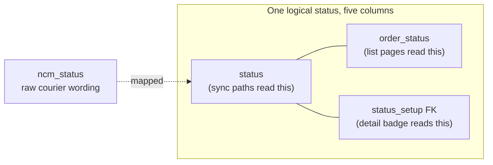
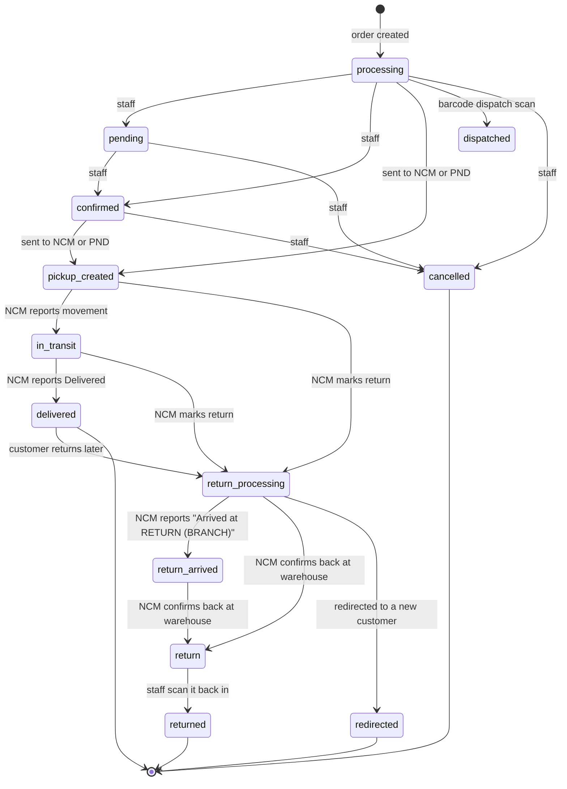
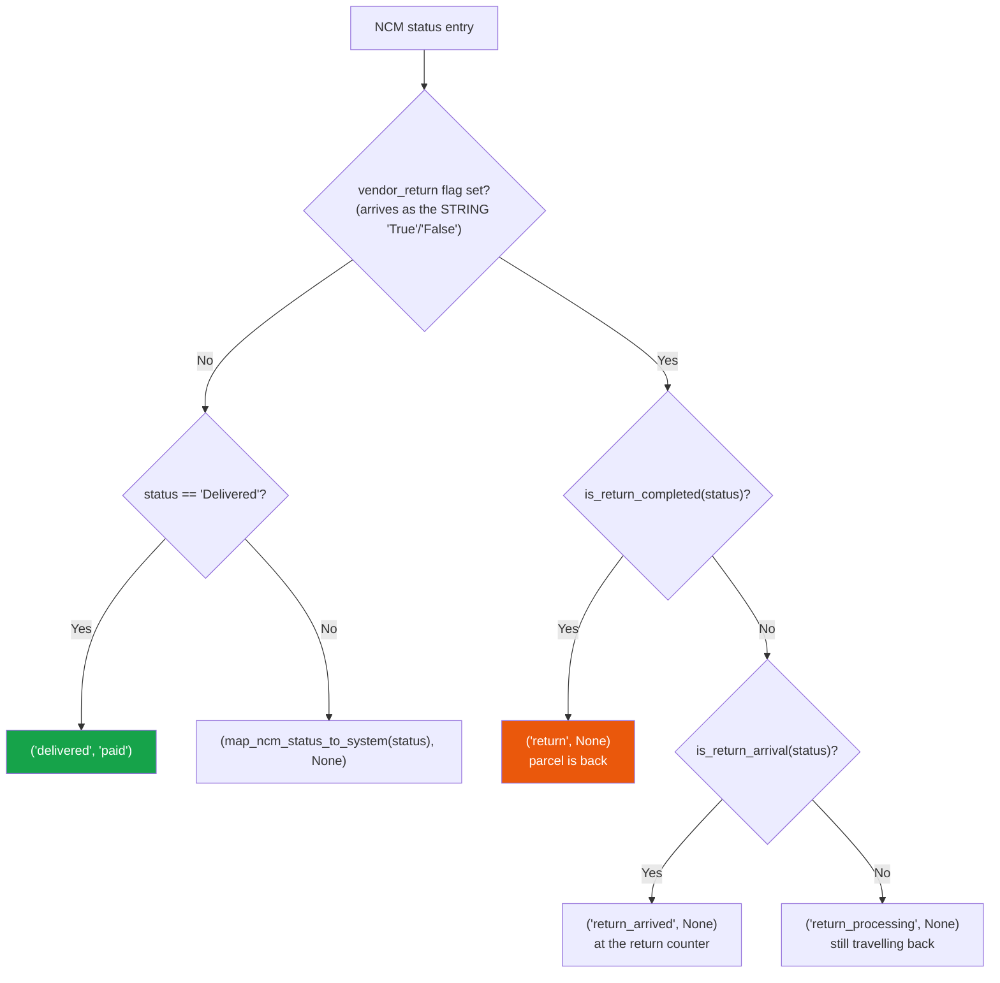
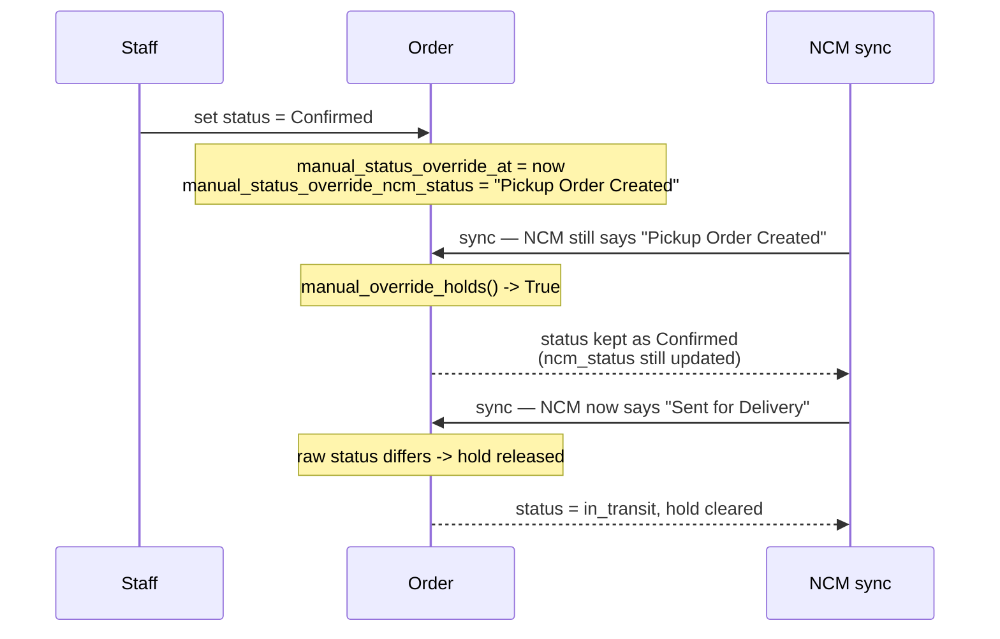
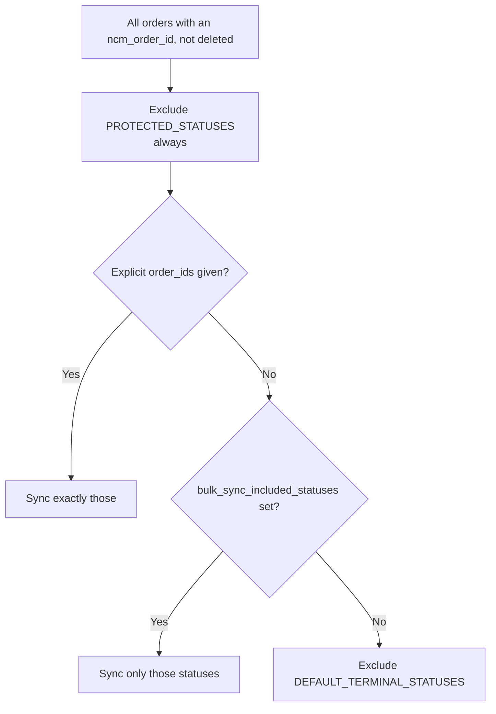

# 07 — Order Statuses: The Complete Reference

The single most confusing part of this system, in one chapter. If an order's status did
something you didn't expect, the answer is here.

---

## 1. There are five status fields, not one

| Field | What it holds | Who reads it |
|---|---|---|
| `Order.status` | System status string, e.g. `in_transit` | Sync paths, bulk sync eligibility, `ncm_sync_all_statuses` |
| `Order.order_status` | **The same value.** A duplicate | Orders list, on-hold list, return list, KPI tiles |
| `Order.status_setup` | FK → `Setup` row | The order-detail header badge and the status dropdown |
| `Order.ncm_status` | **NCM's own wording**, e.g. `Sent for Delivery` | NCM panel, logistics list, badge colours |
| `Order.payment_status` (+ `payment_status_setup`) | `pending` / `paid` / `partial` / `cod_pending` | Revenue KPI, payment badge |

`Order.status` and `Order.order_status` are duplicates — the model comment at
`dashboard/models.py:383` says *"Rename from order_status"*, a rename that was started and
never finished. **Neither has `choices`.** They are free-text `CharField`s.



**Why this matters.** A code path that writes only one of them creates a visible
inconsistency:

| Symptom | Cause |
|---|---|
| Detail page badge says RETURN, dropdown says Return Processing | `status_setup` FK lagged the strings — fixed by `_resolve_setup` creating the row instead of returning `None` (`services/ncm_service.py:1043-1051`) |
| Staff mark an order Confirmed, it reverts on refresh | Only `order_status` was written, so the sync path (which compares `status`) saw no change — fixed by `apply_manual_status` writing both (`services/status_override.py:99-101`) |
| Bulk "Mark as Delivered" silently reverts later | The legacy bulk actions still write only `order_status` and set no hold — see §5 |

**Rule: never write a status field directly.** Use `apply_manual_status()` for staff
actions and `sync_order_status_fields()` for courier-driven ones.

---

## 2. The status vocabulary is data, not code

Because `status` has no `choices`, the list of valid statuses lives in the **`Setup` table**
(`dashboard/models.py:1583`), rows with `setup_type='status'`.

Only **two** rows are seeded by migration: `"Return Processing"`
(`dashboard/migrations/0077_return_processing_status_setup.py`) and `"Return Arrived"`
(`0088_return_arrived_status_setup.py`, which also backfills the orders already in that
stage). Everything else is either
created by an admin at *Settings → Setup Management*, or **auto-created by code** when a
status name appears with no matching row. Three places do that:

| Where | Line |
|---|---|
| `sync_order_status_setup()` | `dashboard/views.py:148` |
| `order_detail` forced repair | `dashboard/views.py:4118-4147`, `:4233` |
| `NCMService._resolve_setup()` | `services/ncm_service.py:1082` |

Naming is normalised in both directions: a Setup named `"Pickup Created"` corresponds to the
stored value `pickup_created` (`name.lower().replace(' ', '_')`).

### The de-facto status set

These are the values the code actually produces:

| System status | Meaning | Set by |
|---|---|---|
| `processing` | Default for a new order; also NCM's "unrecognised status" fallback | Model default, `map_ncm_status_to_system` fallback |
| `pending` | Awaiting confirmation | Staff |
| `confirmed` | Confirmed by staff | Staff |
| `Pickup Created` / `pickup_created` | Handed to a courier, not yet moving | Send-to-courier, NCM mapping |
| `in_transit` | Moving through the courier network | NCM mapping |
| `dispatched` | Dispatched locally via barcode scan | Dispatch scan |
| `shipped` | Legacy bulk action | Legacy bulk action |
| `packed` | Business-specific | Setup / staff |
| `delivered` | Delivered to the customer | NCM mapping |
| `cancelled` | Cancelled locally. **Protected — no sync overwrites it** | Staff |
| `return_processing` | Still travelling back to the vendor | NCM mapping |
| `return_arrived` | Arrived at the courier's **return** branch — the return leg is over, so it can no longer be redirected, but it is not ours yet | NCM mapping |
| `return` | Confirmed back with the vendor | NCM mapping |
| `returned` | Physically scanned back in by staff | Return Management |
| `redirected` | Redirected to a different customer | Redirection flow |
| `on_hold`, `inquiry` | Business-specific holding states | Staff / Setup |

Payment statuses: `pending`, `paid`, `partial`, `cod_pending`.

> Note the casing inconsistency: NCM's mapping produces the display-form `"Pickup Created"`
> while the manual paths store `"pickup_created"`. These are treated as the same status —
> `normalize_status()` (`services/status_override.py:38`) exists to compare them.

---

## 3. The lifecycle



Two things this diagram encodes that are easy to miss:

- Everything downstream of `pickup_created` is driven by **NCM**, not by staff.
- `cancelled` is a one-way door. Every sync path refuses to touch a cancelled order.

---

## 4. The NCM → system mapping

`NCMService.map_ncm_status_to_system()` — **`services/ncm_service.py:638-682`**, dict at
`:653-671`. This is the function that actually runs.

| NCM raw status | System status |
|---|---|
| `Pickup Order Created` | `Pickup Created` |
| `Drop off Order Created` | `Pickup Created` |
| `Pickup Complete` | `in_transit` |
| `Drop off Order Collected` | `in_transit` |
| `Dispatched` | `in_transit` |
| `In Transit` | `in_transit` |
| `Arrived` | `in_transit` |
| `Sent for Delivery` | `in_transit` |
| `Out for Delivery` | `in_transit` |
| `Delivered` | `delivered` |
| `Confirmed` | `delivered` |
| `Returned` | `returned` |
| `Return Initiated` | `return_processing` |
| `Return Approved` | `return_processing` |
| `Order Marked Return` | `return_processing` |
| `Sent to Vendor` | `return_processing` |
| `Returned to Warehouse` | `return` |
| *`Arrived at RETURN …`* (no fixed key — see the fallbacks below) | `return_arrived` |

**Three fallbacks**, in this order:

1. `is_return_arrival(status)` — a status that **starts with `arrived` and names a
   `RETURN` branch**, e.g. `"Arrived at RETURN NAYA BUSPARK"`,
   `"Arrived at RETURN (TINKUNE)"` → **`return_arrived`**. Checked before the keyword
   fallback below, which would otherwise swallow it.
2. Any other unmatched status containing `return`, `rtv`, or `sent to vendor`
   (`RETURN_STATUS_KEYWORDS`, case-insensitive) → **`return_processing`**. This catches
   the remaining branch-qualified variants, e.g. `"Dispatched to RETURN ( TINKUNE)"`.
3. Everything else → **`processing`**.

> **`Arrived at POKHARA` and `Arrived at RETURN NAYA BUSPARK` are opposite facts that
> share a first word.** The first is a parcel waiting at its delivery branch — the only
> state a redirect is physically possible from. The second is a parcel that travelled all
> the way back to the courier's return counter. Every rule that reads "arrived" as
> "sitting at a branch we can redirect from" has to tell them apart; that is what
> `is_return_arrival()` is for, and both `dashboard/views.py` (in Python **and** in the
> Possible Redirection SQL filter) and `possible_redirection.html` mirror it.

### Payment mapping

`NCMWebhookHandler.PAYMENT_STATUS_MAPPING` (`ncm/webhook_handler.py:80-85`):

| NCM | Internal |
|---|---|
| `COD Collected` | `paid` |
| `Payment Collected` | `paid` |
| `Pending` | `pending` |
| `COD Pending` | `cod_pending` |

In practice, payment status is set by `resolve_delivered_status` returning `'paid'` alongside
a genuine `Delivered` — see §6.

> ⚠️ **There is a second, identical copy** of the status table at
> `ncm/webhook_handler.py:56-74`. Its own comment says it is documentation only and **is not
> referenced**. If you change the mapping, change `ncm_service.py` — and ideally update the
> copy so it doesn't drift. Recorded in [A4](./A4-appendix-known-quirks.md).

### Webhook event → status

Used **only** when the webhook payload's `status` field is empty
(`ncm/webhook_handler.py:43-50`, applied at `:185-187`):

| Event | Status |
|---|---|
| `pickup_completed` | `Pickup Complete` |
| `sent_for_delivery` | `Sent for Delivery` |
| `order_dispatched` | `Dispatched` |
| `order_arrived` | `Arrived` |
| `delivery_completed` | `Delivered` |
| `order_marked_rtv` | `Order Marked Return` |

The first five are NCM's **complete documented event list**. NCM documents **no return/RTV
events at all**; `order_marked_rtv` was added from observed production traffic, and the later
RTV steps are believed never to be pushed. That is precisely why the order-detail page pulls
status on load instead of trusting the push — see [11](./11-ncm-webhook.md).

---

## 5. Who writes status, and when

The master table. Every place an order's status changes.

### Staff, through the UI

| Trigger | Entry point | Writes | Stamps a hold? |
|---|---|---|---|
| Order detail → Update Status | `views.py:4007` → `apply_manual_status` | `status`, `order_status`, `status_setup` | ✅ |
| ↳ moving into `delivered` | `views.py:4089-4091` | `delivered_at` | — |
| ↳ moving into `cancelled` | `views.py:4093-4100` | releases stock reservations | — |
| Order edit page | `views.py:4449` → `apply_manual_status` | same three | ✅ |
| ↳ no setup posted | `views.py:4454` | `order_status = order_status or 'processing'` | ❌ |
| ↳ leaving `dispatched` | `views.py:4468-4477` | restores stock, invalidates dispatch items | — |
| Bulk `status_setup_<id>` | `views.py:9264-9265` → `apply_manual_status` | same three | ✅ |
| Bulk `payment_status_setup_<id>` | `views.py:9309-9331` | `payment_status`, `payment_status_setup` | — |
| Bulk delete | `views.py:9219-9250` | `order_status='cancelled'` if dispatched, then soft-delete | ❌ |
| Move to trash | `views.py:4939` | `order_status='cancelled'` if dispatched | ❌ |
| **Legacy bulk actions** | `views.py:9334-9425` | ⚠️ **only `order_status`** | ❌ |
| Barcode dispatch scan | `views.py:10163-10199` | → `dispatched`, sets `logistics` + `dispatch_date` | ❌ |
| Return Management scan-in | `views.py:12620-12651` `_mark_order_as_returned` | → `returned` via `sync_order_status_fields` | ❌ |
| Return refund processed | `views.py:13333-13345` | → `returned` | ❌ |
| Redirect an order | `views.py:6626` → `apply_manual_status`; matched order → `redirected` at `:6765` | | ✅ / ❌ |
| Redirect an RTV | `views.py:7153`, `:7180` | → redirect Setup / `redirected` | — |

> ⚠️ **The legacy bulk actions are a trap.** `mark_delivered` (`:9336`), `mark_cancelled`
> (`:9358`, a raw `.update()`), `mark_processing` (`:9372`), `mark_shipped` (`:9386`),
> `mark_paid` (`:9400`), `mark_pending` (`:9414`) bypass `apply_manual_status` entirely.
> They write **only `order_status`**, leave `status` and `status_setup` untouched, and set
> **no manual hold** — so the next NCM sync can silently revert them. Prefer the
> Setup-driven "Mark as …" options.

### Sending to a courier

| Trigger | Entry point | Result |
|---|---|---|
| Send one order to NCM | `ncm/views.py:254-284` | `ncm_status='Order Created'`, `status='processing'`, clears any hold — then **immediately re-reads** NCM and overwrites with the real status (usually `Pickup Order Created` → `Pickup Created`) |
| Bulk send to NCM | `views.py:15029-15034` | `ncm_status='Pickup Order Created'`, status → the `Pickup Created` Setup row |
| Send to PND | `pick_and_drop/views.py:157-177` | `pnd_status` from the API; status → `Pickup Created`, or `'processing'` if no Setup row exists |
| Cancel a PND order | `pick_and_drop/views.py:257`, `:277` | `pnd_status='Cancelled'` — **written locally even if the PND API rejects the cancel** |

### NCM, automatically

| Path | Entry point | Guards |
|---|---|---|
| **Page-load / button sync** | `ncm/realtime_api.py:195` | cancelled (`:234`), manual hold (`:309`), 20s throttle when `?throttle=1` |
| **Background bulk sync** | `ncm/bulk_sync.py:239` `_sync_one_order` | `PROTECTED_STATUSES` (`:114`), terminal statuses (`:119-123`), return-pipeline guard (`:312-318`), manual hold (`:327`) |
| **Webhook** | `ncm/webhook_handler.py:320` | cancelled (`:334`), manual hold (`:348`) |
| Admin "Sync all statuses" | `views.py:14310` | staff only, protected statuses (`:14338`), manual hold (`:14366`) |
| Order recovery / verify | `ncm/order_recovery.py:111-124` | cancelled (`:78`), manual hold (`:111`) |
| Repair command | `manage.py repair_return_stage` (`:117`) | manual hold |

Every one of these funnels through **`sync_order_status_fields()`** — see §7.

### Signals

`dashboard/signals.py` writes an `OrderActivityLog(action_type='created')` on
`post_save`. **No signal mutates status.**

---

## 6. `resolve_delivered_status` — why "Delivered" is ambiguous

`services/ncm_service.py:694-748`. The most subtle piece of the whole system.

**The problem.** NCM returns `status='Delivered'` for two completely different things:

- the parcel was delivered to the **customer** (a sale), and
- the parcel was delivered back to the **vendor** (a completed return).

The `vendor_return` flag tells them apart — but the flag alone is **not** terminal. NCM sets
it the moment an order is marked for return and keeps reporting it on **every hop of the
journey back** (`Order Marked Return`, `Sent to Vendor`, `Arrived at RETURN (…)`).

So: the flag decides **which pipeline** the status belongs to; the raw status text decides
**how far along** it is.



**`parse_vendor_return`** (`:684-692`) — NCM sends this as the string `'True'` / `'False'`,
not a boolean.

**`is_return_completed(text)`** (`:621-636`) — matches on the **leading words** against
`RETURN_COMPLETED_STATUSES` (`:608-614`: `delivered`, `confirmed`, `returned`,
`returned to warehouse`, `return completed`):

| Text | Completed? | Why |
|---|---|---|
| `Returned to Warehouse (TINKUNE)` | ✅ | Starts with a completion phrase |
| `Arrived at RETURN (TINKUNE)` | ❌ | Starts with a transit verb — still on its way |
| `Dispatched to RETURN (TINKUNE)` | ❌ | Same |

**The bug this fixed.** Treating the bare flag as terminal marked orders `return` while they
were still in transit back — and because `return` is in bulk sync's terminal set, they froze
there. The order-detail page would flip the header badge to RETURN seconds after rendering
"Return Processing", and nothing ever synced it again to correct it.

`resolve_delivered_status` also reads `last_status` (`:730-733`) — the shape NCM uses when it
answers with a single summary object rather than a timeline list.

---

## 7. `sync_order_status_fields` — the single writer

`services/ncm_service.py:960-1029`. **Every** courier-driven status change goes through here.

It writes, and returns the names of, only the fields that actually changed:

- `status`
- `order_status`
- `status_setup` (FK)
- `payment_status`
- `payment_status_setup` (FK)

Three behaviours worth knowing:

**Empty status is refused** (`:982-983`). A caller passing `None` would otherwise blank the
order's status.

**A finished return never reopens.** If the incoming verdict is one of
`RETURN_IN_PROGRESS_SYSTEM_STATUSES` (`return_processing`, `return_arrived`) but the order
is already `return` or `returned` (`COMPLETED_RETURN_SYSTEM_STATUSES`), the existing
status is kept — a replayed `"Arrived at RETURN (…)"` must no more reopen a scanned-in
parcel than a replayed `"Sent to Vendor"` does. NCM replays
in-pipeline hops late and out of order, and a staff scan-in (`returned`) is a stronger
signal than anything NCM reports. Only `manage.py repair_return_stage` passes
`allow_return_reopen=True`.

**The return value is a signal.** Because it lists only genuinely changed fields, an empty
list means "nothing changed" — and `api_sync_order_status` uses exactly that to decide
whether to tell the browser to patch the page (`ncm/realtime_api.py:342-344`). A mapping
that always reported a change would put the order-detail page in a reload loop.

### `_resolve_setup` — keeping the FK honest

`services/ncm_service.py:1031-1090`. Finds the `Setup` row for a system status, comparing
both sides normalised (`return_processing` ↔ `Return Processing`). Lookup order:

1. `name__iexact` on the de-underscored form — the indexed fast path
2. a full scan for names that normalise equal without matching literally
3. reuse a **deactivated** row if one exists (the unique constraint would reject a duplicate)
4. otherwise **create** the row, inside a savepoint

Step 4 is deliberate. Returning `None` left `status_setup` pointing at the *previous* status
while the strings moved on — which is what made the detail-page badge and the dropdown
disagree.

---

## 8. Manual override — staff vs NCM

`services/status_override.py`. The tiebreaker.

**The problem.** An order's status is written from two directions, and the automatic side
re-derives it from NCM's answer every time it runs. Setting an order that NCM still calls
`Pickup Order Created` back to `Confirmed` therefore lasted only until the page reloaded.

**The rule.** A manual change records **which raw NCM status was in force** when it was
made. Sync paths then leave the status alone **only while NCM keeps reporting that exact
same status**.



### The functions

| Function | Line | Does |
|---|---|---|
| `normalize_status(v)` | `:38` | `"Pickup Created"` → `"pickup_created"` |
| `stamp_manual_override(order)` | `:43` | Records `now()` + the current `ncm_status` |
| `clear_manual_status_override(order)` | `:55` | Drops the hold |
| **`apply_manual_status(order, name, status_setup=None)`** | `:64` | The correct way to hand-set a status. Writes `order_status` **and** `status` **and** the FK, then stamps the hold. Returns changed field names |
| **`manual_override_holds(order, incoming_ncm_status, event_at)`** | `:110` | `True` while the hold should win |

### When the hold releases

`manual_override_holds` returns `False` — meaning NCM wins — if **any** of:

- the order has no recorded manual change at all (so untouched orders behave exactly as before)
- NCM reports a **different** raw status than the one held
- NCM's own `event_at` is **later** than the manual change

So an override can delay NCM, but can **never** strand an order on a status the parcel has
left behind.

### What a hold does *not* protect

Only the **system** status fields. `ncm_status` — the raw provider string — is still
recorded on every sync, so the order timeline and the NCM panel keep telling the truth about
where the parcel actually is.

### Every path that consults it

`ncm/webhook_handler.py:348` · `ncm/views.py:361` · `ncm/realtime_api.py:309` ·
`ncm/bulk_sync.py:327` · `ncm/order_recovery.py:111` · `dashboard/views.py:14366` ·
`dashboard/management/commands/repair_return_stage.py:117`

---

## 9. Protected and terminal statuses

Two different concepts, both in `ncm/bulk_sync.py`.

### `PROTECTED_STATUSES = ('cancelled',)` — `bulk_sync.py:52`

A remote status can **never** overwrite these. A cancellation is a local staff decision and
NCM can report a stale status long after it was made. Enforced **regardless** of how orders
were selected — because `bulk_sync_included_statuses` is admin-configurable and could
otherwise be set to include `cancelled`.

The single-order sync endpoint (`realtime_api.py:234`), the webhook handler (`:334`) and
order recovery (`:78`) all refuse cancelled orders for the same reason.

### `DEFAULT_TERMINAL_STATUSES` — `bulk_sync.py:40-43`

```python
['cancelled', 'delivered', 'return', 'returned',
 'return_initiated', 'return_approved']
```

Orders in these statuses are **skipped** by the background sync — there is nothing left to
learn. This list is **overridable** by `APISettings.bulk_sync_included_statuses`
(*Settings → API Sync Settings*); when that field is non-empty it replaces the exclusion
entirely. `PROTECTED_STATUSES` still applies on top.



---

## 10. Badge colours

`dashboard/logistics_status.py`. These colour the **raw courier status**, not the system
status.

| Bucket | Statuses | Class |
|---|---|---|
| `_DELIVERED` (`:16`) | `Delivered`, `Confirmed` | `bg-success` |
| `_IN_TRANSIT` (`:19-21`) | `In Transit`, `Dispatched`, `Arrived`, `Sent for Delivery`, `Out for Delivery` | `bg-primary` |
| `_RETURNING` (`:24-27`) | `Returned`, `Return Initiated`, `Return Approved`, `Order Marked Return`, `Sent to Vendor`, `Returned to Warehouse` | `bg-danger` |
| `_CREATED` (`:30-33`) | `Order Created`, `Pickup Order Created`, `Drop off Order Created`, `Pickup Complete`, `Drop off Order Collected` | `bg-warning text-dark` |
| `_CANCELLED` (`:35`) | `Cancelled` | `bg-danger` |
| anything else | — | `bg-secondary` |

Blank status falls back to `DEFAULT_NCM_STATUS = 'Pickup Order Created'` or
`DEFAULT_PND_STATUS = 'Order Created'` (`:37-38`).

> **Why this is Python and not JavaScript.** The logistics list renders these badges
> server-side, and the same column is patched live over AJAX. Both paths must agree, so the
> colour rules live here once: the template reaches them through the
> `logistics_badge_class` filter, and `api_get_orders_status_batch` returns the computed
> class alongside each status so the browser only has to assign it. A duplicated colour
> table drifts the first time somebody adds a status to one copy and not the other.

---

## 11. Debugging a status problem

| Symptom | Check |
|---|---|
| Status reverted after a refresh | Was it set by a **legacy bulk action**? Those set no hold (§5) |
| Status won't change from NCM | Is there a manual hold? Look at `manual_status_override_at` / `_ncm_status`. Is the order `cancelled`? |
| Badge and dropdown disagree | `status_setup` FK is out of step with the strings. Reopening the order runs the repair (`views.py:4230-4252`) |
| Order stuck on `return` | `sync_order_status_fields`'s "finished return never reopens" guard (§7). Use `manage.py repair_return_stage` |
| Order not syncing at all | Is it in `DEFAULT_TERMINAL_STATUSES`? Does it have an `ncm_order_id`? Is the right `api_config` set? |
| Everything is stale overnight | The heartbeat only runs while a tab is open — see [12](./12-ncm-sync-and-scheduler.md) |
| Status is `processing` and nobody set it | `map_ncm_status_to_system` fell through to its final fallback — NCM sent a string not in the table |

**Where to look in the data:** the order's `OrderActivityLog` rows. Sort by
`Coalesce(event_at, created_at)`. `event_at` tells you when NCM says it happened;
`created_at` tells you when we found out.

**Where to look in the logs:** `logs/ncm_integration.log` (sync), `logs/ncm_webhooks.log`
(pushes).

---

## Files that own this

- `services/ncm_service.py` — `map_ncm_status_to_system`, `resolve_delivered_status`, `sync_order_status_fields`, `_resolve_setup`
- `services/status_override.py` — the manual hold, `apply_manual_status`
- `ncm/webhook_handler.py` — `EVENT_TO_STATUS`, the documentation-only mapping copy
- `ncm/bulk_sync.py` — protected and terminal status sets
- `dashboard/logistics_status.py` — badge colours
- `dashboard/models.py:360-580` — the fields themselves
- `dashboard/views.py` — every staff-driven mutation site listed in §5
