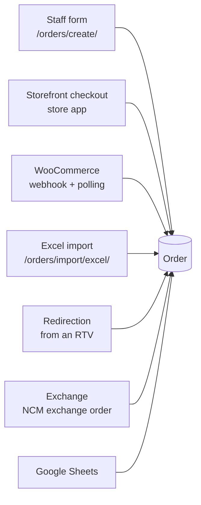
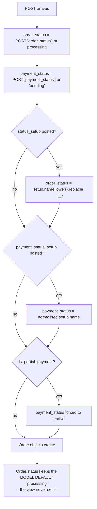

# 08 — Creating, Editing & Bulk Actions

How orders enter the system, how they are changed, and what the bulk operations really do.

---

## Where orders come from

| Source | Entry point | Notes |
|---|---|---|
| Staff form | `order_create` — `views.py:3349` | The main path |
| Storefront | `store/views.py:610`, `:802` | Creates a **`store.Order`**, and separately a dashboard order via `_create_dashboard_order` |
| WooCommerce | `integrations/views.py:18` + `manage.py sync_woocommerce_orders` | Creates a `store.Order` — [27](./27-sheets-and-woocommerce.md) |
| Excel import | `import_orders_excel` — `views.py:8593` | Bulk |
| Redirection | `redirect_order_save` — `views.py:6482` | [14](./14-rtv-and-redirection.md) |
| Exchange | `create_exchange_order_view` — `views.py:24010` | Creates orders **at NCM**, not locally |

---

## Creating an order

**Purpose** — The main order-entry form.
**URL** `/orders/create/` · **name** `order_create` · **view** `dashboard/views.py:3349`
**Template** `dashboard/templates/order_create.html`
**Permission** `@permission_required('can_create_orders')`

Supports both a normal form POST and an AJAX submit (`_ajax=1`, `views.py:3352-3356`,
JSON reply at `:3679-3681`). The whole POST body runs inside `transaction.atomic()`
(`:3359`).

### Validation — `views.py:3443-3462`

Required: Customer Name, Phone, Branch/City, Shipping Address, Created By, IN/OUT.
Additionally:

- `created_by` must resolve to a real `User` (`:3464-3471`)
- the cart must be non-empty (`:3517-3521`)
- all money fields are coerced with `Decimal()` and an `InvalidOperation` fallback
  (`:3413-3440`), then passed through `safe_decimal()` (`:3524-3527`)

### Side records created along the way

| Record | How | Line |
|---|---|---|
| `City` | `get_or_create`, with `valley_status` derived from `in_out` | `:3474-3488` |
| `Customer` | `get_or_create(phone=…)`, then fields overwritten with what was typed | `:3490-3505` |
| `OrderItem` rows | One per cart line | `:3601-3646` |
| `OrderActivityLog` `city_detected` | Records the valley detection | `:3650-3655` |
| `FollowUp` → `Converted` + a `FollowUpLog` | If the order came from a CRM lead | `:3657-3672` |
| `OrderActivityLog` `created` | Written by the `post_save` signal, not by the view | `dashboard/signals.py` |

### VAT / PAN — and the Landmark box that is no longer there

The customer block's Landmark input was replaced by **VAT / PAN** (Sep 2026): the buyer's own
tax number, `Order.vat_pan`, asked for only when they want a billable invoice. It prints
through the whitelisted `customer.vat_pan` invoice token, so Setup → Invoice Customizer can
rename, move or switch the line off like any other
([22](./22-settings-and-setup.md#invoice-customizer)).

`Order.landmark` **stays** — NCM payloads, the dispatch sheet and the CSV export all still
print it. Two rules stop the dropped box from destroying it:

| Rule | Where | Why |
|---|---|---|
| `order.landmark = request.POST.get("landmark", order.landmark or "")` | `order_edit` | An ordinary save now omits the key entirely; with a `""` default every edit would erase a landmark the courier is still using |
| `if landmark: customer.landmark = landmark` | `order_create`, `order_edit` | The same protection for the denormalised `Customer` copy |

Other callers — the Excel import, the redirection flow — still post a landmark, which is why
the field is read defensively rather than removed.

The phone lookup (`search_customer_by_phone`, `/api/search-customer-by-phone/`) prefills the
number, with a fallback: a VAT/PAN belongs to the **buyer**, not to one order, and most of a
returning business customer's orders will not carry it — so when the most recent order has
none, the lookup hands back the most recent order that does.

### Initial statuses — `views.py:3372-3411`, `:3530-3533`

> **Note.** `order_create` sets `order_status` but **never sets `Order.status`**, so `status`
> keeps its model default `'processing'` (`dashboard/models.py:383`). For a brand-new order
> the two happen to agree. `sync_order_status_setup(order)` runs at `:3598` and reconciles
> the `Setup` FK. See [07](./07-order-statuses.md).

### The order-number race — `views.py:3539-3587`

`_get_next_order_number()` (`views.py:212-227`) is a read-then-write over
`MAX(CAST(SUBSTR(order_number, 2) AS int))`, so two simultaneous submissions can pick the
same number. Creation is therefore wrapped in a retry loop:

- up to **5 attempts**
- each inside its own nested `atomic()` savepoint
- catching `IntegrityError` on the unique `order_number` constraint
- recomputing the number on each retry

On success the view redirects to `orders_list` (`:3684`).

### ⚠️ Stock is **not** reserved here

`inventory.services.allocate_order()` is called **only from the storefront**
(`store/views.py:610-611` checkout, `:802-803` buy-now), and only when
`order_type == 'confirmed'`. It operates on `store.models.Order`.

**A dashboard-created order reserves nothing and deducts nothing.** Real stock deduction for
dashboard orders happens later, at the **barcode dispatch scan**
(`views.py:9866` `dispatch_management`, deduction around `:10100-10154`).

See [17 — Inventory & stock](./17-inventory-and-stock.md).

---

## Editing an order

**Purpose** — Change any field on an existing order.
**URL** `/orders/<int:order_id>/edit/` · **name** `order_edit` · **view** `dashboard/views.py:4382`
**Template** `dashboard/templates/order_edit.html`
**Permission** `@permission_required('can_edit_orders')`

Status changes here go through `apply_manual_status()` (`views.py:4449`) — the same helper
the detail page uses — so an edit **stamps a manual hold**.

| Condition | Effect | Line |
|---|---|---|
| A `status_setup` was posted | `apply_manual_status(...)`, hold stamped | `:4449` |
| No setup posted | `order_status = order_status or 'processing'`, **no hold** | `:4454` |
| Status moves **away from** `dispatched` | `restore_order_stock()` + `_invalidate_dispatch_items()` | `:4468-4477` |

`restore_order_stock()` is guarded (`inventory/services.py:380-387`): it refuses unless a
`DispatchItem` with `dispatch_status='success'` exists, unless called with `force=True`.
That prevents "restoring" stock that was never deducted.

---

## Bulk actions

**URL** `/orders/bulk-action/` · **name** `orders_bulk_action` · **view** `dashboard/views.py:9192`
**Guard** `@login_required` only

Submitted from the orders-list form at `orders_list.html:220`. The action value determines
the branch.

### The Setup-driven actions — **use these**

| Action value | Effect | Line |
|---|---|---|
| `status_setup_<id>` | `apply_manual_status()` per order → writes all three status fields, **stamps a hold** | `:9264-9265` |
| `payment_status_setup_<id>` | Sets `payment_status_setup` + `payment_status` | `:9309-9331` |

Side effects mirror the detail page: `delivered_at` stamped (`:9268-9269`), stock restored
when leaving `dispatched` (`:9272-9283`), reservations released on cancel (`:9286-9292`).

These options are generated from live `Setup` rows (`views.py:3281-3288`), so the dropdown
always matches the configured statuses.

### The legacy actions — ⚠️ **avoid**

| Action | Line | What it writes |
|---|---|---|
| `mark_delivered` | `:9336` | `order_status = 'delivered'` |
| `mark_cancelled` | `:9358` | raw `.update(order_status='cancelled')` |
| `mark_processing` | `:9372` | `order_status = 'processing'` |
| `mark_shipped` | `:9386` | `order_status = 'shipped'` |
| `mark_paid` | `:9400` | `payment_status = 'paid'` |
| `mark_pending` | `:9414` | `payment_status = 'pending'` |

All six bypass `apply_manual_status`. They write **only** `order_status`, leave `status` and
`status_setup` untouched, and set **no manual hold**. Consequences:

- the order-detail badge (which reads the FK) will disagree with the list
- the next NCM sync can silently revert the change
- `mark_cancelled` uses a queryset `.update()`, so `Order.save()` — and therefore decimal
  validation — never runs

### `print_invoices`

Redirects to `/orders/bulk-invoice/?ids=…` — one sheet holding every selected order's invoice
([05](./05-orders-list.md#bulk-invoice-printing)). The orders list normally intercepts the
action in JavaScript and opens the sheet in a new tab; this branch is the fallback for a
browser that did not run it.

### Delete

`views.py:9219-9250`. For each selected order:

- if it was `dispatched` → `restore_order_stock()` and set `order_status='cancelled'` (`:9230`)
- otherwise → `release_order_reservations()`
- then a bulk `.update(is_deleted=True, deleted_at=…)`

This is a **soft** delete. Rows remain and are visible in the trash.

---

## Trash and restore

| Page / action | URL | View | Permission |
|---|---|---|---|
| Orders trash | `/orders/trash/` | `orders_trash` | `can_view_orders` |
| Move to trash | `/orders/<id>/move-to-trash/` | `order_move_to_trash` (`views.py:4928`) | `can_delete_orders` |
| Restore | `/orders/<id>/restore/` | `order_restore` | `can_delete_orders` |
| Permanent delete | `/orders/<id>/permanent-delete/` | `order_permanent_delete` | `can_delete_orders` |
| Trash bulk action | `/orders/trash/bulk-action/` | `orders_trash_bulk_action` | `can_delete_orders` |
| Empty trash | `/orders/trash/empty/` | `empty_orders_trash` | `can_delete_orders` |

Moving a dispatched order to trash restores its stock and sets `order_status='cancelled'`
(`views.py:4939`). Hard delete (`order_delete`, `views.py:4873`) restores stock first
(`:4883-4885`) and then actually removes the row.

---

## Excel import

**URL** `/orders/import/excel/` · **name** `import_orders_excel` · **view** `dashboard/views.py:8593`
**Guard** `@login_required`

Uploaded from the modal at `orders_list.html:2709`.

| Step | Line |
|---|---|
| Resolve defaults from `Setup(is_default=True)` | `:8764-8765` |
| `default_order_status = default_status_setup.name … or 'processing'` | `:8769` |
| Per-row status override, if the sheet supplies one | `:8865-8883` |
| `Order` created | `:8932-8936` |

Import does **not** stamp manual holds, so imported statuses are subject to the next sync
like any other automatically-written status.

---

## Excel export

| Action | URL | View | Permission |
|---|---|---|---|
| Export selected orders | `/orders/export/selected/` | `export_selected_orders_excel` | `@login_required` |
| Export one order's details | `/orders/<id>/export/` | `export_order_details` | `can_export_data` |

---

## Duplicate detection

`check_duplicate_order` — `/api/check-duplicate-order/` (`dashboard/urls.py:273`). Called
from the create form to warn about a customer who already has a recent order.

Related order-search APIs: `/api/search-orders/`, `/api/order-by-barcode/`.

---

## Gotchas

- **`order_create` does not set `Order.status`.** It relies on the model default.
- **`order_create` does not reserve stock.** Only the storefront does.
- **The order number can race.** The 5-attempt retry loop is load-bearing — don't remove it.
- **Legacy bulk actions leave the three status fields out of sync** and set no hold.
- `orders_bulk_action` is guarded by `@login_required` **only** — any logged-in user can
  bulk-change orders. The individual permission checks live inside the branches.
- `orders_bulk_ncm_send` and `send_single_order_to_ncm` **used to be defined twice**, and the
  dead first copy had been collecting fixes since February. Merged and deleted Sep 2026; the
  surviving `orders_bulk_ncm_send` (`views.py:14730`) now carries
  `@permission_required('can_create_ncm_orders')`, which only the dead copy had.
  `orders_bulk_pnd_send` (`views.py:20931`) still has **no login decorator at all**. See
  [A4](./A4-appendix-known-quirks.md).
- Editing an order's non-status fields does **not** stamp a hold — `apply_manual_status`
  no-ops when the normalised status is unchanged, which is deliberate.

---

## Files that own this

- `dashboard/views.py:3349-3749` — `order_create`
- `dashboard/views.py:4382-…` — `order_edit`
- `dashboard/views.py:9192-9425` — `orders_bulk_action`
- `dashboard/views.py:8593-…` — `import_orders_excel`
- `dashboard/views.py:212-227` — `_get_next_order_number`
- `services/status_override.py` — `apply_manual_status`
- `inventory/services.py` — reservation and restock helpers
- `dashboard/urls.py:72-86` — the routes
