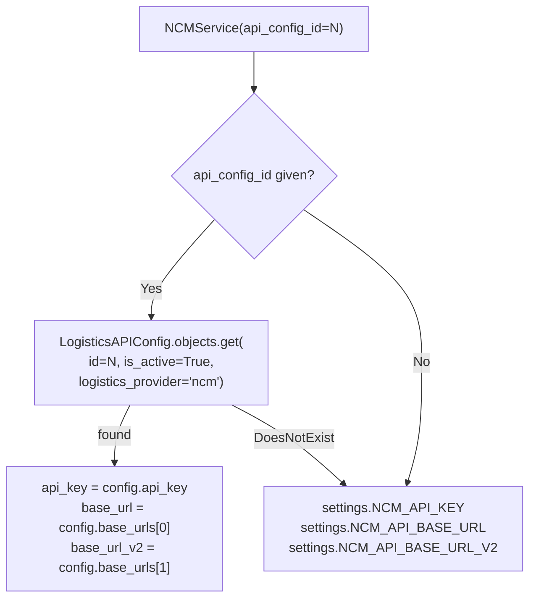
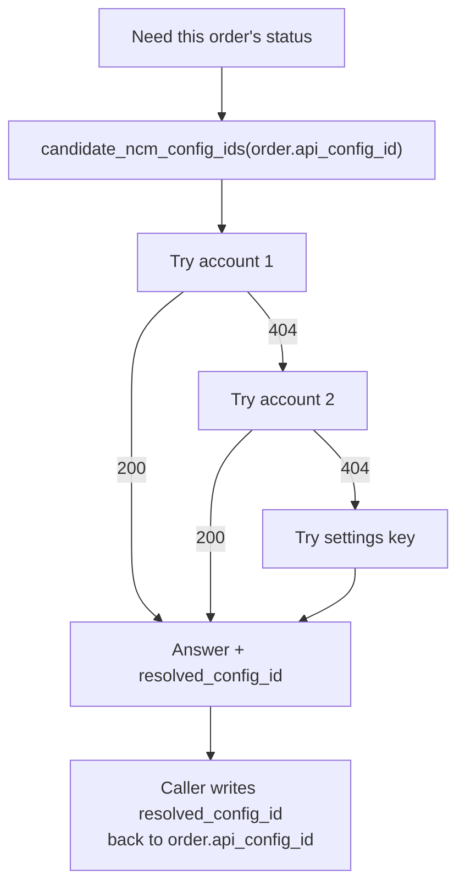

# 09 — NCM API Client

Everything about talking to Nepal Can Move. This chapter covers the client itself; the
three chapters after it cover sending ([10](./10-ncm-sending.md)), receiving
([11](./11-ncm-webhook.md)) and syncing ([12](./12-ncm-sync-and-scheduler.md)).

**File** `services/ncm_service.py` (1,283 lines) · **Class** `NCMService`

---

## Where credentials come from



`NCMService.__init__` — `services/ncm_service.py:22-46`.

| Source | Detail |
|---|---|
| **Database (preferred)** | `LogisticsAPIConfig` row (`dashboard/models.py:1540`). `get_primary_base_url()` → `base_urls[0]`, `get_base_url_v2()` → `base_urls[1]` |
| **Settings fallback** | `NCM_API_KEY`, `NCM_API_BASE_URL`, `NCM_API_BASE_URL_V2` — `myproject/settings.py:243-246` |

The DB path is what makes **multiple NCM accounts** possible. Each `Order` remembers which
one it was sent on via `Order.api_config`.

Typical base URLs:

```
v1: https://portal.nepalcanmove.com/api/v1
v2: https://portal.nepalcanmove.com/api/v2
```

Both v1 and v2 are in active use — different endpoints live on different versions.

### Auth header — `ncm_service.py:38-41`

```python
{'Authorization': f'Token {self.api_key}', 'Content-Type': 'application/json'}
```

Capital `Token`, single value. (Pick and Drop uses a different scheme — see
[13](./13-pick-and-drop.md).)

### Timeout — `_resolve_timeout()` `ncm_service.py:48-56`

Read from `APISettings.get_settings().ncm_api_timeout` (default **30s**), cached per service
instance, falling back to `30` on any exception. So an admin can raise the timeout at
*Settings → API Sync Settings* without a deploy.

---

## Transport, retries and error handling

`_make_request()` — `ncm_service.py:58-127`. Only `GET` and `POST` are supported
(`:77-80`).

### The retry policy

```python
can_retry = _retry and method == 'GET'
```
`ncm_service.py:74`.

> **POSTs are never auto-retried.** A retried `create_order` would produce a duplicate
> shipment. Documented at `ncm_service.py:63-68`.

A `GET` retries **exactly once** on:

| Condition | Line |
|---|---|
| A 200 response whose body isn't JSON | `:85-91` |
| `requests.Timeout` | `:93-98` |
| `requests.ConnectionError` | `:100-105` |
| HTTP 5xx | `:117-119` |

A 404 is downgraded to a `logger.warning` rather than an error (`:111-112`) — it is a normal
answer for "this order isn't on this account".

### The response envelope

Every method returns the same shape:

```python
# success
{'success': True,  'data': <parsed json>, 'status_code': 200}
# failure
{'success': False, 'error': '<str or dict>', 'status_code': 404}
```

Callers always check `result['success']` before touching `result['data']`.

---

## Endpoint reference

`{v1}` and `{v2}` are the two configured base URLs.

### Orders

| Method | HTTP | URL | Params / body | Line |
|---|---|---|---|---|
| `create_order(data)` | POST | `{v1}/order/create` | JSON body — see [10](./10-ncm-sending.md) | `:191` |
| `get_order_details(id)` | GET | `{v1}/order` | `?id=` | `:229` |
| `get_order_status(id)` | GET | `{v1}/order/status` | `?id=` — returns the **status timeline** | `:235` |
| `get_bulk_order_statuses(ids)` | POST | `{v1}/orders/statuses` | `{'orders': [ids]}` — returns only bare status strings | `:241` |

### Comments

| Method | HTTP | URL | Notes | Line |
|---|---|---|---|---|
| `_fetch_comments(id)` | GET | `{v2}/order/comment` → falls back to `{v1}/order/comment` | **404 means "no comments"** and is returned as `[]` | `:129` |
| `_post_comment(id, text)` | POST | `{v2}/order/comment` → falls back to `{v1}/comment` | `{'orderid':…, 'comments':…}` | `:168` |
| `get_staff_comments(id)` | | | Wrapper | `:247` |
| `get_order_comments(id)` | | | Wrapper | `:272` |
| `create_order_comment(id, text)` | | | Wrapper | `:295` |

### Reference data

| Method | HTTP | URL | Params | Line |
|---|---|---|---|---|
| `get_branches()` | GET | `{v2}/branches` | — | `:176` |
| `get_shipping_rate(from, to, type)` | GET | `{v1}/shipping-rate` | `?creation=&destination=&type=` (default `Door2Door`) | `:181` |

### Vendor / RTV

| Method | HTTP | URL | Notes | Line |
|---|---|---|---|---|
| `get_vendor_rtvs_by_status()` | GET | `{v2}/vendor/orders` | Fetches 4 statuses in parallel + 3 recent pages | `:299` |
| `get_vendor_rtvs()` | GET | `{v2}/vendor/orders` | Paginated, early-exits after 3 empty pages | `:393` |
| `get_vendor_rtvs_parallel()` | GET | `{v2}/vendor/orders` | Shared `requests.Session`, `page_size=100` (**NCM's hard cap**, `:488`), up to 300 workers | `:472` |
| `return_order(id, comment)` | POST | `{v2}/vendor/order/return` | `{'pk': id, 'comment': …}` | `:546` |
| `create_exchange_order(id)` | POST | `{v2}/vendor/order/exchange-create` | `{'pk': id}` → returns `cust_order`, `ven_order` | `:554` |

The statuses queried by `get_vendor_rtvs_by_status` are
`['Arrived', 'Dispatched', 'Sent to Vendor', 'Returned to Warehouse']` (`:316`).

### Webhook registration

| Method | HTTP | URL | Line |
|---|---|---|---|
| `set_webhook_url(url)` | POST | `{v2}/vendor/webhook` | `:569` |
| `test_webhook(url)` | POST | `{v2}/vendor/webhook/test` | `:575` |

Driven by `manage.py setup_ncm_webhook --domain https://… [--test]`.

---

## Multi-account resolution — the 404 problem

**NCM returns 404 for an order queried with the wrong account key.** With several accounts
configured, "order not found" is ambiguous: it may exist on a different account.

Three module-level helpers solve this (`ncm_service.py:1105-1283`):

| Helper | Line | Does |
|---|---|---|
| `candidate_ncm_config_ids(preferred)` | `:1162` | Ordered, de-duplicated-by-API-key list of accounts to try. `None` in the list means "the settings key" |
| `fetch_order_status_raw(...)` | `:1200` | Sweeps the candidates until one answers. Returns `(result, resolved_config_id)` |
| `fetch_order_status_history(...)` | `:1262` | Same, for the timeline. Returns `(entries, resolved_config_id, error)` |



Callers **persist `resolved_config_id` back onto the order**, so the next sync goes straight
to the right account. See `ncm/realtime_api.py:254-259`.

De-duplication is **by API key**, not by config id — two config rows sharing a key would
otherwise double every sweep.

---

## Response normalisation

NCM answers the same question in several shapes. `normalize_status_entries(raw)`
(`ncm_service.py:1105-1159`) accepts all of them:

- a bare list
- `{"data": [...]}`
- `{"results": [...]}`
- a lone dict

and emits a uniform list of
`{'status', 'timestamp', 'timestamp_display', 'remarks'}`, sorted newest-first with
undated rows sinking to the bottom.

**Timestamps.** `parse_ncm_datetime` (`dashboard/timezone_utils.py:154`) handles NCM's
ISO-8601-with-Nepal-offset form (`2026-02-20T11:19:53.209447+05:45`) as well as the `Z` form
its webhook docs show. Aware values are never re-localised; naive values are read as Nepal
wall-clock. Out-of-range values return `None`.

---

## Status interpretation

These live on `NCMService` but are documented in full in
[07 — Order statuses](./07-order-statuses.md):

| Member | Line | Purpose |
|---|---|---|
| `map_ncm_status_to_system(s)` | `:638` | Raw NCM status → system status |
| `RETURN_STATUS_KEYWORDS` | `:596` | `('return', 'rtv', 'sent to vendor')` |
| `RETURN_COMPLETED_STATUSES` | `:608` | Texts meaning "the return is finished" |
| `COMPLETED_RETURN_SYSTEM_STATUSES` | `:619` | `('return', 'returned')` |
| `is_return_completed(s)` | `:621` | Prefix match, so branch-qualified variants still count |
| `parse_vendor_return(v)` | `:684` | NCM sends this as the **string** `'True'`/`'False'` |
| `resolve_delivered_status(entry)` | `:694` | Disambiguates delivery-to-customer from delivery-to-vendor |
| `sync_order_status_fields(...)` | `:960` | The single writer of all status fields |
| `_resolve_setup(type, value)` | `:1031` | Finds or creates the matching `Setup` row |

RTV date helpers (`extract_rtv_marked_at` `:769`, `extract_return_step_time` `:856`,
`apply_rtv_marked_at` `:903`) are covered in
[14 — RTV & redirection](./14-rtv-and-redirection.md).

---

## Phone cleaning

`_clean_phone(phone)` — `ncm_service.py:581-586`. Strips everything but digits before the
number goes to NCM. `create_order` refuses to proceed if the number is empty after cleaning
(`:207-209`).

---

## NCM-related permissions

`accounts/models.py:156-165`, enforced by `ncm_permission_required` (`ncm/views.py:43`):

| Flag | Gates |
|---|---|
| `can_view_ncm_orders` | NCM order pages, tracking |
| `can_create_ncm_orders` | Sending an order to NCM |
| `can_edit_ncm_orders` | Editing NCM details |
| `can_delete_ncm_orders` | Deleting |
| `can_sync_ncm_orders` | Manual and bulk sync |
| `can_view_ncm_branches` / `can_manage_ncm_branches` | Branch list |
| `can_view_ncm_bulk_logs` / `can_manage_ncm_bulk_logs` | Bulk send logs |
| `can_view_ncm_trash` | NCM order trash |

AJAX endpoints check inline instead of using the decorator (`ncm/views.py:595-603`,
`ncm/realtime_api.py:431-433`) so a refusal is JSON, not an HTML redirect. See
[03](./03-auth-roles-permissions.md).

---

## Where NCM data is stored

There is **no `NCMOrder` model and no `NCMConfig` model.**

| Data | Lives in |
|---|---|
| NCM order id, status, branches, delivery type | Columns on `dashboard.Order` (`models.py:477-537`) |
| API credentials and base URLs | `dashboard.LogisticsAPIConfig` |
| Sync cadence and scheduler lock | `dashboard.APISettings` |
| Bulk send batches | `ncm.NCMBulkLog` / `NCMBulkLogOrder` / `NCMBulkLogDetail` |
| Inbound webhooks | `ncm.WebhookLog` |
| Status history | **Not persisted.** Fetched live via `fetch_order_status_history`. The persisted trace is `OrderActivityLog` rows with `field_name='ncm_status'` and `event_at` set |
| RTV records | `dashboard.RTVOrder` |

---

## Files that own this

- `services/ncm_service.py` — the client, the mapping, the multi-account helpers
- `dashboard/models.py:1540-1579` — `LogisticsAPIConfig`
- `dashboard/models.py:2083-2157` — `APISettings`
- `dashboard/timezone_utils.py:154` — `parse_ncm_datetime`
- `myproject/settings.py:243-251` — NCM settings
- `ncm/views.py:43` — `ncm_permission_required`
