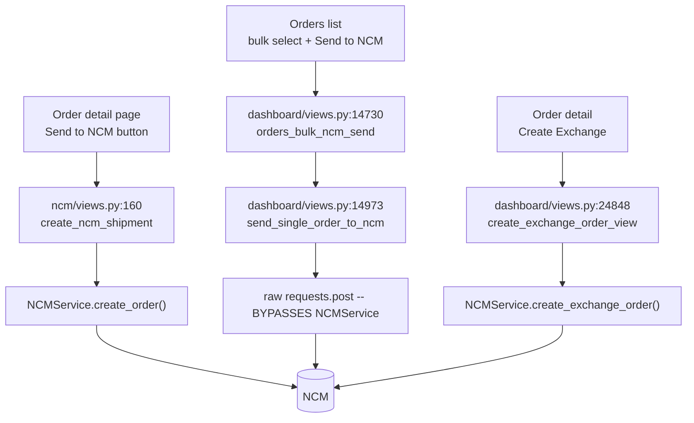

# 10 — Sending Orders to NCM

How an order leaves this system and becomes an NCM shipment.

---

## Three send paths

> ⚠️ **The single-send and bulk-send paths are two different implementations of the same
> operation.** They differ in field truncation, in the type of `cod_charge`, and in how the
> destination branch is chosen. Detailed below and recorded in
> [A4](./A4-appendix-known-quirks.md).

---

## Path 1 — Sending one order

**Purpose** — Hand a single order to NCM from the order detail page.
**URL** `/ncm/orders/<int:order_id>/create/` · **name** `ncm:create_shipment`
**View** `ncm/views.py:160` · **Method** POST only
**Permission** `@ncm_permission_required('can_create_ncm_orders')`
**Triggered from** `dashboard/templates/order_detail.html:749`

### Pre-flight checks

Each failure adds a Django message and redirects back to the order.

| Check | Line |
|---|---|
| Order does not already have an `ncm_order_id` | `:165` |
| `order.logistics == 'ncm'` | `:169` |
| Customer name, phone and shipping address are all present | `:173` |
| A destination branch **code and name** were posted | `:178-183` |
| Both validated against a live `get_branches()` call | `:192-213` |
| Customer name is at least 2 characters | `:216-219` |

Branch validation is a real API round-trip before the send. If `get_branches()` itself
fails, the send proceeds with a warning rather than blocking (`:211-213`).

### The payload — `ncm/views.py:229-245`

| NCM field | Source | Notes |
|---|---|---|
| `name` | `order.customer_name` | **The customer's name**, not the staff member's. The comment at `:226` exists because this was once wrong |
| `phone` | `order.customer_phone` | Digits-only via `_clean_phone` (`ncm_service.py:581`). The bulk path cleans it the same way |
| `phone2` | `order.customer.alternate_phone` | Only if present (`:244-245`) |
| `cod_charge` | `str(order.amount_due)` | **`amount_due`, not `total_amount`** — see below |
| `address` | `order.shipping_address` | |
| `fbranch` | `order.ncm_from_branch or 'TINKUNE'` | Origin branch (`:223`) |
| `branch` | POSTed `ncm_branch_name` | Destination branch **name**, uppercased |
| `package` | `_get_package_description(order)` | First 3 items as `"{qty}x {name} ({variation})"`, then "and N more" (`ncm/views.py:662-684`) |
| `vref_id` | `order.order_number` | Our reference, so NCM's records tie back |
| `instruction` | `order.notes` | |
| `delivery_type` | `order.ncm_delivery_type` | Default `Door2Door` |
| `weight` | `str(order.package_weight)` | |

> **`cod_charge` uses `Order.amount_due`** (`dashboard/models.py:539`). For a partially-paid
> order that is `remaining_amount`, not the gross total — otherwise the courier would collect
> money the customer has already paid.

`NCMService.create_order` validates the required set again on its own side:
`['name', 'phone', 'cod_charge', 'address', 'fbranch', 'branch']` (`ncm_service.py:196`).

### What happens on success — `ncm/views.py:254-284`

```mermaid
sequenceDiagram
    participant V as create_ncm_shipment
    participant N as NCM API
    participant O as Order

    V->>N: POST /order/create
    N-->>V: {"orderid": 123456}
    V->>O: ncm_order_id = 123456<br/>ncm_status = "Order Created"<br/>ncm_created_at = now<br/>ncm_destination_branch = branch<br/>status = "processing"<br/>clear manual hold
    V->>N: GET /order/status?id=123456
    N-->>V: [{status: "Pickup Order Created", ...}]
    V->>O: ncm_status = "Pickup Order Created"<br/>status fields -> "Pickup Created"
    V->>O: OrderActivityLog(action_type='updated', field_name='ncm_integration')
```

| Step | Line | Detail |
|---|---|---|
| Read the new id | `:255` | `result['data'].get('orderid')` |
| Write NCM fields | `:257-261` | `ncm_status` is set to the placeholder `'Order Created'` |
| Clear any manual hold | `:264` | A fresh NCM order restarts the parcel's lifecycle, so a hold from before the handover no longer applies |
| **Immediately re-read the real status** | `:267-284` | `get_order_status()` → `resolve_delivered_status()` → `sync_order_status_fields()` |
| Stamp `delivered_at` | `:277-281` | Only if the first status is somehow already `delivered` |
| Write the activity log | `:286-293` | Records the NCM order id |

> **Why the immediate re-read.** NCM's create response does not carry a status, and
> `'Order Created'` is not a real NCM status — it would sit in the UI looking wrong. The
> second call fetches the true first status (normally `Pickup Order Created`, which maps to
> the system status `Pickup Created`).

### Failure

The error message from NCM is surfaced to the user, and the full payload plus URL is written
to `logs/ncm_integration.log` (`:297-301`). Nothing on the order is changed, so the send can
simply be retried.

---

## Path 2 — Bulk send

**Purpose** — Send many selected orders in one batch, with progress, cancel and resume.
**URL** `/orders/bulk-ncm-send/` · **name** `orders_bulk_ncm_send`
**View** `dashboard/views.py:14730` · **Triggered from** `orders_list.html:548`

### The batch record

An `NCMBulkLog` is created up front (`views.py:14676-14691`) — see
[the model reference](#the-bulk-log-models) below. Two fields exist purely so a batch can
survive its worker dying:

- **`selected_order_ids`** — the orders the batch was asked to send, captured **before the
  first API call**. Without it, a dead batch would know only *how many* orders it owed.
- **`send_options`** — the parameters that only ever lived in the POST body: which API
  account, the fallback weight, whether to stamp `order.logistics`. A resume must reproduce
  them or the rest of the batch goes out on the wrong account.

### Cooperative control — `dashboard/bulk_batch.py`

| Mechanism | Field | How |
|---|---|---|
| Cancel | `cancel_requested` | The send loop reads it between orders and stops. There is no way to kill the worker outright |
| Liveness | `worker_heartbeat_at` | A `processing` batch with a stale or null heartbeat is **stalled**, not running |

Endpoints: `/logistics/bulk-logs/progress/` (JSON poller),
`/logistics/bulk-logs/<provider>/<log_id>/terminate/`, and `/resume/`.

### The worker — `send_single_order_to_ncm` `dashboard/views.py:14973-15296`

> ⚠️ **This path does not use `NCMService`.** It issues a raw `requests.post`
> (`:14979-14987`) to `{base_url}/order/create` with `Authorization: Token {api_key}` and a
> **hardcoded** `timeout=30`.

Differences from Path 1:

| | Path 1 (single) | Path 2 (bulk) |
|---|---|---|
| Client | `NCMService` | raw `requests.post` |
| Timeout | `APISettings.ncm_api_timeout` | hardcoded 30s |
| `cod_charge` | `str(...)` | `float(...)` |
| Field truncation | none | `name[:50]`, `address[:200]`, `package[:50]`, `instruction[:100]` |
| Destination branch | posted and validated against `get_branches()` | resolved by `ncm/branch_resolver.py` — see below |
| Retry | inherits the client's policy (POST = never) | none |
| Initial `ncm_status` | `'Order Created'`, then re-read | `'Pickup Order Created'` written directly (`:15013`) |

Payload is built at `:14962-14975`.

**Success detection** is by message text, not status code:
`data.get('Message') == 'Order Successfully Created'` (`:15002`), with the id at
`data.get('orderid')` (`:15003`).

**What it stores** (`:15013-15036`): `ncm_order_id`, `ncm_status`, `ncm_created_at`,
`ncm_from_branch`, `ncm_delivery_type`, `ncm_destination_branch`, `api_config`, and the
order status set to the `Setup` row named "Pickup Created".

**Error branches**, each producing a distinct `NCMBulkLogOrder` message: 400 validation,
401 auth, 404, timeout, connection error. That message is shown in the **Reason** column of
the expanded batch row on the Bulk Logs page — for a long time it was recorded and rendered
nowhere, so a failed batch was a red badge with no explanation anywhere in the UI.

### The destination branch — `ncm/branch_resolver.py`

> ⚠️ **NCM's `branch` is the name of one of its own branches, not a city and not a
> district.** The bulk path used to post `order.branch_city.upper()`, defaulting to the
> literal string `'KATHMANDU'`. That is a district; the valley's branches are TINKUNE,
> CHABAHIL, KALANKI… so a batch of valley orders was rejected by NCM once per order, and
> **Resume failed identically**, because nothing about the orders had changed.

An order does not necessarily carry a branch name:

| Order came from | `ncm_destination_branch` | `branch_city` |
|---|---|---|
| Storefront (`store/views.py::_place_order`) | the branch **code** the shopper picked | the **district** |
| Dashboard order form | blank | a `NEPAL_CITIES` choice — "Kathmandu", "Other" |
| A previous single send | the validated branch **name** | unchanged |

`branch_resolver.resolve(order, catalogue)` tries `ncm_destination_branch` then
`branch_city`, against branch names, then branch codes, then a district that has exactly one
branch. It returns `(name, None)` or `(None, reason)`; the sender turns a reason into a
failed order without spending an HTTP call, and the reason names the value and lists the
branches that district actually has.

`catalogue()` caches NCM's ~630 branches for 12 hours, keyed by API account. It is built
**once per batch** and handed to every order — both by `orders_bulk_ncm_send` and by
`bulk_batch`'s resume adapter (`prepare()`) — because NCM rate-limits at 3 requests a
second. A catalogue that could not be fetched is falsy, and resolution then passes the
order's own value straight through: a courier outage must not block sending.

---

## Path 3 — Exchange orders

**Purpose** — Ask NCM to create a paired exchange shipment for a delivered order.
**URL** `/orders/<int:order_id>/exchange/` · **View** `dashboard/views.py:24848-24939`
**Triggered from** `order_detail.html:3833`

Eligibility (all required):

- the order has an `ncm_order_id`
- `exchange_status != 'created'`
- the order is `delivered` / `confirmed`
- it is **not** an RTV

Calls `NCMService.create_exchange_order(ncm_order_id)` → `POST {v2}/vendor/order/exchange-create`,
which returns `cust_order` and `ven_order`. These are stored as
`ncm_exchange_cust_order` / `ncm_exchange_ven_order`, and `exchange_status` becomes
`'created'` (`dashboard/models.py:535-537`).

---

## The bulk log models

`ncm/models.py`.

### `NCMBulkLog` — `:7-72`

| Field | Notes |
|---|---|
| `batch_number` | Unique, indexed. `NCM-YYYYMMDD-XXXXXX` via `generate_batch_number()` (`:68`) |
| `total_orders`, `success_count`, `failed_count`, `skipped_count` | Counters |
| `status` | `processing` / `completed` / `partial` / `failed` / `cancelled` |
| `from_branch` | Default `TINKUNE` |
| `delivery_type` | Default `Door2Door` |
| `selected_order_ids` | JSON — resume support |
| `send_options` | JSON — resume support |
| `cancel_requested` | Cooperative cancel |
| `worker_heartbeat_at` | Stall detection |
| `created_by`, `created_at`, `completed_at` | |
| `is_deleted`, `deleted_at` | Soft delete |

### `NCMBulkLogOrder` — `:75-113`

One row per order in the batch. Denormalises `order_number`, `customer_name`,
`customer_phone`, `shipping_address`, `cod_amount`, `destination_branch` — so the log stays
readable even if the order is later deleted. `status` is `success` / `failed` / `skipped`;
`ncm_status` defaults to `'Pickup Order Created'`.

### `NCMBulkLogDetail` — `:116-151`

Append-only event log for the batch: `batch_started`, `order_sent`, `order_failed`,
`order_skipped`, `batch_completed`, `status_synced`, `error`. Carries the full
`response_data` JSON — this is where you look when a specific order failed.

### Where to view them

| Page | URL | Permission |
|---|---|---|
| Bulk logs list | `/logistics/bulk-logs/` | `can_view_ncm_bulk_logs` |
| One batch | `/ncm-bulk-logs/<id>/` | `can_view_ncm_bulk_logs` |
| Trash | `/logistics/bulk-logs/trash/` | `can_manage_ncm_bulk_logs` |

---

## Gotchas

- **Two implementations, one operation.** A payload bug fixed in one path is not fixed in
  the other.
- **Bulk send ignores the branch dropdown.** It derives the destination from
  `order.branch_city`, uppercased, defaulting to `KATHMANDU`. An order with a blank or
  misspelled `branch_city` silently goes to the wrong place.
- **`ncm_order_id` is unique.** A retry that succeeds twice would raise `IntegrityError`;
  the pre-flight check at `ncm/views.py:165` is what prevents it.
- **Bulk send's success check is a string comparison** against
  `'Order Successfully Created'`. If NCM ever rewords that message, every send will be
  recorded as a failure while actually succeeding.
- **`'Order Created'` is not a real NCM status.** It is a placeholder that exists for the
  moment between create and the follow-up status read.
- Sending clears any manual status hold — deliberately.
- A batch stuck in `processing` with a stale `worker_heartbeat_at` is dead. Use the
  **resume** endpoint, which is why `selected_order_ids` and `send_options` are stored.

---

## Files that own this

- `ncm/views.py:160-314` — single send
- `dashboard/views.py:14730-14944` — bulk send orchestration
- `dashboard/views.py:14973-15296` — the bulk send worker
- `dashboard/views.py:24848-24939` — exchange orders
- `dashboard/bulk_batch.py` — terminate / resume / heartbeat
- `services/ncm_service.py:191-227` — `create_order`
- `ncm/models.py` — the bulk log models
- `ncm/views.py:662-684` — `_get_package_description`
- `ncm/branch_resolver.py` — mapping an order onto an NCM branch
- `test_ncm_bulk_branch.py` — verification for that mapping and the bulk worker
