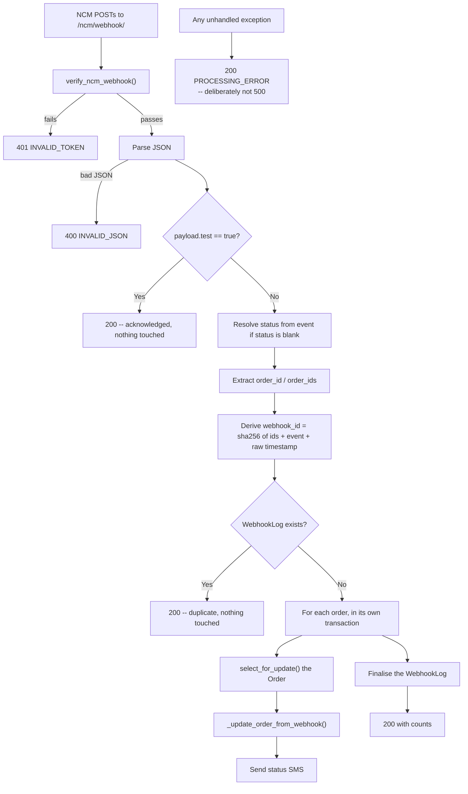

# 11 — Receiving from NCM: The Webhook

How NCM pushes status changes into this system.

**URL** `/ncm/webhook/` · **name** `ncm:webhook` · **View** `ncm/views.py:418`
**Method** POST only · **Decorators** `@csrf_exempt @require_POST`
**Auth** No login required — see below
**Handler** `ncm/webhook_handler.py` → `NCMWebhookHandler.process_webhook`

---

## The flow



---

## Authentication — there is **no HMAC**

> ⚠️ **This is the most commonly mis-documented part of the system.** Older project
> documentation describes HMAC-SHA256 verification via an `X-NCM-Signature` header. That is
> not what the code does, and `WebhookLog.signature` is never written.

`verify_ncm_webhook(request, payload_bytes)` — `ncm/views.py:73-99`:

| Check | Behaviour |
|---|---|
| **User-Agent** | If present and it does not contain `NCM-Webhook`, a **warning is logged** — the request is **not** rejected (`:85-87`) |
| **Token** | If **both** `settings.NCM_WEBHOOK_SECRET` **and** a `?token=` query param are present, they are compared with `hmac.compare_digest` (`:93-97`) |
| Everything else | Passes |

So the endpoint is effectively open unless **both** halves of the token check are in place:
the secret must be configured **and** the registered webhook URL must carry `?token=`.

```
https://office.example.com/ncm/webhook/?token=<NCM_WEBHOOK_SECRET>
```

A second, currently-unused implementation of the same logic lives at
`ncm/webhook_handler.py:114-130`.

**CSRF is exempt by necessity** — NCM cannot supply a Django CSRF token. Do not add CSRF
protection back to this endpoint.

---

## Status codes it returns

| Situation | Status | `error_code` |
|---|---|---|
| Processed successfully | 200 | — |
| Test webhook | 200 | — |
| Duplicate (already processed) | 200 | — |
| Token mismatch | **401** | `INVALID_TOKEN` |
| Malformed JSON | **400** | `INVALID_JSON` |
| **Any other exception** | **200** | `PROCESSING_ERROR` |

> **Why an error returns 200.** A 500 can make NCM consider delivery failed, retry
> aggressively, and eventually flag or disable the endpoint. Acknowledging receipt while
> recording the failure in `WebhookLog` and `logs/ncm_webhooks.log` is the safer trade
> (`ncm/views.py:476-488`).

---

## Payload shapes — `ncm/webhook_handler.py:132-161`

**Single order**
```json
{"order_id": "123456", "status": "Delivered",
 "timestamp": "2024-01-15T10:30:00Z", "event": "delivery_completed"}
```

**Bulk**
```json
{"order_ids": ["123456", "123457"], "status": "Dispatched",
 "timestamp": "2024-01-15T10:30:00Z", "event": "order_dispatched"}
```

**Test**
```json
{"event": "order.status.changed", "order_id": "TEST-123456",
 "status": "In Transit", "timestamp": "...", "test": true}
```

A payload with `test: true` short-circuits with an acknowledgement and touches nothing
(`:176-182`).

### Filling in a missing status

If `status` is empty but `event` is present, the status is resolved from `EVENT_TO_STATUS`
(`:43-50`, applied at `:185-187`):

| Event | Status |
|---|---|
| `pickup_completed` | `Pickup Complete` |
| `sent_for_delivery` | `Sent for Delivery` |
| `order_dispatched` | `Dispatched` |
| `order_arrived` | `Arrived` |
| `delivery_completed` | `Delivered` |
| `order_marked_rtv` | `Order Marked Return` |

Missing order ids or a still-blank status raise `ValueError` (`:196-200`), which the outer
handler turns into a recorded failure.

### What NCM does **not** push

The first five events above are NCM's **complete documented list**. NCM documents **no
return/RTV events at all**. `order_marked_rtv` was added from observed production traffic,
and the later RTV steps — `Sent to Vendor`, the final RTV `Delivered` — are believed never
to be pushed.

> **This is why the order-detail page pulls status on every load** (see
> [06](./06-order-detail.md)) rather than waiting for a push that may never arrive. The
> comment block at `ncm/webhook_handler.py:26-42` records this reasoning.

---

## Idempotency — `WebhookLog`

**NCM sends no webhook id**, so one is derived by hashing the content
(`ncm/webhook_handler.py:208-210`):

```python
ids_part  = ','.join(sorted(order_ids))
raw_key   = f"{ids_part}|{event}|{timestamp_str}"
webhook_id = hashlib.sha256(raw_key.encode()).hexdigest()
```

Two details matter:

- **SHA-256** keeps the value inside the 100-character column.
- The **raw** timestamp string is hashed, never the parsed value. Normalising it would
  change every `webhook_id` already stored and make past webhooks look new (`:205-207`).

Then:

```python
webhook_log, created = WebhookLog.objects.get_or_create(webhook_id=webhook_id, defaults={...})
if not created:
    return {'status': 'duplicate'}   # nothing is touched
```

Source IP is taken from the first hop of `HTTP_X_FORWARDED_FOR`, else `REMOTE_ADDR`
(`:213-219`).

### The `WebhookLog` model — `ncm/models.py:154-191`

| Field | Notes |
|---|---|
| `webhook_id` | Unique, indexed, max 100 |
| `event` | |
| `status` | `pending` / `processing` / `completed` / `failed` |
| `payload` | JSON — the full body as received |
| `response_data` | JSON — `{updated_count, failed_count}` |
| `updated_orders_count`, `failed_orders_count` | |
| `error_message` | |
| `source_ip` | |
| `signature` | **Declared but never written** |
| `received_at`, `processed_at` | |

Viewable in Django admin (`ncm/admin.py:6-51`, add disabled).

---

## Transaction handling

**Each order gets its own transaction** (`ncm/webhook_handler.py:240-252`):

```python
for ncm_order_id in order_ids:
    with transaction.atomic():
        order = Order.objects.select_for_update().get(
            ncm_order_id=ncm_order_id, is_deleted=False)
        result = self._update_order_from_webhook(order, status, payload, event_at=event_at)
```

- `select_for_update()` takes a row lock, so a concurrent page-load sync cannot interleave.
- One failing order does **not** roll back updates to the others — failures are collected
  into `failed_orders` (`:269-280`).
- `Order.DoesNotExist` is logged as a warning, not an error — a webhook for an order that
  isn't ours is normal on a shared account.

Nested savepoints exist inside for `_record_rtv_marked` (`:448`) and
`NCMService._resolve_setup` (`ncm_service.py:1081`), precisely because they run inside the
caller's transaction.

The `WebhookLog` is then finalised to `completed` with counts (`:283-291`), or to `failed`
with an `error_message` if the outer block raised (`:309-312`).

---

## Updating one order — `_update_order_from_webhook`

`ncm/webhook_handler.py:320-429`.

### Guards, in order

**1. Cancelled orders are never resurrected** (`:334-340`)
A webhook can arrive late or out of order. A cancellation is a local staff decision that
outranks anything NCM reports.

**2. A manual hold wins** (`:346-357`)
```python
if manual_override_holds(order, status, event_at):
    return {'success': False, 'error': 'Status was set manually; webhook update skipped'}
```
A webhook repeating the status that was already in force when staff made their choice
carries no new information about the parcel, so it must not overwrite that choice. Anything
newer does. See [07 §8](./07-order-statuses.md).

### Then

| Step | Line | Detail |
|---|---|---|
| Build a status entry | `:363-369` | `{'status': status}` plus `vendor_return` / `vendorReturn` copied from the payload if present |
| Resolve | `:372` | `NCMService.resolve_delivered_status(status_entry)` — disambiguates delivery-to-customer from delivery-to-vendor |
| Store the raw status | `:375` | `order.ncm_status = status` — **always**, even when a hold blocks the system status |
| Write system fields | `:378` | `NCMService.sync_order_status_fields(...)` |
| Retire the hold | `:382` | NCM has moved past what was set by hand |
| Stamp `delivered_at` | `:385-387` | `event_at or now()`, only if not already set |
| Save | `:390-391` | With de-duplicated `update_fields` |
| Activity log | `:395-404` | With `event_at` set to **NCM's** timestamp |

### `event_at` — why it exists

```python
event_at = parse_ncm_datetime(payload.get('timestamp', ''))
```
`ncm/webhook_handler.py:170`.

Webhooks arrive minutes or days after the fact — NCM retries, and the RTV steps are pushed
unreliably. Stamping the activity log with **receipt** time made the order timeline disagree
with what NCM's own portal shows. So `OrderActivityLog` carries both:

- `created_at` — when we recorded it
- `event_at` — when NCM says it happened

Always sort timelines by `Coalesce('event_at', 'created_at')`.

---

## RTV side effect

When `event == 'order_marked_rtv'`, the handler additionally upserts an `RTVOrder` row with
`rtv_marked_at_source = SOURCE_WEBHOOK` (`:409-410`, `:431-465`). That source ranks as
**trusted**, so it beats the approximations derived from timelines and comments. See
[14 — RTV & redirection](./14-rtv-and-redirection.md).

---

## Customer SMS

`_send_status_notification(order, status)` — `ncm/webhook_handler.py:467-502`, called at
`:265` after each successful update.

| Resolved system status | SMS type |
|---|---|
| `delivered` | `delivered` |
| `in_transit`, `shipped` | `in_transit` |
| `return`, `return_processing`, `returned`, `return_initiated`, `return_approved` | `returned` |
| anything else | **no SMS** |

Delivery goes through `services/sms_service.py`, which abstracts over `SMS_PROVIDER`
(`console` / `twilio` / `sparrow` / `atuha`). If `SMS_ENABLED` is false, nothing is sent.
Logged to `logs/ncm_sms.log`.

Orders with no `customer_phone` are skipped with a warning (`:470-472`).

---

## Registering the webhook with NCM

```bash
python manage.py setup_ncm_webhook --domain https://office.example.com --test
```

`dashboard/management/commands/setup_ncm_webhook.py`. Calls
`NCMService.set_webhook_url()` (`:88`) → `POST {v2}/vendor/webhook`, and optionally
`test_webhook()` (`:123`). The endpoint path defaults to `/ncm/webhook/` and can be
overridden with `--endpoint`.

**Include the token** in the domain/endpoint you register if you want the token check to be
active.

---

## The system user

Webhook-driven changes are attributed to a service account, `ncm_webhook_system`, created
on demand (`ncm/webhook_handler.py:98-112`). It appears as the `user` on activity logs, so
you can tell a webhook change from a staff change at a glance. (The WooCommerce receiver
mirrors this with `woocommerce_webhook_system`.)

---

## Debugging

| Question | Where to look |
|---|---|
| Did the webhook arrive? | `logs/ncm_webhooks.log` — every request logs IP, User-Agent, query string and full payload |
| Was it a duplicate? | `WebhookLog` in Django admin; a duplicate returns without a new row |
| Why was an order skipped? | The `failed_orders` entry names the reason — cancelled, manual hold, or not found |
| Did the status actually change? | The order's `OrderActivityLog` rows |
| Is the token check even on? | Only if `NCM_WEBHOOK_SECRET` is set **and** the registered URL has `?token=` |

---

## Gotchas

- **No HMAC.** Only an optional query-param token, only enforced when both halves exist.
- **`WebhookLog.signature` is dead.** The column exists and is never written.
- **Errors answer 200** — deliberately. Do not "fix" this to a 500.
- **NCM pushes no return events.** Relying on webhooks alone leaves RTV orders stale.
- **The idempotency key includes the raw timestamp string.** If NCM ever changes its
  timestamp formatting, every past webhook becomes "new" again.
- `NCMWebhookHandler.STATUS_MAPPING` (`:56-74`) is a documentation-only copy of the real
  mapping and can drift from `services/ncm_service.py:653-671`.
  `PAYMENT_STATUS_MAPPING` (`:80-85`) is likewise unreferenced in the update path.
- The User-Agent check only warns. It is not a security control.

---

## Files that own this

- `ncm/views.py:73-99` — `verify_ncm_webhook`
- `ncm/views.py:418-488` — the endpoint
- `ncm/webhook_handler.py` — all processing logic
- `ncm/models.py:154-191` — `WebhookLog`
- `dashboard/management/commands/setup_ncm_webhook.py` — registration
- `services/sms_service.py` — customer notifications
- `services/status_override.py` — the manual hold guard
