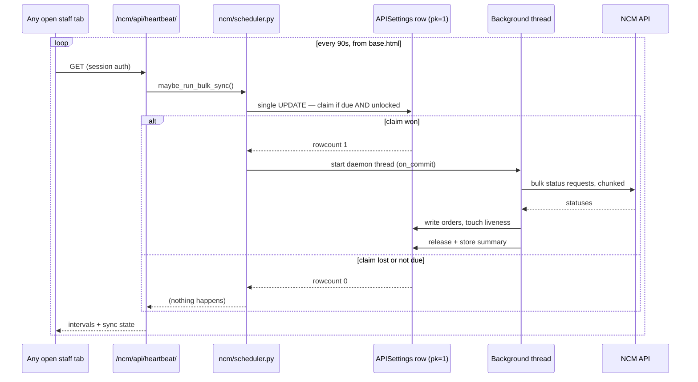
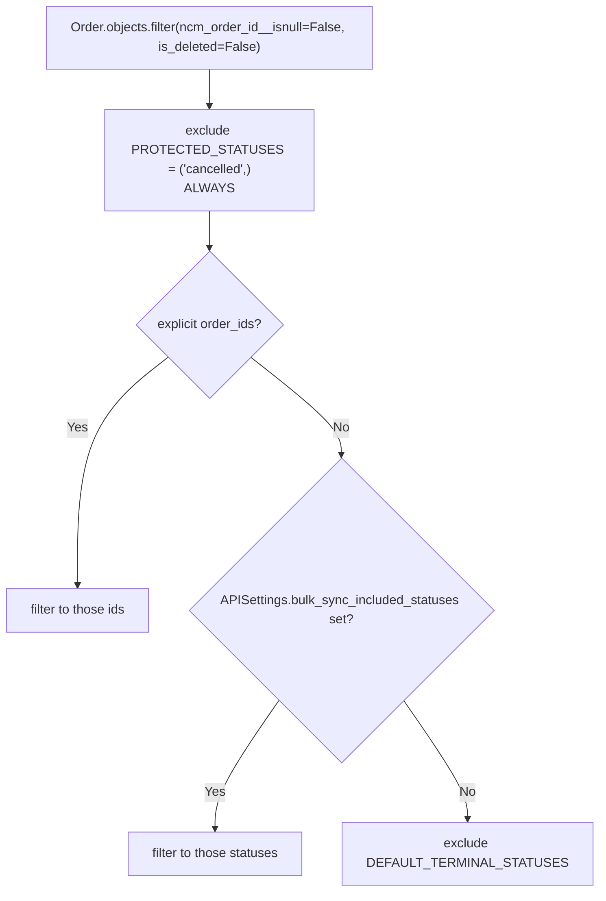

# 12 — NCM Sync & the Cron-less Scheduler

How order statuses stay fresh when there is no cron job.

---

## The problem this solves

This project is deployed on **cPanel shared hosting**: no Celery beat, no persistent worker,
and in practice no crontab either. The bulk sync was written to be driven by
`manage.py sync_all_ncm_orders` from cron — and because that cron entry was never installed,
**nothing ever refreshed NCM status in the background**. Order status only changed when
somebody clicked "Sync Status" on an individual order.

So the trigger moved into the application.



**The whole design rests on one requirement: no two syncs may ever run at once** — across
threads, across Passenger worker processes, and across a real cron run if one is ever added.

Django's cache here is `LocMemCache`, which is **per-process**, so cache-based locking would
be worthless. The lock is therefore a **compare-and-swap against the `APISettings` row**,
expressed as a single `UPDATE` statement so the *database* decides the winner.

---

## The heartbeat

**URL** `/ncm/api/heartbeat/` · **name** `ncm:api_sync_heartbeat`
**View** `ncm/realtime_api.py:788` · **Method** GET
**Client** `templates/base.html:2723-2786` — runs on **every authenticated page**

### What it returns

```json
{
  "success": true,
  "started": false,
  "syncing": false,
  "server_sync_interval": 900,
  "page_refresh_interval": 30,
  "last_sync_at": "2026-08-26T11:02:00+05:45",
  "last_sync_display": "26 Aug 2026, 11:02 AM",
  "last_summary": {"total_orders": 42, "updated_count": 3, "error_count": 0}
}
```

Returning the two intervals is deliberate: a tab that has been open since **before** an
admin changed them re-arms its timers on the next ping. That is what makes the Settings
page's "changes take effect immediately" promise true without a restart or a reload
(`realtime_api.py:797-800`).

### Browser-side behaviour — `templates/base.html:2723-2786`

| Detail | Value |
|---|---|
| Ping interval | `HEARTBEAT_MS = 90000` (90s) |
| Minimum gap between pings | `MIN_GAP_MS = 30000` |
| Multi-tab coordination | **localStorage leader election** via an `ncmHeartbeatLease` key with a 3× TTL — only one tab pings |
| Visibility | Only fires when `document.visibilityState === 'visible'` |
| First beat | Staggered randomly 2–7s after load, so a shift starting together doesn't stampede |

### Auth — `realtime_api.py:810-819`

Normally session-based like every other endpoint. **Additionally**, if
`NCM_HEARTBEAT_TOKEN` is configured, a matching `?token=` is accepted:

```
https://office.example.com/ncm/api/heartbeat/?token=<NCM_HEARTBEAT_TOKEN>
```

> **This is how you keep statuses fresh overnight.** Without it, the background sync only
> ticks while somebody has a tab open. Set the token and point any external uptime pinger
> at that URL. Left empty, the token door stays shut entirely.

The comparison uses `secrets.compare_digest` on **UTF-8 bytes** — `compare_digest` raises
`TypeError` on non-ASCII `str`, so a garbage token in the query string would have produced
a 500 instead of a clean rejection (`:812-816`).

A failing heartbeat is logged and answered with a 500 body, never allowed to break page JS
(`:840-843`).

---

## The claim — `ncm/scheduler.py`

### Constants

| Constant | Value | Line | Meaning |
|---|---|---|---|
| `STALE_CLAIM_SECONDS` | 300 | `:47` | A claim not refreshed in this long is treated as abandoned and taken over |
| `MAX_RUN_SECONDS` | 480 | `:51` | Wall-clock budget for one run; past this no **new** chunk starts |
| `MIN_SYNC_SECONDS` | 60 | `:56` | Floor on the configured interval, enforced here as well as in the form |
| `MAX_ADAPTIVE_INTERVAL_SECONDS` | 1800 | `:61` | Ceiling on the adaptive backoff |
| `TOUCH_MIN_INTERVAL_SECONDS` | 30 | `:158` | Smallest gap between two liveness writes |
| `SETTINGS_PK` | 1 | `:64` | `APISettings` is a singleton |

### `_claim(force, advance_schedule)` — `:71-153`

The due-check and the lock are deliberately the **same statement**:

```python
claim = APISettings.objects.filter(pk=1).filter(
    Q(bulk_sync_running_since__isnull=True) | Q(bulk_sync_running_since__lt=stale_cutoff))
if not force:
    claim = claim.filter(
        Q(last_bulk_sync_started_at__isnull=True) | Q(last_bulk_sync_started_at__lte=due_cutoff))
won = claim.update(**fields) == 1
```

> **Why one statement.** Splitting it ("is it due?" then "is it unlocked?") leaves a window
> where a worker holding a stale `last_bulk_sync_started_at` can claim the instant the
> previous run releases, producing back-to-back full syncs. As one `UPDATE`, the row lock
> serialises the decision and exactly one caller sees rowcount 1.

**The due-check measures from when the last run *started*, not when it finished**
(`:89-92`). Measuring from the finish would mean a run taking longer than the interval is
due again the moment it ends — a permanent sync loop.

`queryset.update()` bypasses `auto_now`, so this never touches `updated_at` — which the
Settings page shows as "Last updated" and should keep meaning "when an admin last saved
these settings" (`:140-142`).

### The adaptive floor — `:97-126`

```python
effective_interval = min(max(interval, 2 * last_duration), 1800)
```

The configured interval is a wish, and on shared hosting it can be a harmful one. At 60s, a
run taking 90s would restart immediately every time — a sync thread doing NCM I/O
essentially forever, competing with real user requests for the handful of workers and DB
connections the plan allows. Pages elsewhere go sluggish and nobody connects it to a setting
on the NCM screen.

Because the gap is measured **start-to-start**, resting "as long as the last run took" would
mean restarting the instant it finished. **Twice** the duration is what actually caps the
sync at roughly half of wall-clock time: work for D, idle for D. A fast run — the normal
case, a few requests well under a second — never reaches the configured interval and is
unaffected.

The duration is read from the last run's own **summary**, not derived from
`finished_at − started_at`. Those columns do not always describe the same run: a partial
"Sync Now" deliberately leaves `started_at` alone but still stamps `finished_at`, so
subtracting them turned a two-second button click into a "duration" of however long ago the
last full sync began — suppressing background syncing for minutes (`:113-122`).

### `advance_schedule=False`

Takes the lock **without** moving the schedule clock. Used for runs covering only a handful
of orders — the "Sync Now" button on a page of results. Such a run isn't a substitute for a
full one, so letting it reset the clock would silently postpone the next real sync by up to
a whole interval (`:77-82`, applied at `:264`).

### Liveness, release and threading

| Function | Line | Notes |
|---|---|---|
| `_touch()` | `:165-183` | Rate-limited to once per 30s by **wall clock**, not by order count. A run whose NCM requests are all timing out at 60s spends half an hour on 25 orders — a count-based ping would let its own claim look abandoned and be stolen mid-run |
| `_release(summary)` | `:186-198` | Runs even when the sync raised. If the release itself fails, the stale-claim window frees the lock |
| `_run()` | `:201-231` | Times itself with `monotonic()` so a clock adjustment can't produce a negative or inflated duration |
| `_run_in_thread()` | `:234-243` | Calls `connections.close_all()` — Django opens a connection per thread and `CONN_MAX_AGE` keeps it around, so a thread exiting without closing leaks one MySQL connection per run |
| `maybe_run_bulk_sync()` | `:246-290` | Thread started via `transaction.on_commit` so the claim is durable before the thread can act on it |

**Thread-start failure is handled.** cPanel caps process/thread counts (LVE `nproc`), so
"can't start new thread" is a real failure here. The claim is released immediately rather
than leaving the sync locked out until the stale window expires (`:282-288`).

---

## What the sync actually does — `ncm/bulk_sync.py`

`run_bulk_ncm_status_sync(user, order_ids, fetch_event_times, progress_callback, deadline)`
— `:60-214`.

### Choosing candidates



`DEFAULT_TERMINAL_STATUSES` (`:40-43`) =
`cancelled`, `delivered`, `return`, `returned`, `return_initiated`, `return_approved`.

`PROTECTED_STATUSES` (`:52`) is enforced **regardless of selection**, because
`bulk_sync_included_statuses` is admin-configurable and could otherwise be set to include
`cancelled`.

### Batching

- Orders are **grouped by `api_config_id`** (`:133-136`) — each account's orders go out on
  that account's key.
- Chunked at `CHUNK_SIZE = 100` (`:56`). NCM caps how many ids one bulk request can carry,
  and long URIs and timeouts start biting well before that.
- One `get_bulk_order_statuses` call per chunk (`:166`).
- Expected response shape: `result['data']['result']` = `{"<ncm_order_id>": "<status>"}`
  (`:176-181`).
- The `deadline` is checked **between chunks only** — the in-flight chunk always finishes
  (`:153-159`).

### Resilience

A failure on one order, or one chunk, is recorded and skipped rather than aborting the run.
This runs unattended, so one malformed NCM payload must not stop every remaining order.

**Stopping early is always safe.** Each order is resolved and committed on its own, and
re-syncing an unchanged order is a no-op. A run cut short by the deadline just means the
remaining orders wait for the next run.

### `_sync_one_order` — the reconciliation core — `:239-362`

The bulk endpoint returns only a **bare status string**, which cannot distinguish an RTV hop
from ordinary transit. So the sync **re-fetches the full status entry** when:

- the raw status is `Delivered`, **or**
- the order is in the return pipeline (`RETURN_PIPELINE_STATUSES`, `:25`) and its status just
  moved (`:272-296`)

**`_carries_vendor_return(entry)`** (`:28-38`) — absence of the flag is **not** the same as
`False`. `resolve_delivered_status` defaults a missing flag to `False`, which reads as "not a
return". For an order already heading back to the vendor, that default is a guess.

**The return-pipeline guard** (`:312-318`) — an order in the return pipeline is **never**
moved out of it by a verdict that isn't backed by an actual `vendor_return` flag.

Then the manual-hold guard (`:327-332`), the write (`:339-349`), `delivered_at`
(`:345-347`), and the activity log (`:351-361`).

### Event times

`_fetch_event_time` (`:365-393`) costs one **extra** `/order/status` request per **changed**
order, in exchange for activity-log timestamps that match NCM instead of the sync run's own
clock. Controlled by `APISettings.bulk_sync_fetch_event_times` (default on).

---

## The per-order sync API

**URL** `POST /ncm/api/order/<id>/sync/` · **View** `ncm/realtime_api.py:195`

This is what the order-detail page calls on load and what the **Sync Status** button calls.
Unlike the bulk sync, it makes a **real NCM call for one order**.

| Feature | Line | Detail |
|---|---|---|
| Throttle | `:219-232` | `?throttle=1` → cache key `ncm_sync_throttle_{id}` for `SYNC_THROTTLE_SECONDS = 20` (`:38`). Only the page-load call passes it; the button never does |
| Cancelled guard | `:234-246` | Short-circuits |
| Multi-account sweep | `:254-259` | `fetch_order_status_raw`, then writes `resolved_config_id` back to the order |
| Response shape handling | `:273-278` | A dict carrying `last_status` is used whole; a list uses `data[0]` |
| **Empty list** | `:279-295` | Returns **unchanged** rather than re-deriving — an ambiguous transit-worded RTV hop would otherwise drop the order out of the return pipeline |
| Manual hold | `:309-319` | |
| The `changed` flag | `:342-344` | `bool(update_fields) or ncm_status_changed or delivered_at_missing` |

> **`changed` drives a page reload**, so a check that could never be satisfied would loop
> forever. That is why `delivered_at_missing` is part of it and why
> `sync_order_status_fields` reports only genuinely changed fields (`:332-339`).

---

## The other read-only endpoints

`ncm/realtime_api.py` — under `/ncm/api/`.

| URL | View | Calls NCM? | Purpose |
|---|---|---|---|
| `order/<id>/status/` GET | `api_get_order_status` `:128` | **No** | Local DB read. The order-detail badge poller. The comment at `:129-140` records that it used to call NCM and discard the answer |
| `orders/batch-status/` GET | `api_get_orders_status_batch` `:414` | **No** | `?order_ids=1,2,3`. Returns statuses **plus computed badge classes** and the scheduler's `sync_status`. Backs the orders list and logistics list |
| `order/<id>/activity/` GET | `api_get_order_activity_log` `:524` | No | Ordered by `Coalesce(event_at, created_at)` desc |
| `order/<id>/comments/` GET | `api_get_order_comments` `:583` | Yes | Merges local logs + NCM comments + comments in the order detail. 5s in-process cache |
| `order/<id>/comments/add/` POST | `api_add_order_comment` `:718` | Yes, async | Logs locally at once, posts to NCM on a daemon thread |

`api_get_orders_status_batch` checks permissions **inline** against
`ORDER_STATUS_VIEW_PERMISSIONS` (`:43-45`) — any of `can_view_orders`,
`can_view_orders_list`, `can_view_ncm_orders` — because three differently-gated pages share
it.

---

## The Logistics Orders page

**URL** `/logistics/orders/` · **name** `logistics_orders_list` · **View** `dashboard/views.py:21005`
**Template** `dashboard/templates/logistics_orders_list.html`
**Permission** `can_view_ncm_orders` · **Param** `?provider=ncm|pnd`

The courier-centric view of orders — replaced the old separate NCM and PND list pages. It
polls `/ncm/api/orders/batch-status/` (`logistics_orders_list.html:848`) and can start a
background sync of the visible page via `ncm:bulk_sync_json`
(`logistics_orders_list.html:911`), which is the `advance_schedule=False` path.

Export: `/logistics/orders/export/` (`logistics_orders_export`).

---

## Manual and command-line triggers

| Trigger | Endpoint / command | Notes |
|---|---|---|
| Sync one order | `POST /ncm/api/order/<id>/sync/` | The Sync Status button |
| Sync selected orders | `POST /ncm/bulk-sync/start/` (`ncm:bulk_sync_json`) | Background, JSON reply, doesn't advance the schedule |
| Interactive bulk sync | `/ncm/bulk-sync/` (`ncm:bulk_sync`) | |
| Admin "sync all statuses" | `/ncm-orders/sync-all/` (`views.py:14310`) | Staff only |
| Command line | `python manage.py sync_all_ncm_orders [--force]` | Delegates to `maybe_run_bulk_sync(force, run_in_thread=False)`. **Safe to cron every minute** — the due-check lives in the DB |

`ncm/order_recovery.py` provides two troubleshooting actions:

| Action | URL | Does |
|---|---|---|
| `clear_ncm_order_id` (`:26`) | `/ncm/orders/<id>/clear-ncm-id/` | Nulls `ncm_order_id`, `ncm_status`, `ncm_created_at`, `ncm_destination_branch` so the order can be **re-sent** |
| `verify_ncm_order` (`:64`) | `/ncm/orders/<id>/verify-ncm/` | Queries NCM directly (no multi-account sweep). On 404 it surfaces the recovery options |

---

## Tuning

*Settings → API Sync Settings* writes to the `APISettings` singleton.

| Setting | Default | Raise it when… | Lower it when… |
|---|---|---|---|
| `order_sync_interval` | 900s | NCM rate-limits you, or the site feels slow | Statuses feel stale |
| `page_refresh_interval` | 30s | Rarely — it's free | Badges feel sluggish |
| `ncm_api_timeout` | 30s | NCM is slow and requests abort | Runs are dominated by hanging requests |
| `bulk_sync_included_statuses` | `[]` | You want to sync a narrower set | — |
| `bulk_sync_fetch_event_times` | on | — | You need to cut API calls; timelines then use the sync's own clock |

Remember the **adaptive floor**: if runs are slow, the effective interval is at least twice
the last run's duration, capped at 1800s.

---

## Troubleshooting

| Symptom | Cause / fix |
|---|---|
| Nothing syncs overnight | No tab is open. Set `NCM_HEARTBEAT_TOKEN` and add an external pinger |
| Nothing syncs at all | Check `bulk_sync_running_since` — a value older than 300s is stale and will be taken over automatically; a recent one means a run is genuinely in progress |
| "Sync Now" seems to disable background sync | Fixed. Partial runs use `advance_schedule=False` and their duration is read from the summary, not from subtracting timestamps |
| Syncs constantly, site is slow | The adaptive floor should prevent this. Check `last_bulk_sync_summary.duration_seconds` |
| One order never syncs | Terminal status? Cancelled? No `ncm_order_id`? Wrong `api_config`? Manual hold? |
| Sync started but never finished | `worker_heartbeat_at` equivalent for syncs is `bulk_sync_running_since`; a killed Passenger worker takes its daemon thread with it, and the stale window (300s) releases the lock |

Logs: `logs/ncm_integration.log`.

---

## Files that own this

- `ncm/scheduler.py` — the claim, the lock, the adaptive backoff
- `ncm/bulk_sync.py` — what a run actually does
- `ncm/realtime_api.py` — the heartbeat and the per-order/batch APIs
- `templates/base.html:2723-2786` — the browser-side heartbeat and leader election
- `dashboard/models.py:2083-2157` — `APISettings`
- `ncm/order_recovery.py` — clear-id and verify
- `ncm/management/commands/sync_all_ncm_orders.py` — the CLI entry point
- `dashboard/views.py:21005` — the logistics orders list
