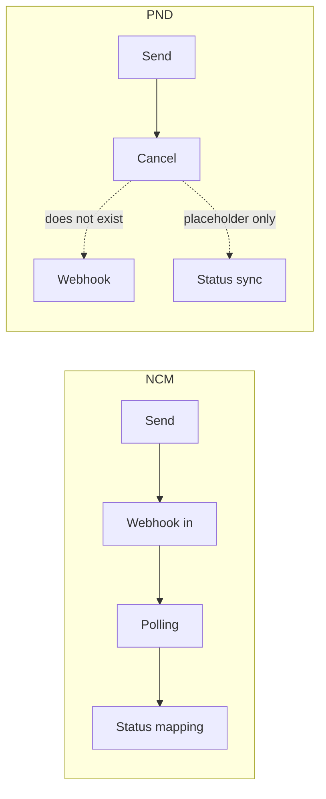

# 13 — Pick and Drop

The second courier. Structurally parallel to NCM, but **much** thinner.

---

## The one thing to know



**Pick and Drop has no inbound path at all.** No webhook, no working status sync, no status
mapping. Once an order is sent, its `pnd_status` stays at whatever the create call returned
until somebody cancels it.

The `sync_pnd_status` and `bulk_sync_pnd_orders` views exist but are **placeholders**
awaiting a PND status API — `pick_and_drop/views.py:220-231` and `:330-334`.

---

## The client — `services/pick_and_drop_service.py` (219 lines)

### Credentials

| Source | Detail |
|---|---|
| Database | `LogisticsAPIConfig(logistics_provider='pick_and_drop')` → `api_key`, **`api_secret`**, `get_primary_base_url()` (`:11-26`) |
| Settings fallback | `PND_API_KEY`, `PND_API_SECRET`, `PND_API_BASE_URL` (default `https://pickndropnepal.com`) — `myproject/settings.py:274-277` |

### Auth — **different from NCM**

```python
{'Authorization': f'token {self.api_key}:{self.api_secret}',
 'Content-Type': 'application/json'}
```
`pick_and_drop_service.py:28-32`.

Lowercase `token`, and a **colon-joined key:secret pair**. NCM uses capital `Token` with a
single value. Getting this wrong produces a 401 that looks like a bad key.

### Endpoints

The backend is a Frappe/ERPNext-style RPC API — everything is `api/method/<dotted.path>`.

| Method | HTTP | URL | Body / params | Line |
|---|---|---|---|---|
| `create_order(data)` | POST | `{base}/api/method/logi360.api.create_order` | JSON body | `:34-100` |
| `get_order_details(id)` | **GET** | `{base}/api/method/logi360.api.get_order` | `?orderID=` | `:102-157` |
| `cancel_order(id)` | **PUT** | `{base}/api/method/logi360.api.cancel_order` | `{'orderID': …}` | `:159-219` |

Note the verbs differ per endpoint — `create` is POST, `get` is GET, `cancel` is **PUT**.

### Response envelope

Success is `data['message']['status'] == 'success'`, with the payload at
`data['message']['data']` (`:66-73`). This is nested one level deeper than NCM's.

### Transport

| | PND | NCM |
|---|---|---|
| Retries | **none** | GET retries once |
| Timeout | **hardcoded 30s** (`:61`, `:119`, `:176`) | `APISettings.ncm_api_timeout` |
| Logger | `getLogger(__name__)` — **unconfigured** | `getLogger('ncm')` → `logs/ncm_integration.log` |

---

## Sending an order

**URL** `/pnd/orders/<int:order_id>/create/` · **name** `pick_and_drop:create_shipment`
**View** `pick_and_drop/views.py:75-215` · **Guard** `@login_required`
**Triggered from** `dashboard/templates/order_detail.html:919`

### The payload — `pick_and_drop/views.py:117-135`

Field names differ **entirely** from NCM's.

| PND field | Source | Notes |
|---|---|---|
| `customerName` | `order.customer_name` | |
| `primaryMobileNo` | `order.customer_phone` | **Must be exactly 10 digits** — see below |
| `secondaryMobileNo` | `order.customer.alternate_phone` | (`:134-135`) |
| `destinationBranch` | POSTed `pnd_destination_branch` → `order.branch_city` → `'KATHMANDU VALLEY'` | (`:93-95`) |
| `destinationCityArea` | `order.shipping_address` | |
| `codAmount` | `float(order.amount_due)` | **`amount_due`**, not the gross total |
| `orderDescription` | `_get_package_description(order)` | (`:47-70`) |
| `vendorTrackingNumber` | `order.order_number` | Our reference |
| `landmark` | `order.landmark` → address → `'N/A'` | |
| `weight` | `str(order.package_weight)` | |
| `orderType` | `'Regular'` | Hardcoded |
| `instruction` | `order.notes` | |

### Phone normalisation — `:103-114`

Stricter than NCM's digits-only cleaning:

1. Strip everything that isn't a digit
2. If the result is 13 digits and starts with `977`, drop the country code
3. Take the **last 10** digits
4. If it still isn't exactly 10 digits, **hard-error** — the send is refused

### What is stored on success — `:150-188`

| Field | From |
|---|---|
| `pnd_order_id` | `data['orderID']` — a **string** like `"XGAD-8"`, hence the `CharField` |
| `pnd_status` | `data.get('status', 'Order Created')` |
| `pnd_created_at` | `now()` |
| `pnd_destination_branch` | The resolved branch |
| `pnd_tracking_url` | `data['tracking_url']` |
| **`delivery_charge`** | `data['delivery_charge']` (`:179-187`) |
| Order status | The `Setup` row named "Pickup Created"; falls back to the literal string, or `'processing'` if no Setup row exists (`:163-177`) |

> **PND returns the delivery charge inline on create. NCM does not** — for NCM you have to
> run `manage.py fetch_ncm_delivery_charges` separately.

---

## Cancelling an order

**URL** `/pnd/orders/<int:order_id>/cancel/` · **View** `pick_and_drop/views.py:236-310`
**Triggered from** `order_detail.html:862`

Calls `PUT .../cancel_order`, then sets `pnd_status = 'Cancelled'`.

> ⚠️ **The local status is written even when the PND API rejects the cancel**
> (`:272-299`). The user gets a warning telling them to cancel on the PND portal manually.
> So a `pnd_status` of `Cancelled` does **not** guarantee the parcel was actually stopped.

---

## Tracking

**URL** `/pnd/orders/<int:order_id>/track/` · **View** `pick_and_drop/views.py:315-325`

Simply redirects to the stored `order.pnd_tracking_url`. No API call.

---

## Bulk send

**URL** `/orders/bulk-pnd-send/` · **name** `orders_bulk_pnd_send`
**View** `dashboard/views.py:20492` · **Triggered from** `orders_list.html:708`

Creates a `PNDBulkLog` (`:20523`) and loops. The worker
`send_single_order_to_pnd` (`dashboard/views.py:20252`) again **bypasses the service** and
posts raw (`:20350`), with its own copy of the payload builder (`:20369-20381`) and the
10-digit phone sanitiser (`:20352-20366`).

> ⚠️ **`orders_bulk_pnd_send` has no `@login_required` decorator.** See
> [A4](./A4-appendix-known-quirks.md).

---

## Models — `pick_and_drop/models.py`

Mirrors the NCM bulk log trio:

| Model | Lines | Differences from NCM |
|---|---|---|
| `PNDBulkLog` | `:7-57` | `destination_branch` defaults to `'KATHMANDU VALLEY'`; batch prefix `PND-` |
| `PNDBulkLogOrder` | `:60-98` | `pnd_order_id` is a **`CharField(100)`**; `pnd_status` defaults to `'Order Created'` |
| `PNDBulkLogDetail` | `:101-136` | Same action vocabulary as NCM |

Viewable at `/pnd-bulk-logs/<id>/` (`pnd_bulk_log_detail`, `@login_required` only) and via
the shared `/logistics/bulk-logs/` list with `?provider=pnd`.

---

## URL reference — `/pnd/`

`pick_and_drop/urls.py` — 5 patterns, all `@login_required`.

| URL | Name | View | Works? |
|---|---|---|---|
| `orders/<id>/create/` | `create_shipment` | `:75` | ✅ |
| `orders/<id>/sync/` | `sync_status` | `:220` | ❌ **Placeholder** |
| `orders/<id>/track/` | `track_order` | `:315` | ✅ (redirect only) |
| `orders/<id>/cancel/` | `cancel_order` | `:236` | ✅ (with the caveat above) |
| `bulk-sync/` | `bulk_sync` | `:330` | ❌ **Placeholder** |

A `pnd_permission_required` decorator factory exists at `pick_and_drop/views.py:26` but is
**not applied to any route**.

---

## How PND status is displayed

Since there is no PND status mapping, `pnd_status` is stored **raw** and only *presented*
through the shared badge table in `dashboard/logistics_status.py`. That table's default for
a blank PND status is `'Order Created'` (`DEFAULT_PND_STATUS`, `:38`).

The colour buckets are shared with NCM because both providers use NCM-style status wording
— the `logistics` argument to `logistics_badge_class()` only decides which default applies
to a blank value (`:41-50`).

### The one other place `pnd_status` is written

`dashboard/views.py:17198-17201` — an opportunistic `?do_sync=1` refresh, capped at 20
orders, driven by delivery-charge fetching. It is not a general status sync.

---

## NCM vs PND at a glance

| | NCM | Pick and Drop |
|---|---|---|
| Auth header | `Token {key}` | `token {key}:{secret}` |
| API style | REST (`/order/create`) | Frappe RPC (`/api/method/logi360.api.create_order`) |
| Order id type | `IntegerField` | `CharField` (`"XGAD-8"`) |
| Response nesting | `data` | `message.data` |
| Timeout | DB-configurable | hardcoded 30s |
| Retries | GET only, once | none |
| **Webhook in** | ✅ | ❌ **none** |
| **Status polling** | ✅ full stack | ❌ **placeholders only** |
| **Status mapping** | ✅ full table | ❌ raw string, presentation only |
| Comments / history | ✅ | ❌ |
| Branch list | ✅ | ❌ |
| RTV / exchange | ✅ | ❌ |
| Cancel API | ❌ | ✅ (PUT) |
| Delivery charge | separate command | returned on create |
| Logging | `logs/ncm_integration.log` | unconfigured — falls through to root |
| Permission decorator | `ncm_permission_required` applied | defined but **not applied** |

---

## Gotchas

- **PND status never updates on its own.** If a PND order looks stale, that's why.
- **A `Cancelled` PND status may be a lie** if the API rejected the cancel.
- **The 10-digit phone rule is strict.** A number that NCM accepts may be refused by PND.
- **Bulk send bypasses the service** and duplicates the payload logic — a fix in one place
  isn't a fix in both.
- **PND logs go nowhere useful.** Add a `pick_and_drop` logger to `settings.LOGGING` if you
  need to debug it.
- `pnd_order_id` is `unique=True` — a double-send would raise `IntegrityError`.

---

## Files that own this

- `services/pick_and_drop_service.py` — the client
- `pick_and_drop/views.py` — send, cancel, track, the two placeholders
- `pick_and_drop/models.py` — bulk log models
- `pick_and_drop/urls.py` — the `/pnd/` routes
- `dashboard/views.py:20252-…` — the bulk send worker
- `dashboard/logistics_status.py` — shared badge presentation
- `myproject/settings.py:274-277` — PND settings
