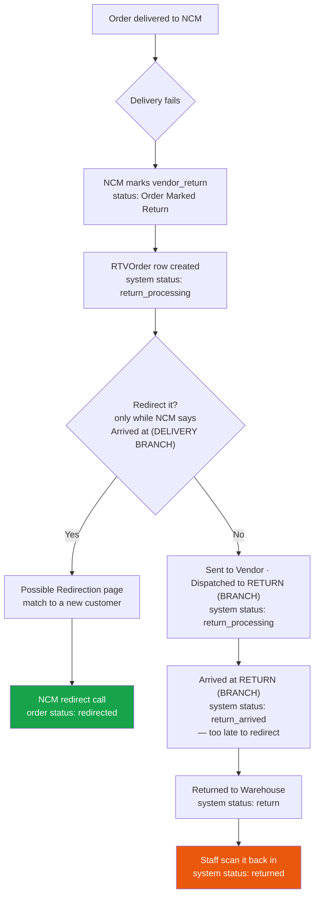
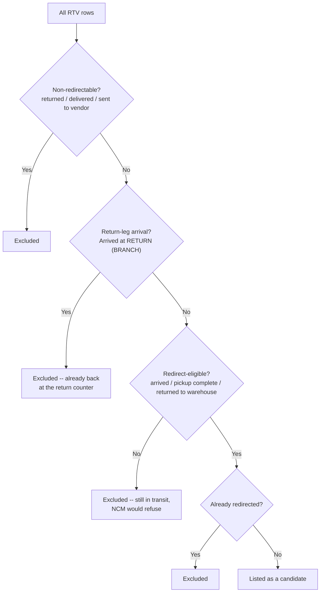

# 14 — RTV & Order Redirection

**RTV** = Return To Vendor. A parcel NCM is sending back to us instead of delivering.
**Redirection** = catching that parcel mid-return and sending it to a *different* customer
instead, saving the return leg entirely.

This is one of the most commercially valuable features in the system, and one of the most
fiddly.

---

## The pipeline



The redirection window is narrow: **only** while NCM reports the parcel is actually sitting
at a branch or warehouse.

---

## The `RTVOrder` model — `dashboard/models.py:2183-2292`

> **`RTVOrder` is not linked to `Order` by a foreign key.** It keys on `order_id`, which is
> the **NCM** order id. Joins to a local order go through `Order.ncm_order_id`.

| Field | Notes |
|---|---|
| `order_id` | **The NCM order id.** Unique |
| `vendor_return` | Default `True` |
| `comment` | |
| `last_status` | Raw NCM status |
| `rtv_status` | FK → `RTVStatus` — a **locally defined** status, not from NCM |
| `vendor` | FK → user |
| `api_config` | Which NCM account (portal) this RTV belongs to |
| `receiver_name`, `receiver_phone`, `receiver_address` | From the v2 vendor/orders API |
| `from_branch`, `to_branch`, `tracking_id` | |
| `cod_charge`, `delivery_charge` | Stored as **`CharField`**, as NCM returns them |
| `product_description` | |
| `ncm_created_date` | NCM's **order creation** date. Kept for filtering only — **this is not when the RTV was marked** |
| `rtv_marked_at` | When NCM staff marked it as a vendor return |
| `rtv_marked_at_source` | Where that date came from — see below. Indexed |
| `rtv_marked_at_checked_at` | Last time we asked NCM. Repair passes take the least-recently-checked rows first |

Ordered by `-rtv_marked_at, -created_at`.

### Date provenance — the ranking system

`rtv_marked_at` is hard to establish: NCM doesn't return it as a field, so it has to be
inferred. Different inference methods have different reliability, so each row records
**where its date came from** and a lower-ranked source can never overwrite a higher one.

| Source constant | Value | Rank | Reliability |
|---|---|---|---|
| `SOURCE_UNKNOWN` | `''` | 0 | — |
| `SOURCE_ORDER_CREATED` | `order_created` | 1 | **Known wrong (legacy)** |
| `SOURCE_STATUS_TIMELINE` | `status_timeline` | 2 | Approximate |
| `SOURCE_NCM_STAFF_COMMENT` | `ncm_staff_comment` | 3 | Approximate |
| `SOURCE_COMMENT` | `comment` | 4 | **Trusted** |
| `SOURCE_WEBHOOK` | `webhook` | 4 | **Trusted** |
| `SOURCE_MANUAL` | `manual` | 4 | **Trusted** |

`TRUSTED_SOURCES = (comment, webhook, manual)` (`:2221`).
`rtv_marked_at_is_trusted` property at `:2285`.

> **Why provenance is tracked at all.** `order_created` is the known-wrong legacy value —
> the sync used to fall back to NCM's *order creation* date, which then stuck forever
> because every repair query filtered on `rtv_marked_at IS NULL`. Recording provenance is
> what makes those rows findable and fixable instead of permanent.

Untrusted values are still **displayed** (flagged as approximate) rather than hidden, but
they stay in the repair queue until NCM confirms them.

### Rank enforcement — `NCMService.apply_rtv_marked_at` `services/ncm_service.py:903-957`

Equal rank overwrites — **unless** it lands on the same instant. `_same_instant()`
(`ncm_service.py:10-16`, second resolution) exists because NCM's comment endpoint has no
stable ordering, so repeat polls would otherwise rewrite the same value and make the RTV
page reload on every poll.

### Repair command

```bash
python manage.py repair_rtv_marked_at
```
Takes the least-recently-checked rows (via `rtv_marked_at_checked_at`) so a bounded batch
size converges over repeated runs.

---

## `RTVStatus` — `dashboard/models.py:2161-2179`

User-defined statuses for RTV orders, stored **locally** and never fetched from NCM. Name +
hex colour. Managed at:

| Page | URL | Guard |
|---|---|---|
| RTV status list | `/setup/rtv-status/` | `@login_required` |
| Add / edit / delete / get | `/setup/rtv-status/…` | `@login_required` |
| Set an RTV's status | `/api/rtv/<id>/set-status/` | `@login_required` |

This lets the business track its own return workflow (e.g. "Inspected", "Restocked") on top
of NCM's shipping status.

---

## The RTV list page

**Purpose** — Every parcel NCM is returning to us.
**URL** `/orders/rtvs/` · **name** `ncm_rtvs_list` · **View** `dashboard/views.py:22782`
**Template** `dashboard/templates/ncm_rtvs.html` · **Permission** `can_view_orders`

### Where the data comes from

`RTVOrder` rows, populated by a sync against NCM's vendor endpoint.

**Sync** — `/api/ncm-rtv/sync/` (`ncm_rtvs_sync`, `views.py:23132`). Calls
`NCMService.get_vendor_rtvs_by_status()` (`services/ncm_service.py:457`), which
queries `{v2}/vendor/orders`.

| Method | Strategy |
|---|---|
| `get_vendor_rtvs_by_status()` | Four statuses in parallel — `Arrived`, `Dispatched`, `Sent to Vendor`, `Returned to Warehouse` — plus 3 recent pages |

The sync is **additive** — `bulk_create` + `bulk_update`, nothing retires an
RTV that is missing from the response. So a failed page costs visibility, not
data: the RTVs it held simply never reach the screen. That used to pass
silently as a clean sync; the fetch now returns `partial` / `error` and the
endpoint reports *"some RTVs may be missing"*.

### Related endpoints

| URL | View | Purpose |
|---|---|---|
| `/api/ncm-rtv/<ncm_id>/detail/` | `ncm_rtv_order_detail` (`views.py:23685`) | Detail modal + status history. Also used by the **order detail page** |
| `/api/ncm-rtv/<id>/comment/` | `ncm_rtv_add_comment` | Post a comment to NCM |
| `/api/ncm-rtv/<id>/comments/` | `ncm_rtv_get_comments` | Read comments |
| `/api/rtv/<id>/followup/add/`, `/api/rtv/<id>/followups/` | | `RTVFollowUp` thread |

### `RTVFollowUp` — `dashboard/models.py:2295-2330`

A note/follow-up thread per RTV: `called_no_answer`, `called_answered`, `whatsapp_sent`,
`email_sent`, `custom_note`.

---

## Possible Redirection

**Purpose** — RTV parcels that could be redirected to a *different* customer, matched
against open orders wanting the same product.
**URL** `/orders/possible-redirection/` · **name** `possible_redirection_list`
**View** `dashboard/views.py:5532` · **Template** `dashboard/templates/possible_redirection.html`
**Permission** `can_view_orders`

### The two status gates

Both live at module level (`dashboard/views.py:5395-5446`) because **two** views must agree
on them: the list view builds the queryset in SQL, and the refresh endpoint re-applies the
same rule in Python after pulling fresh statuses from NCM.

**Gate 1 — non-redirectable** (`:5401-5424`)

A row is excluded if **any** of:

| Check | Value |
|---|---|
| The RTV's `last_status` is one of | `returned`, `delivered`, `sent to vendor` |
| The linked order's `ncm_status` matches the regex | `delivered\|returned\|sent to vendor` |
| The linked order's `status` or `order_status` is one of `NON_REDIRECTABLE_ORDER_STATUSES` | `delivered`, `return_arrived` |

The regex exists because the local order's stored NCM status can carry branch-qualified
variants (`"Returned to Warehouse"`) rather than an exact match.

**Gate 2 — redirect-eligible**

```python
REDIRECT_ELIGIBLE_STATUS_PREFIXES = ('arrived', 'pickup complete', 'returned to warehouse')
```

Taken **verbatim from NCM's own rejection message**: *"Order can only be redirected when
status is: Arrived, Pickup Complete, Returned to Warehouse."*

Matched as a case-insensitive **prefix**, so branch-qualified variants like
`"Arrived at POKHARA"` still count, **minus** the return-leg arrivals
(`NCMService.is_return_arrival()`). A parcel still travelling back
(`"Dispatched to Return (…)"`) is **not** a candidate — NCM's redirect endpoint refuses it
outright.

> **The `arrived` prefix means two opposite things.** NCM names the branch a parcel just
> reached, and prefixes that branch with `RETURN` on the way back:
>
> | Status | Where the parcel is | Redirectable |
> |---|---|---|
> | `Arrived at POKHARA` | at its **delivery** branch | ✅ redirect it to another Pokhara customer |
> | `Dispatched to RETURN NAYA BUSPARK` | moving back | ❌ still travelling |
> | `Arrived at RETURN NAYA BUSPARK` | at NCM's **return counter** | ❌ came all the way back |
>
> The last row used to pass this gate on its `arrived` prefix, so a parcel that had
> finished the whole return journey sat on the Possible Redirection page offering a
> redirect NCM would always refuse. `is_return_arrival()` (`services/ncm_service.py`) —
> *starts with `arrived` **and** contains `return`* — is the single definition of that
> difference; the list view's SQL filter, `_rtv_is_redirect_eligible()`, and
> `isReturnLegArrival()` in `possible_redirection.html` all mirror it, and the same hop
> resolves the order to the `return_arrived` status (see
> [07 — Order statuses](./07-order-statuses.md)).
>
> **A return-leg arrival on *either* stored copy vetoes the row** — this is the one place
> the two-copy OR below does not apply. Everywhere else either copy may lag, and "at a
> branch" is a state a parcel enters and leaves. A return-leg arrival is *monotonic*: a
> parcel does not un-arrive at the return counter, so whichever copy reports it is the
> fresher one by definition.
>
> That is not a theoretical nicety — it is the shape the bug actually had. NCM's
> `vendor/orders` endpoint, which feeds `RTVOrder.last_status`, answers with the coarse
> word **`"Arrived"`**, while the tracking endpoint behind `Order.ncm_status` gives
> **`"Arrived at RETURN NAYA BUSPARK"`**. OR-ing them kept the parcel listed on the coarse
> copy alone, so a per-copy exclusion would have fixed nothing.
>
> The linked order's own system status `return_arrived` is a third veto
> (`NON_REDIRECTABLE_ORDER_STATUSES`), so a blank or lagging `ncm_status` cannot lose the
> fact either.

Both gates read **two** stored copies of the parcel's NCM status and accept the row if
*either* says "at a branch". That is deliberate, and it is also where the page's one
persistent bug lived — see the next section.



**Already-redirected detection** — `_redirected_rtv_ncm_ids()` (`:5449-5484`) checks **three
independent markers**, because a redirect can be recorded in more than one way.

### Two copies of one status, and which one to trust

| Copy | Who writes it |
|---|---|
| `RTVOrder.last_status` | The RTV list sync — rewrites it for **every** active RTV on each run (`:24207`) |
| `Order.ncm_status` | The NCM webhook, and the order detail page's load-time sync. Nothing else: the background bulk sync skips RTV'd orders, since `'return'` is terminal |

Either can lag, so eligibility accepts either — dropping the order-side rescue would hide a
webhook-fresh arrival until the next RTV sync. But the two directions of disagreement are
**not** equally suspicious:

- *RTV says at-branch, order says in transit* — routine. The RTV copy is the systematically
  refreshed one and it is what lists the row.
- *RTV says in transit, order says at-branch* — **the failure.** A stale
  `"Arrived at RETURN (…)"` frozen on the order is all that still lists a parcel NCM has
  already sent back out. `_rtv_listed_on_stale_order_status()` (`:5450`) detects exactly
  this direction; the entry carries it as `status_uncertain`, and the row renders with
  `data-status-uncertain="1"` and a *"Verifying"* chip. The page's own **Quick Guide** panel
  (the framed manual under the title) explains that chip to the operator.

All three linked-order subqueries in the list view filter `is_deleted=False`, matching the
Python mirror — a trashed order must not decide what this page shows.

**Where the modals resolve it** — `redirect_rtv_get` backs both the detail modal and the
redirect modal, and `_rtv_redirect_eligibility()` (`:5519`) is what it reports as
`redirect_eligible`:

| Case | Verdict from |
|---|---|
| No linked order | NCM's live status alone, since `get_order_details` just returned it. Falls back to the stored `last_status` if NCM answered without one |
| Linked order, statuses agree | The stored OR — no NCM call |
| Linked order, statuses disagree *suspiciously* | One `_live_ncm_status()` call. Only here, and only for a single modal open |

Any live answer is written back to `RTVOrder.last_status`, so the Possible Redirection page
does not have to discover it again. Before this, a stale `"Arrived"` could enable the Redirect
button, and the operator filled out the whole form only for NCM to reject the redirect.

### Live refresh

`/api/possible-redirection/refresh-status/` (POST form-encoded `ncm_ids`) pulls fresh
statuses from NCM in one bulk call per API config, then uses `_rtv_is_non_redirectable()` /
`_rtv_is_redirect_eligible()` to decide whether a row on screen would still be listed on a
reload — so rows disappear as parcels move on. The verdict is deliberately computed from the
**stored** values after the writes below, not from the raw NCM answer, so it can never
disagree with the list view's SQL and put the page in a reload loop.

What it writes back:

| Target | When |
|---|---|
| `RTVOrder.last_status` | Any time NCM's answer is non-blank and different. Free — it comes out of the same bulk response |
| The linked `Order` (via `ncm.bulk_sync.sync_order_status_from_raw`) | The fresh status is **terminal**, *or* it says "not at a branch" while the order's stored `ncm_status` still claims it is |

That second condition is the fix for the long-standing report *"the row only disappears after
I open the order detail page"*. The endpoint used to write terminal statuses only, so a
parcel that had moved from `"Arrived at RETURN (…)"` to `"Dispatched to RETURN (…)"` left the
stale `ncm_status` in place — which re-listed the row on the very reload the endpoint asked
for, and made the endpoint itself read that stale copy and report nothing dropped. The order
detail page's sync was the only other writer, which is why visiting it was the only thing
that worked.

Anything else is left alone on purpose: the bulk endpoint answers with a bare status string
carrying no `vendor_return` flag, so an in-pipeline `"Arrived"` would resolve to plain
`in_transit` and strip the order's `return` status. (`bulk_sync` refuses that write anyway —
not asking is just cheaper.)

Rows flagged `status_uncertain` are sorted to the front, so they get first call on
`POSSIBLE_REDIRECTION_REFRESH_MAX_ORDER_WRITES` (10) — a page full of ordinary rows can no
longer spend the whole budget and leave the one wrong row wrong.

**Cadence** (`possible_redirection.html`, `statusRefresh()`) — on load, every 5 minutes, and
on `visibilitychange`. A 90-second cross-tab cooldown in `localStorage` normally suppresses
the extra triggers; a rendered `data-status-uncertain` row **overrides that cooldown once per
load**, which is what makes going straight to this page (rather than via an order detail
page) enough to clear a stale row. The endpoint's own 45-second server-side throttle still
applies, so this cannot become a hammer.

Verified by `test_possible_redirection_status_refresh.py`.

### Matching amounts

The match list quotes **`Order.amount_due`**, not `total_amount`
(`dashboard/models.py:539-562`). For a partially paid order, quoting the gross total would
charge the customer twice.

---

## Redirect Orders

**Purpose** — Orders that have actually been redirected.
**URL** `/orders/redirect-orders/` · **name** `redirect_orders_list`
**View** `dashboard/views.py:6130` · **Template** `dashboard/templates/redirect_orders.html`
**Permission** `can_view_orders`

### The save endpoints

| URL | View | Line | For |
|---|---|---|---|
| `/api/orders/<id>/redirect-get/` | `redirect_order_get` | | Load the form |
| `/api/orders/<id>/get-redirect-details/` | `get_redirect_order_details` | | Match details |
| `/api/orders/<id>/redirect-save/` | `redirect_order_save` | `:6482` | **Commit a redirect** |
| `/api/rtv/<ncm_id>/redirect-get/` | `redirect_rtv_get` | | RTV-side form |
| `/api/rtv/<ncm_id>/redirect-save/` | `redirect_rtv_save` | `:6989` | **Commit an RTV redirect** |

### What a redirect writes

| Order | Change | Line |
|---|---|---|
| The **original** order | `apply_manual_status(order, status_obj.name, …)` — stamps a manual hold | `:6626` |
| The **matched destination** order | `order_status = 'redirected'` | `:6765-6769` |
| RTV path | Status → the configured redirect Setup, or `'redirected'` | `:7153`, `:7180-7184` |

An `OrderActivityLog` with `action_type='redirected'` is written, and its `metadata` JSON
carries a **snapshot of the old customer details** — so the order detail page can show who
the parcel was originally for. Rendered via `_redirect_old_customer()`
(`dashboard/views.py:3765-3793`, attached at `:4278-4283`).

`redirect_order_to_ncm` (`views.py:7404-7405`) is the path that actually tells NCM.

---

## The RTV report

**URL** `/reports/rtv/` · **name** `rtv_report` · **View** `dashboard/views.py:25821`
**Template** `dashboard/templates/rtv_report.html`
**Permission** inline `can_view_rtv_report` (not a decorator)

Includes CSV export. Badge colours come from `NCM_STATUS_COLOURS`
(`dashboard/views.py:25761-25771`) with `NCM_STATUS_FALLBACK = '#94a3b8'`.

> **KPI tiles count over *all* RTV orders, not just the listed page** — a deliberate recent
> change. Filtering the list does not change the totals.

---

## How RTV statuses map to order statuses

Covered in full in [07 — Order statuses](./07-order-statuses.md). The short version:

| NCM raw status | System status |
|---|---|
| `Order Marked Return` | `return_processing` |
| `Sent to Vendor` | `return_processing` |
| `Return Initiated` / `Return Approved` | `return_processing` |
| `Dispatched to RETURN (…)` and other unmatched return-worded strings | `return_processing` (keyword fallback) |
| `Arrived at RETURN (…)` | `return_arrived` (`is_return_arrival`, checked before the keyword fallback) |
| `Returned to Warehouse` | `return` |
| `Returned` | `returned` |
| `Delivered` **with** `vendor_return` | `return` if the text reads as completed, else `return_processing` |

The keyword fallback triggers on `return`, `rtv`, or `sent to vendor`
(`RETURN_STATUS_KEYWORDS`, `services/ncm_service.py:596`).

**Two guards keep the pipeline honest:**

1. `sync_order_status_fields` never downgrades a finished return (`return` / `returned`)
   back to an in-progress stage (`return_processing` / `return_arrived`).
2. Bulk sync never moves an order out of the return pipeline on a verdict not backed by an
   actual `vendor_return` flag (`ncm/bulk_sync.py:312-318`).

---

## Repair commands

| Command | Fixes |
|---|---|
| `manage.py repair_rtv_marked_at` | Rows whose `rtv_marked_at` came from an untrusted source |
| `manage.py repair_return_stage` | Orders marked `return` while still in transit back. The **only** caller that passes `allow_return_reopen=True` |

---

## Gotchas

- **`RTVOrder.order_id` is the NCM id, not our order id.** Join via `Order.ncm_order_id`.
- **`ncm_created_date` is not the RTV date.** It is when the *order* was created at NCM.
- **`cod_charge` and `delivery_charge` on `RTVOrder` are `CharField`s**, as NCM returns
  them. Cast before doing arithmetic.
- **The redirect window is narrow.** Both gates must pass, and they mirror NCM's own rules —
  loosening them locally just moves the rejection to NCM.
- **Redirect eligibility is a prefix match, minus the return leg.** `"Arrived at POKHARA"`
  passes; `"Dispatched to RETURN (TINKUNE)"` and `"Arrived at RETURN (TINKUNE)"` do not.
  The last one is the trap: it shares the `arrived` prefix but the parcel has already
  come all the way back, so it resolves to `return_arrived` and never lists here.
- **A listed row is not proof the parcel is still at the branch.** Eligibility reads two
  copies of the status and accepts either, so one stale copy can list a parcel that has moved
  on. The page corrects itself by asking NCM on load — do not "simplify" that away, and do
  not add a third writer of `Order.ncm_status` without teaching the refresh endpoint about
  it.
- The RTV sync's cost is now the per-order comment fetches that follow the bulk
  fetch, not the bulk fetch itself — the status-filtered query covers all active
  RTVs in a handful of calls.
- `'Return to Vendor'` as a literal string appears **only** as a UI toast title
  (`order_detail.html:3802`). It is not an NCM status.

---

## Files that own this

- `dashboard/models.py:2161-2330` — `RTVStatus`, `RTVOrder`, `RTVFollowUp`
- `dashboard/views.py:5391-5489` — the redirection status gates and
  `_rtv_listed_on_stale_order_status()`
- `dashboard/views.py:5492-5548` — `_live_ncm_status()`, `_rtv_redirect_eligibility()`
- `dashboard/views.py:5532-…` — `possible_redirection_list`
- `dashboard/views.py:5999-…` — `possible_redirection_refresh_status`
- `dashboard/views.py:6212-…` — `redirect_orders_list`
- `dashboard/views.py:6482`, `:6989` — the redirect save endpoints
- `dashboard/views.py:22782-…` — `ncm_rtvs_list`
- `dashboard/views.py:25821` — the RTV report
- `services/ncm_service.py:299-544` — vendor RTV fetching
- `services/ncm_service.py:758-957` — RTV date extraction and rank enforcement
- `dashboard/management/commands/repair_rtv_marked_at.py`, `repair_return_stage.py`
