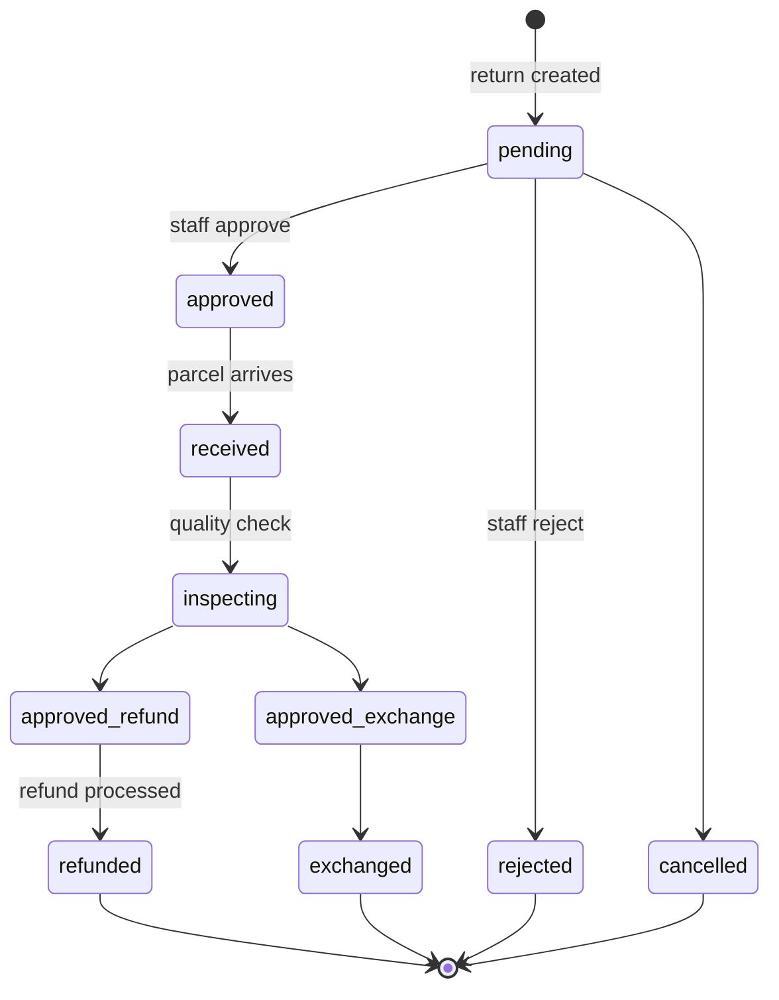

# 15 — Returns (RMA)

The **local** return process: a customer sends something back and we inspect, restock, and
refund or exchange it.

> Not to be confused with **RTV** ([14](./14-rtv-and-redirection.md)), which is NCM sending
> an *undelivered* parcel back to us. RTV is courier-driven; this chapter is staff-driven.

---

## The flow



Processing a refund also sets the **order's** status to `returned`
(`dashboard/views.py:13333-13345`).

---

## Pages

All templates live under `dashboard/templates/returns/`.

| Page | URL | View | Template | Permission |
|---|---|---|---|---|
| Returns dashboard | `/returns/` | `returns_dashboard` | `returns/dashboard.html` | `can_view_returns` |
| Returns list | `/returns/list/` | `returns_list` | `returns/list.html` | `can_view_returns` |
| Create a return | `/returns/create/` | `return_create` | `returns/create.html` | `can_create_returns` |
| Bulk create | `/returns/bulk-create/` | `bulk_return_create` | — | `can_create_returns` |
| Return detail | `/returns/<id>/` | `return_detail` | `returns/detail.html` | `can_view_returns` |
| Move to trash | `/returns/<id>/trash/` | | `returns/trash_confirm.html` | `can_delete_returns` |
| Trash list | `/returns/trash/` | `returns_trash_list` | `returns/trash_list.html` | `can_view_returns` |
| Restore | `/returns/<id>/restore/` | | `returns/restore_confirm.html` | `can_delete_returns` |
| Permanent delete | `/returns/<id>/permanent-delete/` | | `returns/permanent_delete_confirm.html` | **`@admin_only`** |
| Empty trash | `/returns/empty-trash/` | | `returns/empty_trash_confirm.html` | **`@admin_only`** |

Bulk actions: `returns_bulk_action`, `returns_batch_bulk_action` (`can_view_returns`),
`returns_trash_bulk_action` (`can_delete_returns`).

There is also an **order-centric** view of the same thing:

| Page | URL | View | Shows |
|---|---|---|---|
| Return orders | `/orders/returns/` | `return_orders_list` (`views.py:5084`) | Orders whose `order_status` is `return` or `return_processing` (`:5095-5102`) |

That page has a `stage` parameter — `processing` or `completed` — with counts computed at
`:5162-5165` and applied at `:5166-5171`.

---

## `ReturnRequest` — `dashboard/models.py:912-1066`

| Field group | Fields |
|---|---|
| Link | `order` FK → `Order`, `related_name='returns'` (`:958`) |
| Status | `status`, default **`pending`** (`:966`) |
| Reason | `reason`, from `RETURN_REASON_CHOICES` (`:928-938`) |
| Refund | `refund_type`, from `REFUND_TYPE_CHOICES` (`:940-946`), default `full_refund` |
| Condition | `condition`, from `CONDITION_CHOICES` (`:948-954`) |
| Soft delete | `is_deleted`, `deleted_at` |

### `RETURN_STATUS_CHOICES` — `:915-926`

`pending` · `approved` · `rejected` · `received` · `inspecting` · `approved_refund` ·
`approved_exchange` · `refunded` · `exchanged` · `cancelled`

`get_status_display_class()` (`:1036-1050`) maps each to a badge class.

> **This is a proper `choices` list with a default** — unlike `Order.status`, which is
> free-text. Returns are the better-behaved half of the status story.

### `ReturnItem` — `:1069-1099`

| Field | Purpose |
|---|---|
| `good_qty` | Units fit to resell (`:1084`) |
| `damaged_qty` | Units written off (`:1085`) |
| `restocked` | Whether stock has been returned to inventory (`:1089`) |

The good/damaged split is what makes partial restocking possible — you don't have to accept
or reject a whole line.

### `ReturnActivityLog` — `:1102-1117`

Per-return audit trail. `action_type` here is **free text** (`:1106`), not a choices field.
Values seen in code include `approved`, `rejected`, `received`, `refunded`,
`quality_checked`.

---

## Scanning a parcel back in

`_mark_order_as_returned()` — `dashboard/views.py:12620-12651`.

When staff physically scan a returned parcel in Return Management, the order's status is set
to **`returned`** via `sync_order_status_fields(order, 'returned')`.

Two guards:

- It is a **no-op if the order is already `cancelled` or `returned`** (`:12634-12635`).
- `returned` is in `COMPLETED_RETURN_SYSTEM_STATUSES` (`services/ncm_service.py:619`), so a
  later NCM sync reporting `return_processing` **cannot** downgrade it. A staff scan is a
  stronger signal than anything NCM reports.

---

## Processing a refund

`return_detail` — `dashboard/views.py:13333-13345`. Sets the return to `refunded` **and**
writes the order's `status` / `order_status` / `status_setup` to `returned`.

The same write happens from `returns_bulk_action` (`:13643-13645`) and
`returns_batch_bulk_action` (`:13782-13784`).

---

## Stock restocking

Restocking is **not** automatic on approval. It happens when a `ReturnItem` is marked
`restocked`, and routes through `inventory/services.py` —
see [17 — Inventory & stock](./17-inventory-and-stock.md).

Only `good_qty` goes back into sellable stock; `damaged_qty` is written off.

---

## Repair command

```bash
python manage.py repair_return_stage
```

Fixes orders that were marked `return` while still in transit back — the bug described in
[07 §6](./07-order-statuses.md). It is the **only** caller that passes
`allow_return_reopen=True` to `sync_order_status_fields`, lifting the "a finished return
never reopens" guard.

---

## Permissions

| Flag | Grants |
|---|---|
| `can_view_returns` | Dashboard, list, detail, bulk actions |
| `can_create_returns` | Create, bulk create |
| `can_edit_returns` | Edit |
| `can_delete_returns` | Trash, restore |
| `can_approve_returns` | Approve / reject |
| `can_process_refunds` | Process refunds |
| **admin only** | Permanent delete, empty trash |

---

## Gotchas

- **Two different "return" concepts.** `ReturnRequest` is a local RMA; `RTVOrder` is an NCM
  return. They are unrelated models and can both apply to the same order.
- **`ReturnActivityLog.action_type` is free text** — no choices, so typos save silently.
- **A staff scan-in beats NCM.** `returned` is protected from downgrade.
- Permanent delete and empty trash are `@admin_only` — a user with `can_delete_returns` can
  only trash and restore.
- The Return Orders page (`/orders/returns/`) filters on **`order_status`**, so an order
  whose `status` was updated but not `order_status` will not appear.

---

## Files that own this

- `dashboard/models.py:912-1119` — `ReturnRequest`, `ReturnItem`, `ReturnActivityLog`
- `dashboard/views.py:12620-12651` — `_mark_order_as_returned`
- `dashboard/views.py:13333-13345` — refund processing
- `dashboard/views.py:5084-…` — `return_orders_list`
- `dashboard/templates/returns/` — all return templates
- `dashboard/management/commands/repair_return_stage.py`
- `inventory/services.py` — restocking
