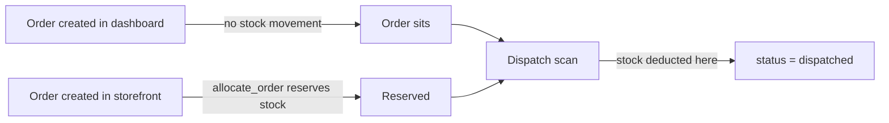

# 16 — Dispatch

Barcode-scanning orders out of the warehouse. **This is where stock is actually deducted**
for dashboard-created orders.

---

## Why this matters

A dashboard-created order reserves **nothing**. The dispatch scan is the first moment real
stock leaves the system. See [17 — Inventory & stock](./17-inventory-and-stock.md).

---

## The scan screen

**Purpose** — Scan order barcodes into a batch; each successful scan dispatches the order
and deducts its stock.
**URL** `/dispatch/` · **name** `dispatch_management` · **View** `dashboard/views.py:9866`
**Template** `dashboard/templates/dispatch_management.html`
**Permission** `can_view_dispatch` (scanning also needs `can_scan_barcodes`)

### What a scan does

| Step | Line | Effect |
|---|---|---|
| Match the scanned value | | Against `Order.order_number` **or** `Order.barcode` |
| Deduct stock | `views.py:10100-10154` | Via `clear_reservation_on_dispatch()` and FIFO batch deduction |
| Set status | `views.py:10163-10199` | → `dispatched`. **Creates the "Dispatched" `Setup` row if missing** (`:10173-10178`) |
| Set logistics | `:10163-10199` | `logistics` and `dispatch_date` |
| Write logs | | An `OrderActivityLog` `status_changed` plus a `DispatchLog` row |

> The status write here does **not** go through `apply_manual_status`, so it sets **no
> manual hold**. A subsequent NCM sync can move the order on from `dispatched` — which is
> usually what you want, since the courier takes over from there.

---

## Pages

| Page | URL | View | Template | Permission |
|---|---|---|---|---|
| Scan screen | `/dispatch/` | `dispatch_management` | `dispatch_management.html` | `can_view_dispatch` |
| Batch list | `/dispatch/list/` | `dispatch_list` | `dispatch_list.html` | `can_view_dispatch` |
| Batch detail | `/dispatch/<pk>/` | `dispatch_detail` | `dispatch_detail.html` | `can_view_dispatch` |
| Trash | `/dispatch/trash/` | | `dispatch_trash.html` | `can_delete_dispatch` |
| Trash / restore / permanent delete | `/dispatch/<pk>/trash\|restore\|permanent-delete/` | | — | `can_delete_dispatch` |
| Bulk action | `/dispatch/bulk-action/` | | — | `can_view_dispatch` |
| Trash bulk action / empty | `/dispatch/trash/bulk-action/`, `/dispatch/trash/empty/` | | — | `can_delete_dispatch` |

---

## `Dispatch` — `dashboard/models.py:1121-1337`

The batch. One `Dispatch` row per scanning session.

| Field group | Notes |
|---|---|
| `status` | From `STATUS_CHOICES` (`:1124-1133`): `pending`, `processing`, `confirmed`, `packed`, `shipped`, `delivered`, `cancelled`, `dispatched`. **Default `'dispatched'`** (`:1147`) |
| `logistics` | `LOGISTICS_CHOICES` (`:1135-1142`) |
| Counters | `_status_counts()` (`:1197-1220`) aggregates its items |
| Soft delete | Standard |

---

## `DispatchItem` — `dashboard/models.py:1339-1417`

One row per scanned order.

| Field | Notes |
|---|---|
| `dispatch` | FK, `related_name='items'` |
| `order` | FK → `Order`, `related_name='dispatch_items'` (`:1373-1379`) |
| `dispatch_status` | `success` / `failed` / `not_found`. **Default `not_found`** (`:1380-1385`) |
| `failure_code` | Machine-readable cause — see below |
| `failure_reason` | The human sentence |

### `FAILURE_CODE_CHOICES` — `:1350-1355`

The failure code exists **so the UI can group and colour failures without string-matching
the human sentence**. Each has a stored hint (`FAILURE_CODE_HINTS`, `:1357-1365`) shown to
the operator:

| Code | Meaning | What to do |
|---|---|---|
| `already_dispatched` | This order ID was scanned into an earlier batch that is still active | Remove it from this batch, or restore/clear the earlier dispatch first |
| `not_found` | No order matched by order number or barcode | Check for a mis-scan, a trimmed prefix, or a deleted order |
| `status_reverted` | The order was dispatched in this batch but its status was later moved away from `dispatched`, so the stock deduction was rolled back | Expected — informational |
| `error` | Processing error | See the activity log for the underlying error |

`mark_failed()` (`:1409-1417`) is the helper that sets all three fields together.

### `status_reverted` — the interesting one

When an order's status moves **away from** `dispatched` — via the edit page
(`views.py:4468-4477`) or a bulk action (`:9272-9283`) — two things happen:

1. `restore_order_stock()` puts the stock back
2. `_invalidate_dispatch_items()` (`views.py:9842`) marks the corresponding `DispatchItem`
   as failed with `failure_code='status_reverted'`

So the dispatch batch stays truthful: it records that the dispatch *happened* and was later
undone, rather than silently pretending it never occurred.

`restore_order_stock()` is guarded (`inventory/services.py:380-387`) — it refuses unless a
`DispatchItem` with `dispatch_status='success'` exists, unless called with `force=True`.
That prevents "restoring" stock that was never deducted.

---

## `DispatchLog` — `dashboard/models.py:1461-1538`

**Append-only** audit trail for a batch. Every scan outcome, stock movement and later status
change writes a row, so the detail page can explain exactly what happened and when.

| Field | Values |
|---|---|
| `level` | `info` / `success` / `warning` / `error` |
| `event` | `batch_created`, `order_dispatched`, `order_failed`, `order_not_found`, `stock_oversold`, … |

`stock_oversold` is worth watching — it records a dispatch that went ahead despite
insufficient stock.

---

## Permissions

| Flag | Grants |
|---|---|
| `can_view_dispatch` | Scan screen, list, detail, bulk actions |
| `can_manage_dispatch` | Managing batches |
| `can_delete_dispatch` | Trash, restore, permanent delete, empty trash |
| `can_scan_barcodes` | Performing scans |

---

## Gotchas

- **Dispatch is where stock actually moves** for dashboard orders — not order creation.
- **`DispatchItem.dispatch_status` defaults to `not_found`**, so an item that was never
  processed reads as a failure rather than a success. That is deliberate.
- **The dispatch status write creates a `Setup` row on demand** (`views.py:10173-10178`) —
  another contributor to `Setup` table drift ([22](./22-settings-and-setup.md)).
- **Scanning sets no manual hold**, so NCM can move the order on afterwards.
- Reverting a dispatched order rolls the stock back **and** marks the dispatch item failed —
  it does not delete the record.
- `dispatch_delete` exists in `views.py:10633` but is **not routed**. See
  [A4](./A4-appendix-known-quirks.md).

---

## Files that own this

- `dashboard/models.py:1121-1538` — `Dispatch`, `DispatchItem`, `DispatchLog`
- `dashboard/views.py:9866-…` — `dispatch_management`, the scan handler
- `dashboard/views.py:9842` — `_invalidate_dispatch_items`
- `inventory/services.py` — `clear_reservation_on_dispatch`, `restore_order_stock`
- `dashboard/templates/dispatch_*.html`
