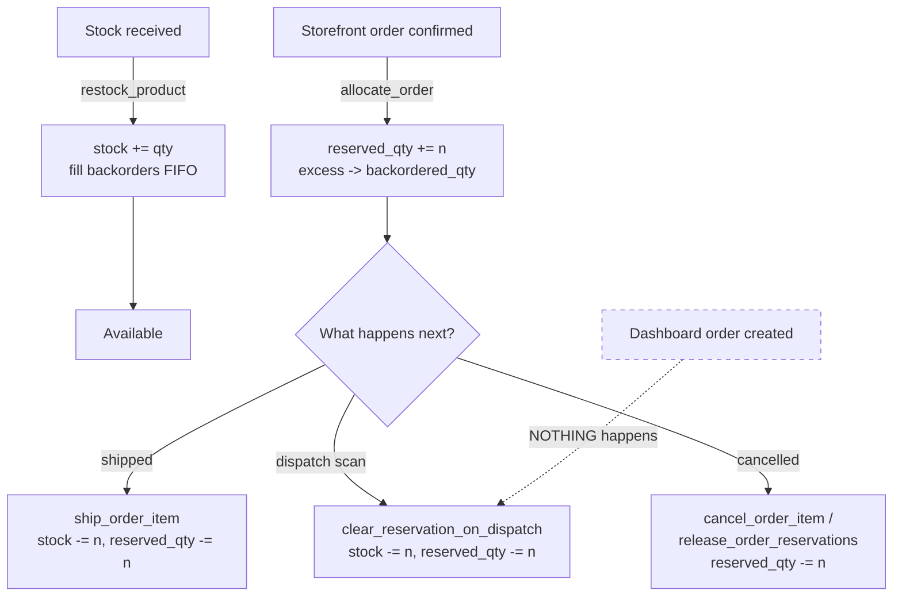

# 17 — Inventory & Stock

Stock reservation, backorders, FIFO batch deduction, and demand forecasting.

The `inventory` app has **no models and no URLs**. It is a pure service layer operating on
`dashboard` models.

---

## The three stock numbers

Every `Product` carries three counters (`dashboard/models.py:86-88`):

| Field | Meaning |
|---|---|
| `stock` | Physical units on hand |
| `reserved_qty` | Units promised to confirmed orders but not yet shipped |
| `backordered_qty` | Units owed that we don't have |

```
available_stock = stock - reserved_qty      # Product.available_stock, models.py:143-157
```

`backorders_allowed` (`:88`) controls whether an unfillable line becomes a backorder or is
simply dropped.

`OrderItem` mirrors the first two per line: `reserved_qty` (`:597`), `backordered_qty`
(`:598`).

---

## The lifecycle



> **The dashed line is the thing to remember.** A dashboard-created order reserves nothing.
> Only the storefront calls `allocate_order`. Dashboard stock moves at the dispatch scan.

---

## The public API — `inventory/services.py`

Every public function runs inside `transaction.atomic()` and uses `select_for_update()` to
prevent races on concurrent requests (docstring `:1-18`).

| Function | Line | Purpose |
|---|---|---|
| `allocate_order(order)` | `:117` | Reserve stock when a **store** order is confirmed |
| `restock_product(product, qty)` | `:172` | Fill backorders FIFO when new stock arrives |
| `ship_order_item(item)` | `:246` | Deduct stock + release the reservation on shipment |
| `cancel_order_item(item)` | `:319` | Roll back one line's reservation |
| `restore_order_stock(order)` | `:358-430` | Put stock back when a dispatch is undone |
| `clear_reservation_on_dispatch(product, qty)` | `:433-469` | Clear counters when the dashboard dispatches stock |
| `release_order_reservations(order)` | `:512-555` | Release all reservations for a cancelled order |
| `reset_stale_counters()` | `:597` | Maintenance — recalculate all counters from the database |

Internal helpers: `_release_prior_allocation` (`:25`), `_allocate_bundle` (`:64`),
`_deduct_from_batches_fifo` (`:285`).

---

## `allocate_order` — `inventory/services.py:117-169`

For each `OrderItem`:

1. Lock the product row (`select_for_update`)
2. **Release any prior allocation** (see below)
3. Bundles branch to `_allocate_bundle`
4. `available = stock − reserved_qty`; reserve `min(quantity, max(available, 0))`
5. The shortfall becomes `backordered_qty` — **but only if `backorders_allowed`**;
   otherwise it is simply dropped
6. Write both the `OrderItem` and the `Product` counters

### Why `_release_prior_allocation` exists — `:25-61`

`allocate_order` **overwrites** the item's own `reserved_qty`/`backordered_qty` but
**accumulates** onto the product's. So allocating the same order twice — a re-confirmation,
a retried checkout, a re-run after an edit — reserved the stock twice and leaked
`reserved_qty` that nothing ever gave back. That stock then reads as unavailable forever,
quietly pushing later orders into backorder.

Releasing the previous allocation first makes re-allocation **idempotent**.

### Called from — the complete list

- `store/views.py:610-611` — storefront checkout
- `store/views.py:802-803` — buy-now

Both only when `order_type == 'confirmed'`, and both operate on **`store.models.Order`**.

---

## Bundles

A `Product` with `is_bundle=True` has `BundleComponent` rows (`dashboard/models.py:248`)
naming its component products and `quantity_required` for each.

`_allocate_bundle` (`:64-114`) reserves `bundle_qty × quantity_required` against **each
component**, locking every component row. `_release_prior_allocation` mirrors this on the
way out.

`dashboard/services.py:8-69` `deduct_stock()` is a separate bundle-aware deduction helper
used by the dispatch path.

---

## FIFO batches

`ProductBatch` (`dashboard/models.py:201-246`) tracks stock in dated lots, which is what
makes expiry tracking possible.

`_deduct_from_batches_fifo` (`inventory/services.py:285`) consumes the oldest batch first.
`dashboard/context_processors.py:283` `expiry_notifications` surfaces batches nearing
expiry on every page.

---

## Where stock is restored

| Trigger | Call | Line |
|---|---|---|
| Order edit moves status away from `dispatched` | `restore_order_stock()` | `dashboard/views.py:4469-4470` |
| Hard delete (`order_delete`) | `restore_order_stock()` | `:4884-4885` |
| Move to trash | `restore_order_stock()` | `:4937-4938` |
| Bulk delete / bulk status change off `dispatched` | `restore_order_stock()` | `:9228-9229`, `:9274-9275` |
| Order cancelled on the detail page | `release_order_reservations()` | `:4097-4098` |
| Move to trash | `release_order_reservations()` | `:4945-4946` |
| Bulk actions | `release_order_reservations()` | `:9235-9236`, `:9289-9290`, `:9353-9354` |

**`restore_order_stock` is guarded** (`inventory/services.py:380-387`): it refuses unless a
`DispatchItem` with `dispatch_status='success'` exists, unless called with `force=True`.
That prevents restoring stock that was never deducted in the first place.

---

## Pages

| Page | URL | View | Template | Permission |
|---|---|---|---|---|
| Inventory dashboard | `/inventory-dashboard/` | `inventory_dashboard` | `inventory_dashboard.html` | `can_view_inventory` |
| Create stock-in | `/inventory/stock-in/create/` | `stock_in_create` | `stock_in_create.html` | `can_manage_inventory` |
| Stock-in detail | `/inventory/stock-in/<id>/` | `stock_in_detail` | `stock_in_detail.html` | `@login_required` |
| Low-stock settings | `/inventory/low-stock-settings/` | `low_stock_settings` | `low_stock_settings.html` | `can_manage_inventory` |
| Low-stock alerts | `/inventory/low-stock-alerts/` | `low_stock_alerts` | `low_stock_alerts.html` | `can_view_inventory` |
| **Backorder management** | `/inventory/backorders/` | `backorder_management` | `backorder_management.html` | `can_manage_inventory` |

`StockIn` / `StockInItem` (`dashboard/models.py:814-880`) record goods receipts.

Product-level stock-in also exists as an API: `/api/product/<id>/stock-in/`.

---

## Low-stock alerts

`dashboard/context_processors.py:76` `low_stock_notifications` runs on every page render and
feeds the navbar badge. Thresholds are set per product at
`/inventory/low-stock-settings/` (`save_low_stock_thresholds`).

Gated by `can_view_low_stock_alerts`.

---

## Forecasting — `inventory/forecasting.py`

Lightweight demand forecasting, no external libraries.

| Function | Line | Does |
|---|---|---|
| `exponential_smoothing(sales, alpha=0.4)` | `:11` | Smoothed demand estimate |
| `detect_spike(sales, spike_window=5, spike_threshold=2.0)` | `:28` | Flags an unusual burst |
| `smart_daily_rate(sales)` | `:52` | Daily rate, spike-aware |
| `days_of_stock_remaining(stock, sales)` | `:74` | Runway |
| `restock_urgency(days_left, lead_time_days=3)` | `:85` | Urgency banding |

Used by the inventory dashboard and backorder screens.

---

## Maintenance

```bash
python manage.py reset_stock_counters
```

Recalculates `reserved_qty` and `backordered_qty` for every product from the underlying
order data. Run this if counters have drifted — for example after a crash mid-allocation, or
if you suspect the double-reservation bug that `_release_prior_allocation` now prevents.

---

## Permissions

| Flag | Grants |
|---|---|
| `can_view_inventory` | Dashboard, alerts |
| `can_manage_inventory` | Stock-in, thresholds, backorders |
| `can_adjust_stock` | Manual adjustments |
| `can_view_inventory_cost` | Cost visibility |
| `can_view_selling_unit_price` / `can_view_cost_unit_price` | Per-unit price columns |
| `can_toggle_product_price` | Switch the displayed price basis |
| `can_view_valuation_selling` / `can_view_valuation_cost` / `can_toggle_stock_valuation` | Stock valuation views |
| `can_view_low_stock_alerts` | The alert badge |

---

## Gotchas

- **Dashboard orders don't reserve stock.** Only the storefront does. This is the single most
  common source of confusion.
- **`allocate_order` operates on `store.models.Order`**, not `dashboard.models.Order`.
- **Re-allocation is idempotent, but only because of `_release_prior_allocation`.** Don't
  remove that call.
- **Backorders are silently dropped** when `backorders_allowed` is false — the shortfall
  simply isn't recorded.
- **`restore_order_stock` refuses without a successful `DispatchItem`.** If stock isn't
  coming back, check that first.
- Counters can drift. `reset_stale_counters()` / `manage.py reset_stock_counters` is the fix.
- Bundle allocation locks every component row — a bundle with many components in a busy
  system is a contention point.

---

## Files that own this

- `inventory/services.py` — the whole public API
- `inventory/forecasting.py` — demand estimation
- `inventory/management/commands/reset_stock_counters.py`
- `dashboard/models.py:48-198` — `Product` and its counters
- `dashboard/models.py:201-280` — `ProductBatch`, `BundleComponent`
- `dashboard/models.py:583-629` — `OrderItem` counters
- `dashboard/models.py:814-880` — `StockIn`, `StockInItem`
- `dashboard/services.py:8-69` — `deduct_stock`
- `store/views.py:610`, `:802` — the only `allocate_order` callers
