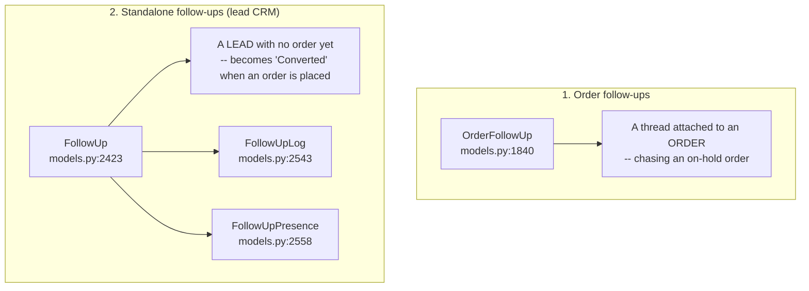

# 19 — Customers & Follow-Ups

Customer records, and the two separate follow-up systems built on top of them.

---

## Customers

### `Customer` — `dashboard/models.py:302-329`

A plain contact record. `CUSTOMER_TYPES` (`:303-307`): `retail` (default), `wholesale`,
`vip`. `related_name='orders'` back to `Order`.

**Matched on phone number.** Order creation does `get_or_create(phone=…)` and then overwrites
the record's fields with whatever was typed (`dashboard/views.py:3490-3505`).

> The order keeps **denormalised copies** of name, phone, email and address
> (`Order.customer_name`, `customer_phone`, …). Those are what get sent to couriers.
> Editing a `Customer` does **not** retroactively change past orders.

### Pages

| Page | URL | View | Template | Permission |
|---|---|---|---|---|
| Customer list | `/customers/` | `customers_list` | `customers_list.html` | `can_view_customers` |
| Add customer | `/customers/add/` | | `customer_form.html` | `can_create_customers` |
| Customer detail | `/customers/<id>/` | `customer_detail` | `customer_detail.html` | `@login_required` |
| Edit | `/customers/<id>/edit/` | | `customer_form.html` | `can_edit_customers` |
| Delete | `/customers/<id>/delete/` | `customer_delete` (`views.py:3043`) | `customer_delete.html` | `can_delete_customers` |
| Bulk action | `/customers/bulk-action/` | | — | |

APIs: `/api/customer/<id>/`, `/api/search-customer-by-phone/` — the latter powers the
autofill on the order form.

> `customer_detail` is **defined twice** (`views.py:2620` and `:3020`). The second wins, and
> it is `@login_required` only — so the `can_view_customers` flag does not actually gate it.
> See [A4](./A4-appendix-known-quirks.md).

---

## Two follow-up systems

This trips people up. There are **two unrelated models**, both called "follow-up":

---

## 1. Order follow-ups

Attached to an existing order, used mainly for on-hold orders.

### Fields on `Order` itself

| Field | Line |
|---|---|
| `next_followup_date` | `:459` |
| `followup_type` — `call` / `whatsapp` / `email` / `visit` | `:466` |
| `followup_assigned_to` | `:467-470` |
| `followup_done` | `:471` |

### `OrderFollowUp` — `dashboard/models.py:1840-1875`

The thread of individual contacts. `FOLLOWUP_TYPE_CHOICES` (`:1842-1848`):
`called_no_answer`, `called_answered`, `whatsapp_sent`, `email_sent`,
`custom_note` (default). `related_name='followups'` on `Order`.

### Endpoints

All JSON, all `can_view_on_hold_orders`:

| URL | Purpose |
|---|---|
| `/orders/<id>/followup/add/` | Add an entry |
| `/orders/<id>/followups/` | List the thread |
| `/orders/<id>/next-followup/` | Set the next date |

Surfaced on the **On-Hold Orders** page: `/orders/on-hold/` (`on_hold_orders_list`,
`views.py:7477`), which matches Setup rows named "On Hold" and "Inquiry" by FK **or** string
(`:7483-7503`).

---

## 2. Standalone follow-ups (lead CRM)

A lightweight lead tracker for people who have not ordered yet.

### `FollowUp` — `dashboard/models.py:2423-2494`

| Field | Notes |
|---|---|
| `name`, `phone` | The lead |
| `lead_source` | Where they came from |
| `product` | **Legacy** single FK, kept for backward compatibility |
| `products`, `product_variations` | **M2M — the preferred fields** |
| `followup_1`, `followup_2` | Two free-text follow-up slots |
| `status` | **Free text**, no choices |
| `remarks` | |
| `version` | Optimistic-concurrency counter, used by the realtime sync |
| `is_deleted` | Soft delete |

Helper properties: `latest_followup_log`, `all_followup_logs`, `followup_count`,
`get_all_products()` (M2M with FK fallback), `get_formatted_products()` (for the frontend).

**Conversion.** When an order is created from a lead, `order_create` sets the lead's
`status` to `'Converted'` and writes a `FollowUpLog` (`dashboard/views.py:3657-3672`).

### `FollowUpLog` — `:2543-2556`

Per-change audit. `field_changed` is free text; the properties above key off the values
`'Entry Created'` and anything starting with `'Followup'`.

### `FollowUpPresence` — `:2558-2573`

Typing / viewing indicators, so two staff don't work the same lead simultaneously.

### Pages and endpoints

| Page | URL | View | Template | Guard |
|---|---|---|---|---|
| Follow-ups board | `/orders/follow-ups/` | `follow_ups_list` (`views.py:26216`) | `dashboard/follow_ups.html` | inline `can_access_follow_ups` |
| Trash | `/orders/follow-ups/trash/` | `follow_ups_trash` | `dashboard/follow_ups_trash.html` | inline `can_access_follow_ups` |
| **Export** | `/orders/follow-ups/export/` | `export_follow_ups` (`:26709`) | xlsx / CSV | inline `can_access_follow_ups` **AND** `can_export_follow_ups` |

APIs (all inline `can_access_follow_ups`):
`/api/orders/follow-ups/add/` · `/<pk>/edit/` · `/<pk>/logs/` · `/<pk>/delete/` ·
`/<pk>/restore/` · `/<pk>/hard-delete/` ·
**`/api/orders/follow-ups/bulk-delete/`** (`bulk_delete_follow_ups`, `:26614`) ·
**`/api/orders/follow-ups/ids/`** (`follow_ups_filtered_ids`, `:26682`)

> The follow-ups views check the flag **inline**, not by decorator — a grep for
> `@permission_required` misses them. See [A4](./A4-appendix-known-quirks.md).

**Real-time:**

| URL | Purpose |
|---|---|
| `/api/orders/follow-ups/sync/` | Poll for changes made by other staff (uses `version`) |
| `/api/orders/follow-ups/presence/` | Typing / viewing indicators |

### Filtering, bulk actions and export (Aug 2026)

The list view, the sync poll, the ids endpoint and the export all run through one shared
pair — `_followup_filter_params()` / `_apply_followup_filters()` — so a bulk action or an
export can never act on a different set than the one on screen.

- **Filters:** search, lead source, status, plus a **date filter** — presets (today,
  yesterday, last 7/30 days, this/last month, this year) or a custom From/To. A *Date Field*
  selector switches the whole filter, the Date column and its sort header between
  `created_at` and `updated_at`. Reversed ranges are swapped; an unparseable date falls
  back to all-time rather than 500ing.
- **Sorting:** a *Sort By* control over eight fields, including two derived ones
  (`last_followup_at`, `followup_count`) that are annotated only when sorted on. Column
  headers and quick-sort shortcuts write the same `?sort=&dir=`, so ordering spans every
  page; blank/null values sink to the bottom in both directions.
- **Bulk selection:** a checkbox column with master checkbox and shift-click range select.
  The selection lives in `sessionStorage`, so it survives paging and filter changes.
  "Select all N matching this filter" pulls ids from `/api/orders/follow-ups/ids/`.
- **Bulk delete** is a **soft delete** (restorable from Trash) in one transaction, with
  `select_for_update` so a row someone else just deleted isn't logged twice, and
  `updated_at` set by hand so the sync poll notices in every other open tab.
- **Export** is xlsx (Follow-ups / Follow-up Notes / Status Summary / Report Info) or CSV,
  covering the whole filtered queryset. An explicit `ids=` selection wins over the ambient
  filters, and the Report Info sheet says so.
- The sync poll sends the date filter too, so it can't splice a row into a date-filtered
  table the page itself would never have rendered.

Verified by `test_followup_bulk_export_sort.py` (repo-root standalone script).

### Follow-up status setup

`dashboard/followup_setup_views.py`, guarded by a local `user_can_setup_followup` →
`can_setup_follow_up_status`.

| Page | URL | Template |
|---|---|---|
| Status management | `/setup/followup-status/` | `dashboard/followup_setup_management.html` |

Plus `add`, `<id>/edit`, `update-color`, `delete`, `toggle-default`.

These rows are `Setup(setup_type='followup_status')` — see
[22](./22-settings-and-setup.md).

### Follow-up report

**URL** `/reports/followups/` · **View** `dashboard/views.py:26600`
**Template** `dashboard/templates/dashboard/followup_report.html`
**Permission** inline `can_view_follow_up_report` (not a decorator)

Drill-down APIs: `/api/reports/followups/<pk>/logs/`, `…/staff/<id>/logs/`,
`…/status/logs/` (`views.py:27053`, `:27091`, `:27179`).

---

## Permissions

| Flag | Grants |
|---|---|
| `can_view_customers` / `can_create_customers` / `can_edit_customers` / `can_delete_customers` | Customer CRUD |
| `can_view_on_hold_orders` | On-hold page and order follow-up endpoints |
| `can_access_follow_ups` | The standalone follow-ups board, bulk delete, ids endpoint (checked inline) |
| `can_export_follow_ups` | The follow-ups Export button — **in addition to** `can_access_follow_ups` |
| `can_view_follow_up_report` | The report (checked inline) |
| `can_setup_follow_up_status` | Follow-up status setup |

---

## Gotchas

- **Two different follow-up systems.** `OrderFollowUp` hangs off an order; `FollowUp` is a
  standalone lead. They share a name and nothing else.
- **`FollowUp.status` is free text.** The Setup rows are a UI convenience, not a constraint.
- **`FollowUp.product` is legacy.** Use `products` / `product_variations`;
  `get_all_products()` handles the fallback.
- **Customers are matched by phone**, so two people sharing a phone number become one
  customer record.
- **Editing a customer doesn't update past orders** — the denormalised copies are the record
  of what was shipped.
- The follow-ups board uses `version` for optimistic concurrency; a stale client's write can
  be rejected.

---

## Files that own this

- `dashboard/models.py:302-329` — `Customer`
- `dashboard/models.py:1840-1875` — `OrderFollowUp`
- `dashboard/models.py:2423-2573` — `FollowUp`, `FollowUpLog`, `FollowUpPresence`
- `dashboard/followup_setup_views.py` — status setup
- `dashboard/views.py:7477` — on-hold orders
- `dashboard/views.py:26600` — the follow-up report
- `dashboard/templates/dashboard/follow_ups.html`, `followup_report.html`
