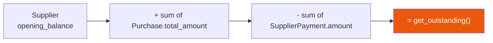

# 21 — Purchases & Suppliers

Buying stock in: supplier records, purchase invoices, payments, and the running balance
owed.

---

## The money model

`Supplier.get_outstanding()` — `dashboard/models.py:1734`.

---

## `Supplier` — `dashboard/models.py:1708-1735`

| Field | Notes |
|---|---|
| `name`, `phone`, `address` | |
| `opening_balance` | Amount already owed when the supplier was added |
| `is_active` | |

Helper methods:

| Method | Line | Returns |
|---|---|---|
| `get_total_purchases()` | `:1727` | `Sum(purchases.total_amount)` |
| `get_total_paid()` | `:1730` | `Sum(payments.amount)` |
| `get_outstanding()` | `:1733` | `opening_balance + purchases − paid` |

---

## `Purchase` — `dashboard/models.py:1737-1785`

A purchase invoice.

| Field | Notes |
|---|---|
| `supplier` | FK, `related_name='purchases'` |
| `purchase_date` | Defaults to now |
| `invoice_number` | **Unique** |
| `total_amount` | |
| `payment_status` | `paid` / `partial` / `unpaid` (default **`unpaid`**) |
| `payment_method` | Free text |
| `notes`, `created_by` | |

Ordered by `-purchase_date, -created_at`.

| Method | Line | Does |
|---|---|---|
| `get_total_paid()` | `:1766` | `Sum(payments.amount)` |
| `get_remaining()` | `:1769` | `total_amount − paid` |
| `update_payment_status()` | `:1772` | Recomputes `paid` / `partial` / `unpaid` from actual payments |

> **`payment_status` is derived, not authoritative.** Call `update_payment_status()` after
> recording a payment, or the badge goes stale.

### `PurchaseItem` — `:1787-1810`

Line items on the invoice. Feeds `ProductPurchase` (`:281-300`), which maintains a
**weighted-average cost price** per product.

### `SupplierPayment` — `:1812-1838`

An individual payment against a supplier (and optionally a specific purchase).
`related_name='payments'` on both.

---

## Pages

All under `dashboard/templates/purchase/`. Guarded by `@login_required` **plus an inline
check** on `can_view_purchases` / `can_manage_suppliers` — not by decorator.

| Page | URL | View | Template |
|---|---|---|---|
| Purchase dashboard | `/purchases/dashboard/` | `purchase_dashboard` | `purchase/purchase_dashboard.html` |
| Create purchase | `/purchases/create/` | `purchase_create` (`views.py:19256`) | `purchase/purchase_form.html` |
| Purchase detail | `/purchases/<id>/` | `purchase_detail` (`views.py:19317`) | `purchase/purchase_detail.html` |
| Edit purchase | `/purchases/<id>/edit/` | `purchase_edit` (`views.py:19390`) | `purchase/purchase_form.html` |
| Purchase report | `/reports/purchase/` | `purchase_report` | `purchase/purchase_report.html` |
| Supplier list | `/suppliers/` | `supplier_list` | `purchase/supplier_list.html` |
| Add supplier | `/suppliers/add/` | | `purchase/supplier_form.html` |
| Edit supplier | `/suppliers/<id>/edit/` | | `purchase/supplier_form.html` |
| Supplier detail | `/suppliers/<id>/` | | `purchase/supplier_detail.html` |
| Record a payment | `/suppliers/payment/add/` | `supplier_payment_add` (`views.py:19695`) | `purchase/payment_form.html` |
| Product purchase history | `/products/<id>/purchase-history/` | | `purchase/product_purchase_history.html` |

API: `/api/supplier/<id>/purchases/` (JSON).

---

## Relationship to stock

Recording a purchase does **not** automatically increase stock. Stock arrives through
**Stock In** (`/inventory/stock-in/create/`) — see
[17 — Inventory & stock](./17-inventory-and-stock.md).

`ProductPurchase` (`dashboard/models.py:281-300`) is what ties the two together for costing:
it maintains a weighted-average cost price as new lots are bought at different prices.

`ProductBatch` (`:201-246`) carries a per-batch `cost_price`, which is what FIFO deduction
uses for accurate cost-of-goods figures.

---

## Permissions

| Flag | Grants |
|---|---|
| `can_view_purchases` | Purchase dashboard, list, detail, report |
| `can_create_purchases` | Creating and editing purchases |
| `can_manage_suppliers` | Supplier CRUD |
| `can_make_supplier_payments` | Recording payments |
| `can_view_cost_price` | Seeing cost figures anywhere |

---

## Gotchas

- **`payment_status` is derived.** It only updates when `update_payment_status()` is called.
- **`invoice_number` is unique** across all suppliers, not per supplier.
- **Purchases don't move stock.** Use Stock In for that.
- **Permission checks here are inline**, not decorators — see
  [03](./03-auth-roles-permissions.md).
- `get_outstanding()` includes `opening_balance`, so a supplier can show a balance with no
  purchases recorded.
- All money fields are `max_digits=18` decimals; parse through `safe_decimal()`.

---

## Files that own this

- `dashboard/models.py:281-300` — `ProductPurchase` (weighted-average cost)
- `dashboard/models.py:1708-1838` — `Supplier`, `Purchase`, `PurchaseItem`, `SupplierPayment`
- `dashboard/views.py:19256-19695` — the purchase and supplier views
- `dashboard/templates/purchase/` — all templates
