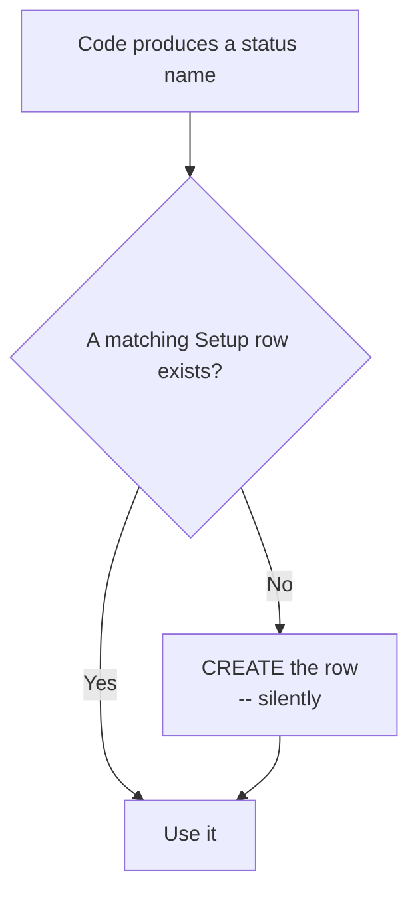
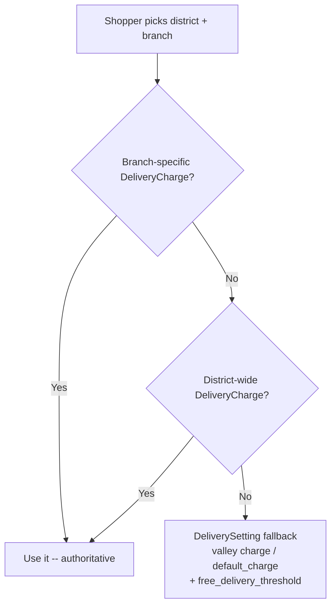

# 22 — Settings & Setup Management

The configuration surface: status vocabularies, cities, company branding, API accounts,
sync cadence, maintenance mode and notices.

---

## The settings hub

**URL** `/settings/` · **name** `settings_hub` · **Template** `settings_hub.html`

A two-panel launcher for everything below.

---

## Setup Management — the status vocabulary

**URL** `/setup/` · **name** `setup_management` · **Template** `setup_management.html`
**Permission** `can_view_orders`

This is where the words that appear in every status dropdown are defined.

### `Setup` — `dashboard/models.py:1583-1609`

| Field | Purpose |
|---|---|
| `setup_type` | Which vocabulary this row belongs to |
| `name` | The human-readable name, e.g. `"Pickup Created"` |
| `description` | Free text |
| `color` | Hex code for the badge |
| `is_active` | Hide without deleting |
| `is_default` | Pre-selected in order forms and used by the Excel importer |
| `sort_order` | Drag-and-drop ordering |

`unique_together = ('setup_type', 'name')`.

### The five setup types — `:1584-1590`

| `setup_type` | Feeds |
|---|---|
| `status` | Order status dropdowns, filters, bulk "Mark as …" options |
| `payment` | Payment method |
| `payment_status` | Payment status |
| `order_source` | `Order.order_from`, and the Orders-by-Source report |
| `followup_status` | Follow-up statuses ([19](./19-customers-and-followups.md)) |

### Actions

| Action | URL | Permission |
|---|---|---|
| Add | `/setup/add/` | `can_create_orders` |
| Edit | `/setup/<id>/edit/` | `can_create_orders` |
| Delete | `/setup/<id>/delete/` | `can_delete_orders` |
| Toggle default | `/setup/<id>/toggle-default/` | `can_create_orders` |
| Reorder | `/setup/reorder/` | `can_create_orders` |

---

## ⚠️ Setup rows are created automatically

This is the most important thing to know about this table.

Three places do this:

| Where | Line |
|---|---|
| `sync_order_status_setup()` | `dashboard/views.py:148` |
| `order_detail` forced repair | `dashboard/views.py:4118-4147`, `:4233` |
| `NCMService._resolve_setup()` | `services/ncm_service.py:1082` |
| Dispatch scan ("Dispatched") | `dashboard/views.py:10173-10178` |

**Consequence:** the `Setup` table drifts toward whatever strings the code has ever
produced. If you find rows nobody created deliberately, this is why.

`_resolve_setup` also **reuses a deactivated row** rather than creating a duplicate — the
unique constraint would reject one anyway (`services/ncm_service.py:1068`).

> Deleting a `Setup` row does not change the orders pointing at it — `status_setup` is
> `SET_NULL`. Those orders fall back to their status **strings**, which is exactly what the
> `status_setup IS NULL` branch in the orders-list filter handles
> ([05](./05-orders-list.md)).

Only two status rows are seeded by migration: `"Return Processing"`
(`dashboard/migrations/0077_return_processing_status_setup.py`) and `"Return Arrived"`
(`0088_return_arrived_status_setup.py`).

---

## Delivery Charge Setup

**URL** `/setup/delivery-charges/` · **name** `delivery_charge_setup`
**View** `dashboard/delivery_charge_views.py:60` · **Template** `dashboard/delivery_charge_setup.html`
**Permission** `@login_required` + `@admin_only` (every route in this file is admin-only)

Storefront delivery pricing, promised times and covered zones. Before Aug 2026 this was
three hardcoded constants in `store/services.py`.

### Two models — `store/models.py`

| Model | Line | Holds |
|---|---|---|
| `DeliverySetting` | `:318` | **One row** (`get_solo()`). Inside-valley charge, fallback `default_charge`, `free_delivery_threshold`, valley district list, default promised-time strings (English + Nepali), show/hide toggles |
| `DeliveryCharge` | `:373` | One rule per `district`, optionally per `branch_code`. `charge`, `free_above`, `delivery_time` (+ `_np`), `covered_areas`, `is_active`, `sort_order`. `unique_together = ('district', 'branch_code')` |

`district` and `branch_code` are forced uppercase on `save()` so lookups match whatever
casing NCM returns. A blank `branch_code` = the rule covers the whole district; a rule with
one set beats it for that branch only.

### Resolution order (storefront quote)

**A matched rule is authoritative for its district** — the site-wide "free above Rs. X"
applies only where no rule matched, so an explicitly configured charge cannot be silently
zeroed on a large order. `delivery_charge_sync` carries the threshold onto the rules it
creates so shop-wide free shipping is not switched off by accident.

### Actions — all `@admin_only`, under `/setup/delivery-charges/`

| Action | Route suffix | Notes |
|---|---|---|
| Save a rule | `save/` | |
| Delete / toggle a rule | `<rule_id>/delete/`, `<rule_id>/toggle/` | |
| Bulk action | `bulk-action/` | activate / deactivate / set-charge / set-time / set-threshold / delete |
| Site-wide settings | `settings/` | edits the `DeliverySetting` row |
| Sync districts | `sync/` | creates a rule for every NCM district that has none yet |
| Export | `export/` | CSV of every rule |
| Branch list | `branches/` | JSON, for the per-branch rule editor |

The storefront reads all this through `/store/api/quote/` — see [24](./24-storefront.md).

---

## Bulk Discount Setup

**URL** `/setup/bulk-discounts/` · **name** `bulk_discount_setup`
**View** `dashboard/bulk_discount_views.py:157` · **Template** `dashboard/bulk_discount_setup.html`
**Permission** `@login_required` + `@admin_only` (every route in this file is admin-only)

Quantity breaks — "buy 3, save 10%" — for the storefront. Added Sep 2026. Sidebar entry sits
directly under Delivery Charge Setup.

### Two models — `store/models.py`

| Model | Line | Holds |
|---|---|---|
| `BulkDiscount` | `:267` | One rule. `scope` + its target, `is_active`, `priority`, `starts_at`/`ends_at`, `show_on_cards`, `badge_text`, `note` |
| `BulkDiscountTier` | `:424` | One rung: `min_qty`, `discount_type` (`percent` / `amount` / `price`), `value`, optional `label`. `unique_together = ('rule', 'min_qty')`, max **8** rungs per rule (`MAX_TIERS`) |

### Scope — what a rule points at

| `scope` | Target | Rank |
|---|---|---|
| `variation` | One `ProductVariation` — set a different break per size or colour | 40 |
| `product` | One `Product` — simple, variable (all options) or bundle | 30 |
| `category` | Every product in a `dashboard.Category` | 20 |
| `all` | The whole shop | 10 |

**`save()` clears the columns the scope doesn't name**, so a rule edited from "product" to
"category" cannot go on matching the product it used to point at. A variation rule always
**re-derives** its `product_id` from the variation — re-point it at an option of another
product and the setup page follows it, rather than filing it under the old name.

### Resolution

Most specific live rule wins (**variation ▸ product ▸ category ▸ all**), then higher
`priority`, then the newest row. Within the winning rule, the **cheapest applicable rung**
applies — a ladder typed out of order can never charge more for taking more. Full picture in
[24 — Storefront](./24-storefront.md#quantity-breaks-bulk-discounts).

The editor **warns when a new rule duplicates an existing target**, and names which of the two
`priority` will pick.

### Actions — all `@admin_only`, under `/setup/bulk-discounts/`

| Action | Route suffix | Notes |
|---|---|---|
| Save a rule | `save/` | Creates or edits, ladder included. Validates scope + target, schedule order and tier rows |
| Delete / pause a rule | `<rule_id>/delete/`, `<rule_id>/toggle/` | |
| Duplicate | `<rule_id>/duplicate/` | Copy lands **paused**, so it can be re-pointed before going live |
| Spread across a product | `<rule_id>/spread/` | Copies one **variation** ladder onto that product's other variations. Options that already have their own rule are left alone |
| Bulk action | `bulk-action/` | activate / deactivate / delete / set-priority / clear-schedule |
| Live preview | `preview/` | "What would 4 cost?" — computed **through `store.bulk_discounts`**, so the preview cannot drift from the real storefront price |
| Export | `export/` | CSV, one row per tier |

### Gotchas

- **Saving busts the cache, but only in this process.** The storefront snapshot
  (`store:bulk_discounts:v1`) is `LocMemCache` with a 60s TTL, so a multi-process deployment
  takes up to a minute to agree. Rules written by a script never reach the running server at all
  until the TTL lapses.
- **A discount code stacks on top** of the bulk-discounted subtotal.
- **Category and shop-wide rules have no `base_price`** — there is no single price to discount,
  so their ladder is priced per line at quote time and the editor's preview asks for a product.

---

## Invoice Customizer

**URL** `/setup/invoice/` · **name** `invoice_customizer`
**View** `dashboard/invoice_customizer_views.py` · **Template** `dashboard/invoice_customizer.html`
**Permission** `@login_required` + `@admin_only` (every route in this file is admin-only)

The design of the printable invoice that opens from the orders list
([05](./05-orders-list.md)). Added Sep 2026. Before this, `order_invoice.html` was a fixed
layout — the shop's VAT/PAN number, phone and address could only be added by editing the
template. Now nothing about the invoice is hardcoded: `dashboard/views.py:order_invoice`
resolves everything through `dashboard/invoice_config.build_invoice_context()`, and the
customizer edits what that reads.

### Two models — `dashboard/models.py`

| Model | Holds |
|---|---|
| `InvoiceTemplate` | Singleton (`pk=1`, enforced in `save()`). Business identity, section/column switches, totals wording, currency, footer copy, paper + typography + colour, `custom_css` |
| `InvoiceElement` | One printable **line** — a label plus a value — in a named region. FK to the template |

`InvoiceTemplate.get_solo()` creates the row and seeds the stock lines on first access, so
the page cannot 500 on an empty database. `save()` clamps `base_font_size` (8–18),
`logo_height` (16–160), `corner_radius` (0–24) and `watermark_opacity` (1–40) rather than
trusting the form.

### Lines are rows, not code

The stock invoice lines — `Invoice #`, `Date`, `Name :-`, `Phone number :-`, `Location :-` —
are seeded as ordinary `InvoiceElement` rows by migration `0090`, flagged `is_builtin`. That
flag is **informational only**: a built-in line is renamed, reordered, hidden or deleted
exactly like one an admin adds. There is no privileged set.

A line's value comes from one of two places:

| `source` | Value | Notes |
|---|---|---|
| `field` | `token`, resolved through `invoice_config.TOKENS` | The token is a **whitelist key**, never an attribute path — the page cannot dereference arbitrary model internals |
| `static` | `static_value` | Fixed text |

An unrecognised token is rejected on save (the line falls back to `static`), and a token that
somehow survives resolves to `''` at render time inside a `try` — one bad row can never take
an invoice down.

### Regions — `InvoiceElement.SECTION_CHOICES`

| `section` | Where it prints |
|---|---|
| `brand` | Under the business name in the header |
| `meta` | The invoice meta box (number / date / time) |
| `bill_to` | The Bill To panel |
| `ship_to` | The Ship To panel — the section is off by default, its lines are pre-seeded |
| `items_note` | Between the items table and the totals |
| `totals` | Extra rows inside the totals box, above the grand total |
| `footer` | The footer |

`hide_if_empty` (on by default) is what makes the business identity fields work: the seeded
`brand` lines for VAT/PAN, phone, email and address print **the moment those fields are
filled in** and stay invisible until then.

### Tokens — `invoice_config.TOKENS`

49 whitelisted values in five groups, rendered as `<optgroup>`s in the line editor:

| Group | Examples |
|---|---|
| Order | number (with `invoice_number_prefix`), date, time, status, payment status/method, tracking number, courier, source, dispatch/delivery dates, weight, line count, total qty, NCM delivery type + destination branch, notes |
| Customer | name, phone, email, shipping address, city, landmark |
| Amounts | subtotal, discount, shipping, delivery, tax + tax percent, grand total, paid, due, COD collected, **grand total in words** |
| Business | name, tagline, VAT/PAN, registration, phone, alternate phone, email, website, address |
| System | printed by, printed at, today |

Money runs through `format_money()` (symbol, position, optional grouping);
`amount_in_words()` uses **Nepali/Indian grouping** — crore ▸ lakh ▸ thousand — and appends
paisa.

### One context builder, two callers

`build_invoice_context(order, items, cfg, user, labels, preview)` returns flat lists — the
resolved lines per region, `columns`, `rows`, `totals`, style variables — and
`order_invoice.html` only iterates over them. It has **no ORM access left**. Both the print
view and the customizer's preview iframe call it, so a preview cannot drift from the paper.

The builder reads the order defensively (`getattr` throughout, `_dec()` for every amount), so
it also accepts the lightweight `invoice_config.sample_order()` stand-in the preview falls
back to when the database has no orders.

### Actions — all `@admin_only`, under `/setup/invoice/`

| Action | Route suffix | Notes |
|---|---|---|
| Save the design | *(POST to the page)* | Booleans, text (length-capped), colours (`#rrggbb` or the default), choices (whitelisted) and clamped numbers. Multipart — carries the logo upload |
| Preview | `preview/` | Renders `order_invoice.html` against the newest real order, or `?sample=1` for the neutral sample. `@xframe_options_sameorigin` |
| Add / edit a line | `lines/save/` | One endpoint for both; `element_id` decides |
| Delete / hide a line | `lines/<id>/delete/`, `lines/<id>/toggle/` | Toggle answers JSON to `X-Requested-With` |
| Reorder | `lines/<id>/move/` (up/down), `lines/reorder/` (JSON list) | `move/` renumbers the section before swapping, so sort-order collisions from a section change cannot wedge it |
| Reset | `reset/` | `scope=lines` reseeds the stock layout, `scope=style` rolls every field back to its model default, `scope=all` does both. **Business identity and the logo are never touched** |

### Gotchas

- **The preview iframe needs `@xframe_options_sameorigin`.** The project leaves
  `X_FRAME_OPTIONS` at Django's `DENY` default, which blanks even a same-origin iframe with
  *"127.0.0.1 refused to connect"*. Only `invoice_preview` carries the exemption; the
  printable `order_invoice` stays `DENY`.
- **`custom_css` is injected with `|safe`** into the invoice's `<style>` block. That is
  deliberate — it is the advanced escape hatch — and it is why every route here is
  `@admin_only`. Element labels and values are escaped normally.
- **Clearing a text field restores its default, not blank**, for fields that have one:
  emptying "Document title" gives back `INVOICE`. Genuinely optional copy (`footer_note`,
  `watermark_text`, and the whole business block) defaults to `''` and stays cleared.
- **Deleting every line in a region is fine** — the region simply stops printing. So is
  switching off every optional column; the Product column always remains.
- **`hide_zero_totals` is per-row, not per-section.** A discount of exactly 0 vanishes even
  with "Discount" switched on.
- The customizer's tab state lives in `sessionStorage`; colour and size sliders push straight
  into the preview's CSS variables for feedback, but **only saving persists them**.

---

## API Sync Settings

Part of the settings hub, backed by the `APISettings` singleton
(`dashboard/models.py:2083-2157`, pinned to `pk=1`).

| Setting | Default | Effect |
|---|---|---|
| `order_sync_interval` | 900s | How often the **server** calls NCM. **Costs API requests** |
| `page_refresh_interval` | 30s | How often an open page re-reads status from the local DB. Free |
| `ncm_api_timeout` | 30s | Per-request timeout |
| `bulk_sync_included_statuses` | `[]` | Which statuses the bulk sync covers. Empty = exclude the default terminal list |
| `bulk_sync_fetch_event_times` | on | Fetch NCM's real event time per changed order (one extra call each) |

The remaining four columns are scheduler state, written with `queryset.update()` so
`updated_at` keeps meaning "when an admin last saved these settings":
`last_bulk_sync_started_at`, `last_bulk_sync_finished_at`, `bulk_sync_running_since`,
`last_bulk_sync_summary`.

Changes take effect in **already-open tabs** on the next heartbeat — no restart, no reload.
See [12](./12-ncm-sync-and-scheduler.md).

There is a hard floor of `MIN_SYNC_SECONDS = 60` enforced in `ncm/scheduler.py:56`, in
addition to the form's own validation.

---

## API Integration — courier accounts

**URL** `/api-integration/` · **name** `api_integration_list` · **Template** `api_integration.html`

Manages `LogisticsAPIConfig` rows (`dashboard/models.py:1540-1579`): the courier API
credentials and base URLs. Add / edit / delete / toggle / get endpoints.

| Field | Notes |
|---|---|
| `api_name` | Descriptive label |
| `logistics_provider` | `ncm` / `pick_and_drop` / `other` |
| `api_key` | |
| `api_secret` | Required for PND only |
| `base_urls` | **JSON list** — `[0]` is the v1 base, `[1]` the v2 base |
| `is_active` | |

Multiple accounts per provider are supported and are the reason the NCM sync sweeps
candidates when an order 404s — see [09](./09-ncm-api-client.md).

---

## Cities

**URL** `/cities/` · **name** `city_management` · **View** `dashboard/views.py:11878`
**Template** `city_management.html` · **Permission** inline `can_view_cities`

### `City` — `dashboard/models.py:882-906`

| Field | Notes |
|---|---|
| `name` | **Unique** |
| `valley_status` | `valley` (default) / `out_valley` |
| `is_active` | |

`valley_status` is what drives `Order.in_out` — inside or outside the Kathmandu valley,
which affects delivery pricing and the courier destination.

Order creation does `City.objects.get_or_create(...)` with the valley status derived from
the form's IN/OUT choice (`dashboard/views.py:3474-3488`), so the city list grows on its own
too.

| Page / API | URL | Permission |
|---|---|---|
| City management | `/cities/` | `can_view_cities` |
| Edit | `/cities/edit/<id>/` | `can_edit_cities` |
| Delete | `/cities/delete/<id>/` | `can_delete_cities` |
| Quick add / bulk add | `/api/cities/quick_add`, `/api/cities/bulk_add` | `can_add_cities` |
| City list JSON | `/api/cities/` | |
| Valley lookup | `/api/cities/get-valley-status/` | |

---

## Company setup & branding

**URL** `/settings/company/` · **name** `company_setup` · **Template** `company_setup.html`

`CompanySetup` (`dashboard/models.py:1878-1918`) holds the company name, logo, contact
details and **theme colours**.

Surfaced on every page by `dashboard/context_processors.py:12` `company_setup`. Colour
values pass through `_safe_color()` (`:7`) before reaching CSS — an admin-supplied colour
string is untrusted input.

---

## Landing page

**URL** `/settings/landing-page/` · **name** `landing_page_setup` · **Template** `landing_page_setup.html`

Drives the public marketing page at `/welcome/` (and `/` for logged-out visitors).

| Model | Lines | Holds |
|---|---|---|
| `LandingPageSettings` | `:1920-2012` | Hero copy, sections, toggles |
| `LandingStatItem` | `:2014-2041` | The stat counters |
| `LandingBrandLogo` | `:2043-2057` | Partner logos |
| `LandingFeatureCard` | `:2059-2081` | Feature cards |

---

## Maintenance mode

`MaintenanceMode` (`dashboard/models.py:2334-2370`) — a **singleton** pinned to `pk=1`.

| Field | Purpose |
|---|---|
| `is_enabled` | When on, **non-admin** users see a maintenance overlay |
| `message` | Custom overlay text |
| `enabled_at`, `enabled_by` | Who turned it on and when |

`save()` deletes the `ctx_maintenance_mode` cache key so the change takes effect
immediately (`:2365-2366`). Surfaced by `dashboard/context_processors.py:188`.

`MaintenanceLog` (`:2372-2396`) records every enable/disable event.

| API | URL |
|---|---|
| Toggle | `/api/maintenance/toggle/` |
| History | `/api/maintenance/logs/` |

> **Admins bypass the overlay**, so you can turn it on and keep working.

---

## Global notices

`GlobalNotice` (`dashboard/models.py:2398-2421`) — a rich-text banner shown to all staff.

| Field | Purpose |
|---|---|
| `content` | Rich text |
| `is_active` | |
| `display_from`, `display_until` | Scheduling window |
| `display_frequency` | How often each user sees it |

`DISPLAY_FREQ_CHOICES`: `every_refresh` (default), `once_per_session`, `once_per_hour`,
`once_per_day`, `once_per_week`, `once_only`.

| API | URL |
|---|---|
| Active notice | `/api/active-notice/` |
| Create | `/api/create-notice/` |
| Update | `/api/update-notice/<id>/` |
| History | `/api/notice-history/` |
| Stop | `/api/notice/<id>/stop/` |

Polled from `templates/base.html:2881` every 10 seconds.

---

## CMS pages

**URL** `/pages/` · **name** `page_list` · **Views** `dashboard/page_views.py`
**Templates** `dashboard/pages/page_list.html`, `dashboard/pages/page_form.html`

Creates `store.Page` rows, which the storefront renders at `/store/p/<slug>/` and links from
its footer. See [24 — Storefront](./24-storefront.md).

---

## Gotchas

- **Setup rows appear on their own.** Four code paths create them.
- **Deleting a Setup row doesn't break orders** — `SET_NULL`, and the strings remain.
- **`order_sync_interval` and `page_refresh_interval` are completely different things.**
  Confusing them is the most common tuning mistake. See
  [12](./12-ncm-sync-and-scheduler.md).
- **`base_urls` order matters** — `[0]` is v1, `[1]` is v2. Getting them backwards breaks
  branches and vendor/RTV endpoints while leaving order creation working.
- **Cities auto-create too**, from the order form.
- **Delivery Charge Setup, Bulk Discount Setup and Invoice Customizer are `@admin_only`**,
  unlike the rest of `/setup/`, which runs on `can_view_orders` / `can_create_orders`. No
  permission flag opens them — the role has to be `administrator`.
- Maintenance mode does not stop the NCM heartbeat — admins keeping a tab open will still
  drive background syncs.
- City management, purchases and several reports check permissions **inline** rather than by
  decorator ([03](./03-auth-roles-permissions.md)).

---

## Files that own this

- `dashboard/models.py:1583-1609` — `Setup`
- `dashboard/delivery_charge_views.py` — Delivery Charge Setup (all `@admin_only`)
- `dashboard/bulk_discount_views.py` — Bulk Discount Setup (all `@admin_only`)
- `dashboard/invoice_customizer_views.py` — Invoice Customizer (all `@admin_only`)
- `dashboard/invoice_config.py` — invoice token whitelist, default layout, context builder
- `dashboard/models.py` — `InvoiceTemplate`, `InvoiceElement` (end of file)
- `store/models.py:597-712` — `DeliverySetting`, `DeliveryCharge`
- `store/models.py:267-482` — `BulkDiscount`, `BulkDiscountTier`
- `store/bulk_discounts.py` — the pricing module both the storefront and the preview use
- `dashboard/models.py:882-906` — `City`
- `dashboard/models.py:1540-1579` — `LogisticsAPIConfig`
- `dashboard/models.py:1878-2081` — `CompanySetup`, landing-page models
- `dashboard/models.py:2083-2157` — `APISettings`
- `dashboard/models.py:2334-2421` — `MaintenanceMode`, `MaintenanceLog`, `GlobalNotice`
- `dashboard/page_views.py` — CMS pages
- `dashboard/context_processors.py` — how most of this reaches every page
- `dashboard/urls.py` — the `/settings/`, `/setup/`, `/cities/`, `/api-integration/` routes
