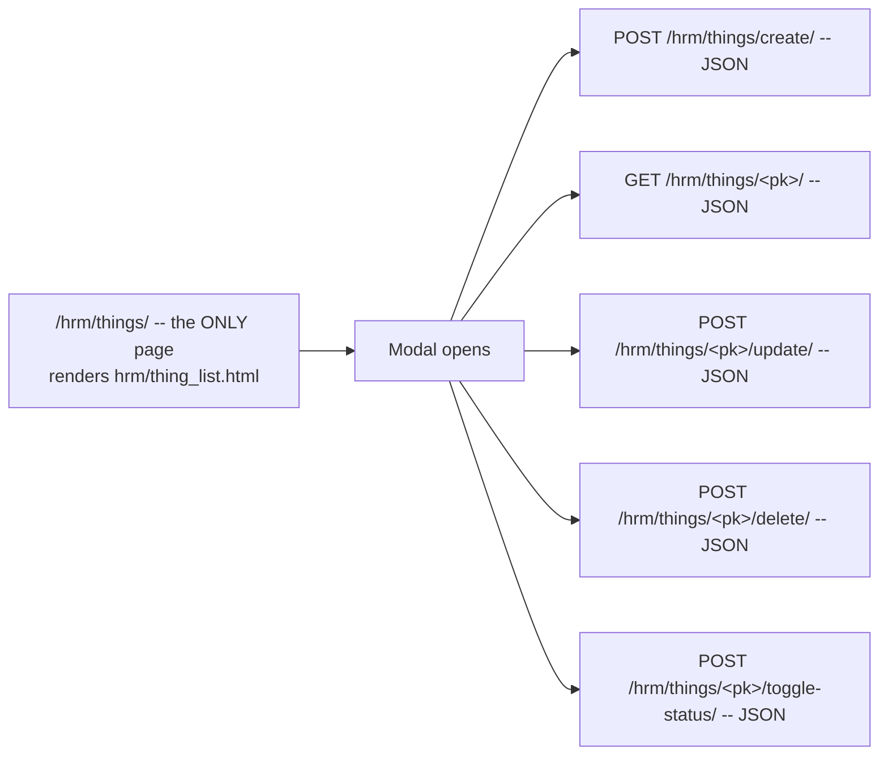
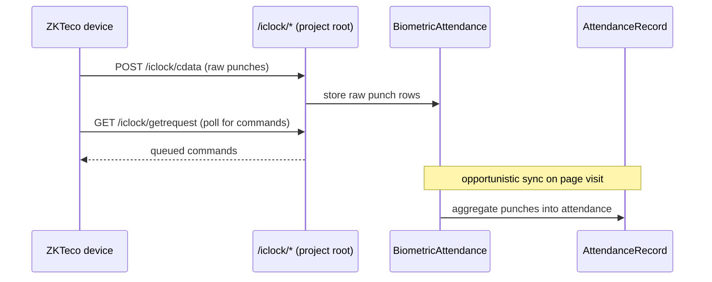

# 23 — HRM (HR, Attendance & Payroll)

The second-largest app in the project: `hrm/views.py` is 11,216 lines across ~218 URL
patterns. Mounted at `/hrm/`, `app_name='hrm'`.

---

## ⚠️ Read this first: HRM has no view-level permissions

**Every `hrm` view carries only `@login_required`.** The `can_view_hrm*` flags gate the
**sidebar links in `templates/base.html`**, not the views themselves. Anyone who knows a URL
can open an HRM page.

The only in-view HRM permission checks are around incomplete attendance
(`hrm/views.py:3453`, `:3561`, `:3677`, `:3784-3797`).

If you need real HRM access control, this is where to add it.

---

## The shape of the app

Almost every module follows the same pattern:

So of the ~218 patterns, only the `*_list` routes (plus a handful of forms and reports)
render templates. The rest are JSON endpoints driven by modals.

---

## Modules and their pages

### HR Management — sidebar flag `can_view_hrm_hr_management`

| Page | URL | Template |
|---|---|---|
| HRM dashboard | `/hrm/` | `hrm/dashboard.html` |
| Branches | `/hrm/branches/` | `hrm/branch_list.html` |
| Departments | `/hrm/departments/` | `hrm/department_list.html` |
| Designations | `/hrm/designations/` | `hrm/designation_list.html` |
| Document types | `/hrm/document-types/` | `hrm/document_type_list.html` |
| **Employees** | `/hrm/employees/` | `hrm/employee_list.html` |
| Create / edit employee | `/hrm/employees/create/`, `/hrm/employees/<id>/edit/` | `hrm/employee_form.html` |
| Employee detail | `/hrm/employees/<id>/` | `hrm/employee_detail.html` |
| Award types | `/hrm/award-types/` | `hrm/award_type_list.html` |
| Awards | `/hrm/awards/` | `hrm/award_list.html` |
| Promotions | `/hrm/promotions/` | `hrm/promotion_list.html` |
| Resignations | `/hrm/resignations/` | `hrm/resignation_list.html` |
| Terminations | `/hrm/terminations/` | `hrm/termination_list.html` |
| Warnings | `/hrm/warnings/` | `hrm/warning_list.html` |
| Complaints | `/hrm/complaints/` | `hrm/complaint_list.html` |
| Contracts | `/hrm/contracts/` | `hrm/contract_list.html` |
| Documents | `/hrm/documents/` | `hrm/document_list.html` |

### Asset management — `can_view_hrm_asset_management`

| Page | URL | Template |
|---|---|---|
| Asset types | `/hrm/assets/types/` | `hrm/asset_type_list.html` |
| Assets | `/hrm/assets/` | `hrm/asset_list.html` |
| Asset dashboard | `/hrm/assets/dashboard/` | `hrm/asset_dashboard.html` |
| Depreciation | `/hrm/assets/depreciation/` | `hrm/asset_depreciation.html` |

Plus `assets/<pk>/assign/` and `/checkin/` (JSON).

### Attendance — `can_view_hrm_attendance`

| Page | URL | Template |
|---|---|---|
| Attendance list | `/hrm/attendance/` | `hrm/attendance_list.html` |
| Adjustments | `/hrm/attendance/adjustments/` | `hrm/attendance_adjustments.html` |
| Shifts | `/hrm/shifts/` | `hrm/shift_list.html` |
| Attendance policies | `/hrm/attendance-policies/` | `hrm/attendance_policy_list.html` |
| Regularizations | `/hrm/attendance-regularizations/` | `hrm/attendance_regularization_list.html` |

Supporting endpoints: `attendance/adjustments/list/` (AJAX), `<pk>/restore/`,
`<pk>/hard-delete/`, `attendance/incomplete/`, `attendance/incomplete/alert-settings/`,
`attendance/sync-settings/`, `attendance/<pk>/fix-logs/`,
`/api/employee-attendance-records/`, plus weekend save/list/delete.

### Payroll — `can_view_hrm_payroll`

| Page | URL | Template |
|---|---|---|
| Payroll management | `/hrm/payroll/` | `hrm/payroll_management.html` |
| Salary components | `/hrm/payroll/salary-components/` | `hrm/salary_component_list.html` |
| Employee salaries | `/hrm/payroll/employee-salaries/` | `hrm/employee_salary_list.html` |
| Payroll calculation | `/hrm/payroll/employee-salaries/<pk>/payroll/` | `hrm/payroll_calculation.html` |
| Payroll runs | `/hrm/payroll/runs/` | `hrm/payroll_run_list.html` |
| Payslips | `/hrm/payroll/payslips/` | `hrm/payslip_list.html` |
| Payslip print | `/hrm/payslips/<pk>/download/` | `hrm/payslip_print.html` |
| Bulk print | `/hrm/payslips/bulk-print/` | `hrm/payslip_bulk_print.html` |
| Payslip adjustments | `/hrm/payslips/<pk>/adjust/` | `hrm/payslip_adjust.html` |
| Advance payments | `/hrm/payroll/advance-payments/` | `hrm/advance_payment_list.html` |
| Bonuses | `/hrm/payroll/bonuses/` | `hrm/bonus_list.html` |
| Holidays | `/hrm/holidays/` | `hrm/holiday_list.html` |

Payslip actions: `finalize`, `unfinalize`, `delete`, `restore`, `permanent-delete`,
`sync-advances`, `filtered-ids`, `bulk-action`. Payroll runs also expose
`active-employees/` and `<pk>/generate-payslips/`.

### Leave

| Page | URL | Template |
|---|---|---|
| Leave applications | `/hrm/leave/applications/` | `hrm/leave_applications.html` |
| Leave balances | `/hrm/leave/balances/` | `hrm/leave_balances.html` |
| Leave types | `/hrm/leave/types/` | `hrm/leave_types.html` |
| Leave policies | `/hrm/leave/policies/` | `hrm/leave_policies.html` |

Plus `balances/resync/` and `balances/sync-history/`.

### Reports

| Report | URL | Template |
|---|---|---|
| Attendance report | `/hrm/attendance/report/` | `hrm/attendance_report.html` |
| Leave report | `/hrm/attendance/leave-report/` | `hrm/leave_report.html` |
| **Salary report** | `/hrm/reports/salary/` | `hrm/salary_report.html` |

The salary report lives in its own module, `hrm/salary_report.py` (1,378 lines), with a JSON
drill-down at `/hrm/reports/salary/detail/`.

The attendance report has AJAX sub-endpoints `/period/` and `/summary/`, and ships a
**Bikram Sambat (Nepali) calendar** as `window.NP`. Reuse that module for Nepali dates
rather than adding a second converter.

---

## Biometric attendance (ZKTeco)

### The device endpoints

Mounted at the **project root**, not under `/hrm/`, because the devices post to a fixed path
(`myproject/urls.py:28-30`):

| URL | View | Notes |
|---|---|---|
| `/iclock/cdata` | `hrm.views.iclock_cdata` | Device pushes punch data |
| `/iclock/getrequest` | `hrm.views.iclock_getrequest` | Device polls for commands |
| `/iclock/devicecmd` | `hrm.views.iclock_devicecmd` | Command acknowledgement |

All three are **`@csrf_exempt` and unauthenticated** — devices cannot log in. They are also
routed under `/hrm/iclock/…` for completeness.

Logged to `logs/adms.log` via `logging.getLogger('hrm.adms')`.

### Pages

| Page | URL | Template |
|---|---|---|
| Biometric attendance | `/hrm/biometric-attendance/` | `hrm/biometric_attendance.html` |
| ZKTeco device settings | `/hrm/settings/zekto/` | `hrm/zekto_settings.html` |

Actions: `<pin>/<date>/view|delete|sync/`, `sync-all/`, and `upload/` for manually uploading
an `ATTLOG` `.dat` file. Device add / detail / update / delete / sync under
`settings/zekto/`.

### The PIN padding problem

The device sends **inconsistently padded PINs** (e.g. `007` and `7` for the same employee),
which split one person's daily punches across two identities. `_normalize_pin` in
`hrm/views.py` fixes this. Verification script: `test_biometric_pin_normalization.py`.

---

## Models — `hrm/models.py` (1,512 lines)

### Org structure
`Branch` (`:7`) · `Department` (`:44`) · `Designation` (`:64`) · `DocumentType` (`:84`) ·
**`Employee`** (`:99`, links to `CustomUser`, resolves its own attendance policy) ·
`EmployeeDocument` (`:197`)

### Employee lifecycle
`AwardType` (`:211`) · `Promotion` (`:230`) · `Award` (`:256`) · `Resignation` (`:275`) ·
`Termination` (`:301`) · `Warning` (`:336`) · `Complaint` (`:378`)

### Assets
`AssetType` (`:416`) · `Asset` (`:437`)

### Attendance
| Model | Line | Purpose |
|---|---|---|
| `Shift` | `:497` | Working hours |
| `AttendancePolicy` | `:535` | Late/half-day thresholds |
| `AttendanceRecord` | `:565` | One day per employee |
| `AttendanceFixLog` | `:649` | Audit of manual corrections |
| `AttendanceAlertSettings` | `:676` | **Singleton** — incomplete-attendance alert cadence |
| `AttendanceSyncSettings` | `:711` | **Singleton** — opportunistic biometric→attendance sync cadence |
| `AttendanceRegularization` | `:744` | Employee requests to fix their own record |
| `EmployeeWeekend` | `:787` | Per-employee weekend days |
| `ZKDevice` | `:827` | A biometric device |
| `BiometricAttendance` | `:858` | **Raw punches** |
| `Holiday` | `:888` | |

### Payroll
`SalaryComponent` (`:929`) · `EmployeeSalary` (`:960`) · `PayrollRun` (`:981`) ·
`PayrollSetting` (`:1021`, singleton with `get_settings()`) · `Payslip` (`:1067`) ·
`PayslipAdjustment` (`:1384`) · `PayslipAuditLog` (`:1420`) · `AdvancePayment` (`:1265`) ·
`Bonus` (`:1335`)

### Leave
`LeaveType` (`:1150`) · `LeaveRequest` (`:1169`) · `LeaveBalance` (`:1214`) ·
`LeavePolicy` (`:1242`)

### Audit
`HRMAuditLog` (`:1440`)

---

## Background work — there isn't any

Like the NCM sync, HRM has **no scheduler**. `AttendanceSyncSettings` exists precisely
because there is no Celery Beat in this project (`hrm/models.py:716`, `hrm/views.py:2956`).

Biometric punches are aggregated into attendance records **opportunistically**, via
`_maybe_auto_sync_attendance` triggered on page visits. If nobody opens an HRM page, nothing
syncs.

The incomplete-attendance alert reaches every page through
`dashboard/context_processors.py:231` `incomplete_attendance_alert`, rendering
`templates/partials/incomplete_attendance_alert.html`.

---

## Timezone sensitivity

HRM is the most timezone-sensitive part of the system: attendance is about wall-clock time
in Nepal (UTC+**5:45**), and payroll periods are calendar months.

**Always** use `dashboard/timezone_utils.py`. Naive-vs-aware and UTC-vs-local mismatches here
have been a recurring source of bugs — see the git history around attendance deletion and
payroll runs.

---

## Permission flags (sidebar only)

| Flag | Sidebar section |
|---|---|
| `can_view_hrm` | HRM at all |
| `can_view_hrm_hr_management` | HR management |
| `can_view_hrm_asset_management` | Assets |
| `can_view_hrm_attendance` | Attendance |
| `can_view_hrm_payroll` | Payroll |
| `can_view_hrm_incomplete_attendance` | The incomplete-attendance alert |
| `can_fix_hrm_incomplete_attendance` | Fixing it — **one of the few enforced in-view** |

---

## Gotchas

- **No view-level RBAC.** Sidebar visibility is not access control.
- **`/iclock/*` is unauthenticated by design.** Devices cannot log in. Do not add auth.
- **Nothing syncs unless someone opens a page.**
- **Stray files:** `hrm/views.py.backup` and `hrm/views.py.git_orig` exist in the repo.
  They are **not active code** — don't edit or import them.
- The Nepali (BS) calendar ships as `window.NP` from the attendance report. There is one
  converter; don't add a second.
- Payslip adjustments and bonuses have had double-counting bugs; `PayslipAuditLog` and the
  root-level scripts `test_payslip_bonus_double_count.py` /
  `fix_payslip_double_bonus.py` exist because of them.

---

## Files that own this

- `hrm/models.py` — all 39 models
- `hrm/views.py` — everything, including the ZKTeco endpoints
- `hrm/salary_report.py` — the salary report
- `hrm/urls.py` — the ~218 routes
- `myproject/urls.py:28-30` — root-level `/iclock/` mounting
- `dashboard/context_processors.py:231` — the incomplete-attendance alert
- `dashboard/timezone_utils.py` — mandatory for anything time-related here
