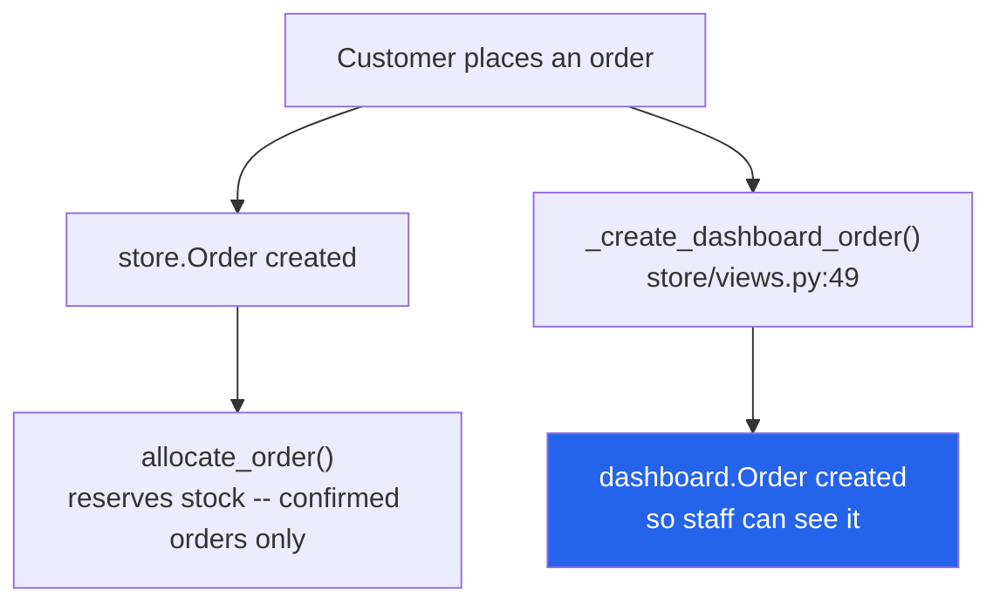

# 24 — Storefront

The customer-facing shop, mounted at `/store/`. Entirely separate from the admin dashboard.

---

## The bridge to the admin side

This is the important structural fact:



**There are two `Order` models.** `store.Order` is the customer's record;
`dashboard.Order` is the operational record staff work with. `_create_dashboard_order`
(`store/views.py:49`) creates the second from the first so store orders appear in the admin.

It also:
- finds or creates a `dashboard.Customer` **by phone**
- picks the status `Setup` row from `order_type` — an **`Inquiry`** row for inquiries,
  otherwise the confirmed-order status

> The storefront is the **only** caller of `inventory.services.allocate_order()`
> (`store/views.py:769-770`), and only when `order_type == 'confirmed'`.
> See [17](./17-inventory-and-stock.md).

---

## Signing in is optional, everywhere

This is the second structural fact, and it changed in the Aug 2026 storefront rebuild.

- **Shopper accounts are `store.StoreCustomer`** (`store/models.py:11`), **not**
  `AUTH_USER_MODEL`. A shopper is never a staff row, carries no RBAC boolean, and
  `request.user` stays the (usually anonymous) staff user on every storefront request.
- Authentication is entirely session-based: `store/customer_auth.py` puts the id under
  session key **`store_customer_id`** (`SESSION_CUSTOMER_KEY`, `:25`) and reads it back
  with `get_customer(request)` (`:32`). No admin decorator ever sees a shopper.
- **Nothing on the storefront requires an account.** Cart, wishlist, the order form,
  reviews and order tracking all work for a guest keyed by `session_key`. An account
  only saves retyping delivery details and keeps order history in one place.
- On sign-in, `adopt_guest_data(request, customer, old_session_key)` (`:80`) merges the
  guest's cart, wishlist, orders and reviews into the account.
- `@customer_required` (`:138`) guards the few account-only pages; it redirects to
  `/store/account/login/`, never to the admin login.

Passwords go through Django's own hashers (`StoreCustomer.set_password` / `check_password`,
`:48-57`), including in-place hash upgrades.

---

## Pages

`store/urls.py`, `app_name='store'`. **No admin permission flag applies anywhere in this app.**

### Browsing (public)

| Page | URL | View | Template |
|---|---|---|---|
| Landing | `/store/` | `landing_page` | `store/landing.html` |
| Product list | `/store/products/` | `product_list` | `store/product_list.html` |
| Product detail | `/store/products/<slug>/` | `product_detail` | `store/product_detail.html` |
| Category | `/store/category/<slug>/` | `category_products` | `store/category_products.html` |
| Search results | `/store/search/` | `search_results` | `store/search_results.html` |
| Dynamic CMS page | `/store/p/<slug>/` | `dynamic_page` | `store/page_detail.html` |

APIs: `/store/search/autocomplete/` (JSON), `/store/api/load-more/` (`load_more_products`,
infinite scroll).

### Cart & wishlist (guest or account)

| Page / action | URL | Notes |
|---|---|---|
| Cart | `/store/cart/` | `store/cart.html` |
| Add to cart | `/store/cart/add/<product_id>/` | `@require_POST`, JSON |
| Remove | `/store/cart/remove/<item_id>/` | `@require_POST`, JSON |
| Update quantity | `/store/cart/update/` | `@require_POST`, JSON |
| Wishlist | `/store/wishlist/` | `store/wishlist.html` |
| Toggle wishlist | `/store/wishlist/toggle/<product_id>/` | POST, JSON |

### Ordering (guest or account)

The product page and checkout both submit the shared **`partials/order_form.html`** panel —
Confirm Order / Inquiry Only, with a district + NCM courier-branch select, a discount-code
field and a live delivery quote. On the product page the top-of-page button reads
**"Order Now"** and the header mode chip is gone; the form itself still offers both
Confirm Order and Inquiry Only at submit.

| Page / action | URL | View | Template |
|---|---|---|---|
| Checkout | `/store/checkout/` | `checkout_view` | `store/checkout.html` |
| Quick order (one product) | `/store/quick-order/<product_id>/` | `quick_order` | `store/quick_checkout.html` |
| Place order (internal) | — | `_place_order` (`store/views.py:696`) | — |
| Track an order | `/store/track-order/` | `order_track` | phone + order number, **no sign-in** |
| Order detail | `/store/orders/<order_number>/` | `order_detail` | `store/order_detail.html` |

Order-form data endpoints (all JSON, all public):

| URL | View | Returns |
|---|---|---|
| `/store/api/locations/` | `locations_json` | Districts + NCM branches (from `store/services.py`) |
| `/store/api/quote/` | `quote_json` | Delivery charge + promised time for the picked district/branch |
| `/store/api/discount/` | `apply_discount` | Validates a `DiscountCode` and returns the amount off |

> `store.Order.order_number` is a 12-char uppercase hex slug (`uuid4().hex[:12]`,
> `store/models.py:255-256`). WooCommerce imports use `WOO-<woo_order_id>` instead.

### Accounts (optional)

| Page | URL | View | Guard |
|---|---|---|---|
| Login | `/store/account/login/` | `account_login` | public; lockout after repeated failures (`_login_locked`) |
| Register | `/store/account/register/` | `account_register` | public |
| Logout | `/store/account/logout/` | `account_logout` | — |
| Account home | `/store/account/` | `account_home` | `@customer_required` |
| Profile | `/store/account/profile/` | `account_profile` | `@customer_required` |
| Change password | `/store/account/password/` | `account_password` | `@customer_required` |

### Reviews

| Action | URL | Notes |
|---|---|---|
| Add review | `/store/review/add/<product_id>/` | POST; owned by `customer` when signed in, else `session_key` + typed `guest_name` |

---

## Models — `store/models.py`

| Model | Line | Purpose |
|---|---|---|
| **`StoreCustomer`** | `:11` | Shopper account — session-authenticated, **not** `AUTH_USER_MODEL`. Saves district / courier branch / address to prefill the order form |
| `ProductReview` | `:76` | Review of a `dashboard.Product`. `customer` **or** `session_key`+`guest_name`; `user` only ever for staff |
| `Cart` / `CartItem` | `:112` / `:131` | One cart per customer **or** session |
| **`DiscountCode`** | `:148` | Storefront discount codes applied on the order form |
| **`Order`** | `:208` | The customer's own order record. `order_number` = 12-char hex |
| `OrderItem` | `:264` | |
| `Wishlist` | `:281` | Per customer **or** session |
| `Page` | `:306` | CMS page — `is_published`, feeds the storefront footer's legal links |
| **`DeliverySetting`** | `:318` | Single-row site-wide delivery defaults (`get_solo()`) — see [22](./22-settings-and-setup.md) |
| **`DeliveryCharge`** | `:373` | One delivery rule per district, optionally per courier branch |

> Products and categories are **not** duplicated — the storefront reads
> `dashboard.Product` and `dashboard.Category` directly.

`store.Order` is also the target of the WooCommerce receiver — see
[27](./27-sheets-and-woocommerce.md).

---

## Delivery pricing

Until Aug 2026 this was three constants in `store/services.py`. It is now data:

- **`DeliverySetting`** (one row) holds the site-wide defaults: inside-valley charge,
  fallback `default_charge`, `free_delivery_threshold`, the valley district list, and the
  default promised-time strings (English + Nepali).
- **`DeliveryCharge`** rows override per district. A row with a blank `branch_code` covers
  the whole district; a row with one set beats it for that branch only. District and
  branch codes are stored uppercase to match NCM's casing.
- **A matched rule is authoritative for its district.** The site-wide "free above Rs. X"
  only applies where *no* rule matched — an explicitly configured charge can no longer be
  silently zeroed on a large order.
- The storefront order form calls `/store/api/quote/` on district/branch change and shows a
  card with the charge, the promised time (both languages) and the branch's covered areas
  as chips; the generic delivery banner hides once the card takes over.

Administered from **Setup → Delivery Charge Setup** (`/setup/delivery-charges/`,
`@admin_only`) — see [22](./22-settings-and-setup.md).

---

## Context processor

`store.context_processors.store_context` runs on **every** template render in the whole
project (`myproject/settings.py`), not just storefront pages. It supplies cart and wishlist
counts, the signed-in `StoreCustomer` (if any) and delivery-banner copy.

---

## Seeding demo data

```bash
python manage.py seed_data
```
`store/management/commands/seed_data.py`.

---

## Gotchas

- **Two `Order` models.** `store.Order` and `dashboard.Order` are different tables. When
  someone says "the order", ask which one.
- **Two "customer" models too.** `store.StoreCustomer` (shopper login) is unrelated to
  `dashboard.Customer` (the phone-keyed contact record staff see). A store order creates or
  matches a `dashboard.Customer` **by phone**, independent of whether the shopper has an
  account.
- **Signing in is optional.** Never add `@customer_required` to cart / order / review /
  tracking flows — guests must keep working, keyed by `session_key`.
- **The storefront reserves stock; the dashboard does not.** Only `order_type == 'confirmed'`
  triggers `allocate_order()`.
- **Inquiries get a different status.** `order_type == 'inquiry'` looks up an `Inquiry`
  Setup row, which is why the on-hold orders page matches both "On Hold" and "Inquiry".
- **A delivery rule wins over the site-wide free-shipping threshold** for its own district.
- Account pages redirect to `/store/account/login/`, a **separate flow** from admin login.

---

## Files that own this

- `store/views.py` — all storefront views; `_create_dashboard_order` at `:49`,
  `_place_order` at `:696`
- `store/customer_auth.py` — session-based shopper auth, `adopt_guest_data()`
- `store/models.py` — the storefront's own models
- `store/services.py` — districts, NCM branches, delivery-quote logic
- `store/forms.py` — order form, registration, review forms
- `store/urls.py` — the `/store/` routes
- `store/context_processors.py` — global cart/wishlist/customer context
- `store/templates/store/` — all templates; `partials/order_form.html` is the shared panel
- `dashboard/delivery_charge_views.py` — Delivery Charge Setup admin
- `dashboard/page_views.py` — where CMS `Page` rows are created
- `inventory/services.py` — stock reservation, called only from here
