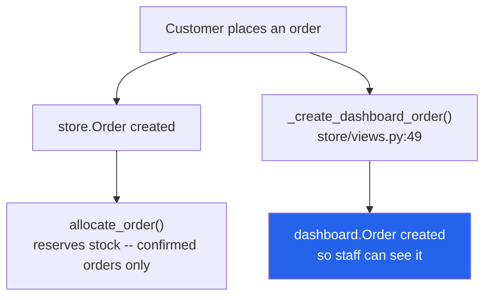
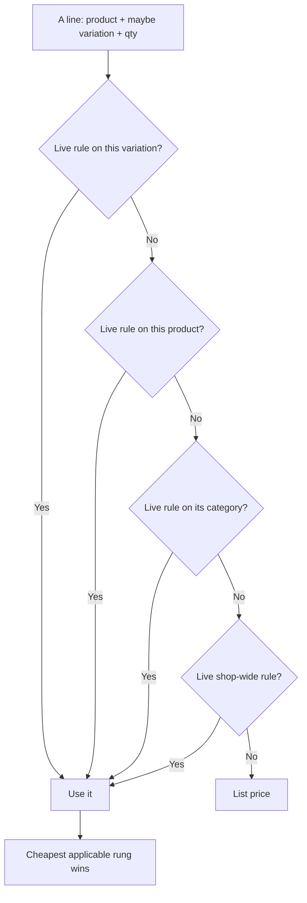

# 24 — Storefront

The customer-facing shop, mounted at `/store/`. Entirely separate from the admin dashboard.

---

## The bridge to the admin side

This is the important structural fact:



**There are two `Order` models.** `store.Order` is the customer's record;
`dashboard.Order` is the operational record staff work with. `_create_dashboard_order`
(`store/views.py:49`) creates the second from the first so store orders appear in the admin.

It also:
- finds or creates a `dashboard.Customer` **by phone**
- picks the status `Setup` row from `order_type` — an **`Inquiry`** row for inquiries,
  otherwise the confirmed-order status

> The storefront is the **only** caller of `inventory.services.allocate_order()`
> (`store/views.py:769-770`), and only when `order_type == 'confirmed'`.
> See [17](./17-inventory-and-stock.md).

---

## Signing in is optional, everywhere

This is the second structural fact, and it changed in the Aug 2026 storefront rebuild.

- **Shopper accounts are `store.StoreCustomer`** (`store/models.py:11`), **not**
  `AUTH_USER_MODEL`. A shopper is never a staff row, carries no RBAC boolean, and
  `request.user` stays the (usually anonymous) staff user on every storefront request.
- Authentication is entirely session-based: `store/customer_auth.py` puts the id under
  session key **`store_customer_id`** (`SESSION_CUSTOMER_KEY`, `:25`) and reads it back
  with `get_customer(request)` (`:32`). No admin decorator ever sees a shopper.
- **Nothing on the storefront requires an account.** Cart, wishlist, the order form,
  reviews and order tracking all work for a guest keyed by `session_key`. An account
  only saves retyping delivery details and keeps order history in one place.
- On sign-in, `adopt_guest_data(request, customer, old_session_key)` (`:80`) merges the
  guest's cart, wishlist, orders and reviews into the account.
- `@customer_required` (`:138`) guards the few account-only pages; it redirects to
  `/store/account/login/`, never to the admin login.

Passwords go through Django's own hashers (`StoreCustomer.set_password` / `check_password`,
`:48-57`), including in-place hash upgrades.

---

## Pages

`store/urls.py`, `app_name='store'`. **No admin permission flag applies anywhere in this app.**

### Browsing (public)

| Page | URL | View | Template |
|---|---|---|---|
| Landing | `/store/` | `landing_page` | `store/landing.html` |
| Product list | `/store/products/` | `product_list` | `store/product_list.html` |
| Product detail | `/store/products/<slug>/` | `product_detail` | `store/product_detail.html` |
| Category | `/store/category/<slug>/` | `category_products` | `store/category_products.html` |
| Search results | `/store/search/` | `search_results` | `store/search_results.html` |
| Dynamic CMS page | `/store/p/<slug>/` | `dynamic_page` | `store/page_detail.html` |

APIs: `/store/search/autocomplete/` (JSON), `/store/api/load-more/` (`load_more_products`,
infinite scroll).

### Cart & wishlist (guest or account)

| Page / action | URL | Notes |
|---|---|---|
| Cart | `/store/cart/` | `store/cart.html` |
| Add to cart | `/store/cart/add/<product_id>/` | `@require_POST`, JSON |
| Remove | `/store/cart/remove/<item_id>/` | `@require_POST`, JSON |
| Update quantity | `/store/cart/update/` | `@require_POST`, JSON |
| Wishlist | `/store/wishlist/` | `store/wishlist.html` |
| Toggle wishlist | `/store/wishlist/toggle/<product_id>/` | POST, JSON |
| Notify when back in stock | `/store/notify-back-in-stock/<product_id>/` | POST, JSON. Optional `variation` id |

`add_to_cart` takes a `selected_variation` id and **requires** one for a variable product.
`update_cart` re-quotes the line server-side and returns `unit_price`, `base_unit_price`,
`bulk_label` and `bulk_saved` — see [Quantity breaks](#quantity-breaks-bulk-discounts).

### Ordering (guest or account)

The product page and checkout both submit the shared **`partials/order_form.html`** panel —
Confirm Order / Inquiry Only, with a district + NCM courier-branch select, a discount-code
field and a live delivery quote. On the product page the top-of-page button reads
**"Order Now"** and the header mode chip is gone; the form itself still offers both
Confirm Order and Inquiry Only at submit.

| Page / action | URL | View | Template |
|---|---|---|---|
| Checkout | `/store/checkout/` | `checkout_view` | `store/checkout.html` |
| Quick order (one product) | `/store/quick-order/<product_id>/` | `quick_order` | `store/quick_checkout.html` |
| Place order (internal) | — | `_place_order` (`store/views.py:696`) | — |
| Track an order | `/store/track-order/` | `order_track` | phone + order number, **no sign-in** |
| Order detail | `/store/orders/<order_number>/` | `order_detail` | `store/order_detail.html` |

Order-form data endpoints (all JSON, all public):

| URL | View | Returns |
|---|---|---|
| `/store/api/locations/` | `locations_json` | Districts + NCM branches (from `store/services.py`) |
| `/store/api/quote/` | `quote_json` | Delivery charge + promised time for the picked district/branch |
| `/store/api/discount/` | `apply_discount` | Validates a `DiscountCode` and returns the amount off |

> `store.Order.order_number` is a 12-char uppercase hex slug (`uuid4().hex[:12]`,
> `store/models.py:255-256`). WooCommerce imports use `WOO-<woo_order_id>` instead.

### Accounts (optional)

| Page | URL | View | Guard |
|---|---|---|---|
| Login | `/store/account/login/` | `account_login` | public; lockout after repeated failures (`_login_locked`) |
| Register | `/store/account/register/` | `account_register` | public |
| Logout | `/store/account/logout/` | `account_logout` | — |
| Account home | `/store/account/` | `account_home` | `@customer_required` |
| Profile | `/store/account/profile/` | `account_profile` | `@customer_required` |
| Change password | `/store/account/password/` | `account_password` | `@customer_required` |

### Reviews

| Action | URL | Notes |
|---|---|---|
| Add review | `/store/review/add/<product_id>/` | POST; owned by `customer` when signed in, else `session_key` + typed `guest_name` |

---

## Models — `store/models.py`

| Model | Line | Purpose |
|---|---|---|
| **`StoreCustomer`** | `:11` | Shopper account — session-authenticated, **not** `AUTH_USER_MODEL`. Saves district / courier branch / address to prefill the order form |
| `ProductReview` | `:76` | Review of a `dashboard.Product`. `customer` **or** `session_key`+`guest_name`; `user` only ever for staff |
| `Cart` / `CartItem` | `:112` / `:131` | One cart per customer **or** session. `CartItem` carries a `variation` FK and is keyed `('cart', 'product', 'variation')` |
| **`DiscountCode`** | `:207` | Storefront discount codes applied on the order form |
| **`BulkDiscount`** | `:267` | A quantity break — scope, schedule, priority, badge. See below |
| **`BulkDiscountTier`** | `:424` | One rung of a ladder: `min_qty` + `discount_type` + `value` |
| **`Order`** | `:485` | The customer's own order record. `order_number` = 12-char hex |
| `OrderItem` | `:541` | Carries `variation` (`SET_NULL`) and `selected_variant` text |
| `Wishlist` | `:560` | Per customer **or** session |
| `Page` | `:585` | CMS page — `is_published`, feeds the storefront footer's legal links |
| **`DeliverySetting`** | `:597` | Single-row site-wide delivery defaults (`get_solo()`) — see [22](./22-settings-and-setup.md) |
| **`DeliveryCharge`** | `:652` | One delivery rule per district, optionally per courier branch |
| **`BackInStockNotice`** | `:714` | A shopper waiting on a sold-out product or one variation of it |

> Products and categories are **not** duplicated — the storefront reads
> `dashboard.Product` and `dashboard.Category` directly.

`store.Order` is also the target of the WooCommerce receiver — see
[27](./27-sheets-and-woocommerce.md).

---

## Variations — what a shopper actually buys

Until Sep 2026 every product rendered identically: an instant **Add to Cart** button, always
at `Product.price`. A variable product was therefore added with no size or colour, at a
parent price no option is sold at. The storefront now treats **one `ProductVariation` = one
choice**, the same way the admin order form already did.

**One `Product.product_type`, three behaviours** ([18](./18-products-and-catalog.md)):

| Type | Card button | Product page |
|---|---|---|
| `simple`, in stock | **Add to Cart** — instant | Buy straight away |
| `variable` | **Select Options** → product page | A rail of real `ProductVariation` rows; buttons stay disabled until one is picked |
| `bundle` | **Select Options** → product page | Priced as itself; components reserve separately |
| anything sold out | disabled **Out of Stock** | Back-in-stock form instead of the buy buttons |

Read-only helpers added to `dashboard.Product` for this — `is_variable`, `active_variations`,
`has_variations`, `variation_price_range`, `in_stock_variation_exists`, `storefront_available`
(`dashboard/models.py:123-190`) — plus `display_label` / `is_in_stock` / `committed_qty` /
`available_stock` on `ProductVariation` (`:726-764`). No schema change; templates, tags and
views all read the same properties so a card and a product page cannot disagree.

- **Per-variation availability is derived, not stored.** `ProductVariation.available_stock` =
  `stock − committed_qty`, where committed is the quantity already sitting on open dashboard
  `OrderItem` rows. There is no counter to drift.
- **Picking an option** rewrites the price, the stock line, the quantity ceiling and the main
  gallery image, and fills the hidden `selected_variation` on both the cart form and the
  order panel (`store/static/store/js/product.js`).
- **The cart holds one line per variation.** `CartItem.unique_together` is
  `('cart', 'product', 'variation')`, and `unit_price` comes from the variation.
- **Orders carry the choice both ways.** `store.OrderItem.variation` is set, and
  `_create_dashboard_order` mirrors it onto the dashboard item as `product_variation`,
  `product_sku` and `variation_name`, so staff see the option on the `T###` order.
- **Sold out ≠ gone.** `BackInStockNotice` records a waiting shopper (guest or account, by
  email or phone). `store/signals.py` listens for a `Product`/`ProductVariation` save with
  stock on hand, messages everyone waiting once, stamps `notified_at` and never fires again.
  Sending is fully wrapped — a failed alert can never break the save that triggered it.

> The inventory engine still deducts `Product.stock` (`inventory/services.py`). Variation-level
> allocation is a known follow-up — see [17](./17-inventory-and-stock.md).

---

## Quantity breaks (bulk discounts)

"Buy 3, save 10%." Rules are authored in **Setup → Bulk Discount Setup**
(`/setup/bulk-discounts/`, `@admin_only` — see [22](./22-settings-and-setup.md)); this section
is how the storefront *spends* them.

### One module decides every price

**`store/bulk_discounts.py` is the single pricing truth.** The product card, the product page,
the order panel, the cart line, the placed order and the admin's own preview all quote through
it, so none of them can drift apart.

| Function | Answers |
|---|---|
| `rule_for(product, variation)` | Which rule applies here |
| `tiers_for(...)` | The ladder, as display-ready rungs |
| `best_tier(...)` / `summary_badge(...)` | The deepest saving, as one line |
| `card_teaser(product)` | The chip on a listing card, or `None` |
| `price_for(product, variation, qty)` | `{base_unit, unit, line_total, saved, tier, next_tier, need_more, tiers}` |
| `tiers_payload(product, variations)` | The JSON blob the product page ships to JS |

### How a rule is chosen



**Specificity first** (`SCOPE_RANK` — variation 40 ▸ product 30 ▸ category 20 ▸ all 10), then
**`priority`**, then the newest row. "Live" means `is_active` **and** inside
`starts_at`/`ends_at`.

Two safety rules are deliberate and worth keeping:

- **The cheapest applicable rung wins**, not the one with the highest `min_qty`. A ladder typed
  out of order can never charge more for taking more.
- **`BulkDiscountTier.unit_price_from()` clamps to `[0, base]`.** A mis-typed rule fails
  towards the normal price — never negative, never above list.

### Where a shopper sees it

| Surface | Shows |
|---|---|
| Listing / home card | A chip — `3pcs · Save 10% · Rs. 360 each` — linking to the product page with `?qty=3` preselected. Only for products buyable straight from the card — never one with variations (it prices per option), never a sold-out one, and only while the rule's `show_on_cards` is on |
| Product page — variation card | A one-line **flag** (`Save up to 15%`), not a price list |
| Product page — ladder | The **Buy more, pay less** rungs, next to the stepper they act on. Clicking a rung sets the quantity; the header names the chosen option |
| Product page — price row | Live unit price, struck-through list price, "You save Rs. X", and a nudge: *"Add 2 more to save 10%."* Mirrored into the mobile sticky bar |
| Order panel | Re-prices as the quantity changes, through the same tier data |
| Cart | Per-line discounted unit price, the old price struck through, and the rung's label |

> **The card flags, the ladder prices.** Both used to print the same rungs, which read as a
> duplicate. Splitting the jobs is the fix — don't put the ladder back on the variation card.

### Caching

The rule set is snapshotted into the default cache under `store:bulk_discounts:v1` for
**60 seconds** (`CACHE_TTL`). The TTL is short on purpose: `CACHES['default']` is
`LocMemCache`, so it is **per process** and `invalidate_cache()` only reaches the process that
saved the rule. A rule written by a management command or a standalone script is invisible to
the running server until the TTL expires or it restarts.

---

## Delivery pricing

Until Aug 2026 this was three constants in `store/services.py`. It is now data:

- **`DeliverySetting`** (one row) holds the site-wide defaults: inside-valley charge,
  fallback `default_charge`, `free_delivery_threshold`, the valley district list, and the
  default promised-time strings (English + Nepali).
- **`DeliveryCharge`** rows override per district. A row with a blank `branch_code` covers
  the whole district; a row with one set beats it for that branch only. District and
  branch codes are stored uppercase to match NCM's casing.
- **A matched rule is authoritative for its district.** The site-wide "free above Rs. X"
  only applies where *no* rule matched — an explicitly configured charge can no longer be
  silently zeroed on a large order.
- The storefront order form calls `/store/api/quote/` on district/branch change and shows a
  card with the charge, the promised time (both languages) and the branch's covered areas
  as chips; the generic delivery banner hides once the card takes over.

Administered from **Setup → Delivery Charge Setup** (`/setup/delivery-charges/`,
`@admin_only`) — see [22](./22-settings-and-setup.md).

---

## Context processor

`store.context_processors.store_context` runs on **every** template render in the whole
project (`myproject/settings.py`), not just storefront pages. It supplies cart and wishlist
counts, the signed-in `StoreCustomer` (if any) and delivery-banner copy.

---

## Seeding demo data

```bash
python manage.py seed_data
```
`store/management/commands/seed_data.py`.

---

## Gotchas

- **Two `Order` models.** `store.Order` and `dashboard.Order` are different tables. When
  someone says "the order", ask which one.
- **Two "customer" models too.** `store.StoreCustomer` (shopper login) is unrelated to
  `dashboard.Customer` (the phone-keyed contact record staff see). A store order creates or
  matches a `dashboard.Customer` **by phone**, independent of whether the shopper has an
  account.
- **Signing in is optional.** Never add `@customer_required` to cart / order / review /
  tracking flows — guests must keep working, keyed by `session_key`.
- **The storefront reserves stock; the dashboard does not.** Only `order_type == 'confirmed'`
  triggers `allocate_order()`.
- **Inquiries get a different status.** `order_type == 'inquiry'` looks up an `Inquiry`
  Setup row, which is why the on-hold orders page matches both "On Hold" and "Inquiry".
- **A delivery rule wins over the site-wide free-shipping threshold** for its own district.
- Account pages redirect to `/store/account/login/`, a **separate flow** from admin login.
- **Never quote a bulk price outside `store/bulk_discounts.py`.** Reading `BulkDiscountTier`
  directly is how the cart and the product page start disagreeing about what a shopper owes.
- **A discount code applies on top of the bulk-discounted subtotal.** The two stack, by
  design. If that ever needs to change, it changes in `_place_order`, not in the pricing module.
- **Cart lines price independently.** Two variations of the same product do **not** pool their
  quantities toward a product-wide break — 2 + 2 is two lines of 2, not one line of 4.
- **The bulk-discount snapshot is per process** (`LocMemCache`, 60s). Rules seeded by a script
  are invisible to the running dev server until the TTL lapses or it restarts.
- **A variable product's own `price` is not a price anyone pays.** It is a parent value; quote
  `variation_price_range` or the picked variation instead. The mobile sticky bar used to get
  this wrong.
- Back-in-stock alerts are **one-shot**: `notified_at` is stamped even when the send fails, so a
  restock never re-spams. A shopper who misses one must re-subscribe.

---

## Files that own this

- `store/views.py` — all storefront views; `_create_dashboard_order` at `:49`,
  `_place_order` at `:883`
- `store/bulk_discounts.py` — **the only place a quantity-break price is decided**
- `store/customer_auth.py` — session-based shopper auth, `adopt_guest_data()`
- `store/models.py` — the storefront's own models
- `store/signals.py` — back-in-stock alerts on `Product`/`ProductVariation` restock
- `store/services.py` — districts, NCM branches, delivery-quote logic
- `store/forms.py` — order form, registration, review forms
- `store/urls.py` — the `/store/` routes
- `store/context_processors.py` — global cart/wishlist/customer context
- `store/templatetags/store_tags.py` — `product_price_display`, `product_bulk_teaser`,
  `order_form_config`
- `store/templates/store/` — all templates; `partials/order_form.html` is the shared panel
- `store/static/store/js/product.js` — variation picker + live bulk pricing on the product page
- `store/static/store/js/order-form.js` — the order panel, incl. its tier price resolver
- `dashboard/delivery_charge_views.py` — Delivery Charge Setup admin
- `dashboard/bulk_discount_views.py` — Bulk Discount Setup admin
- `dashboard/page_views.py` — where CMS `Page` rows are created
- `dashboard/models.py:123-190`, `:726-764` — the storefront helper properties on
  `Product` / `ProductVariation`
- `inventory/services.py` — stock reservation, called only from here
- `test_store_variations.py`, `test_store_bulk_discounts.py` — standalone verification scripts
