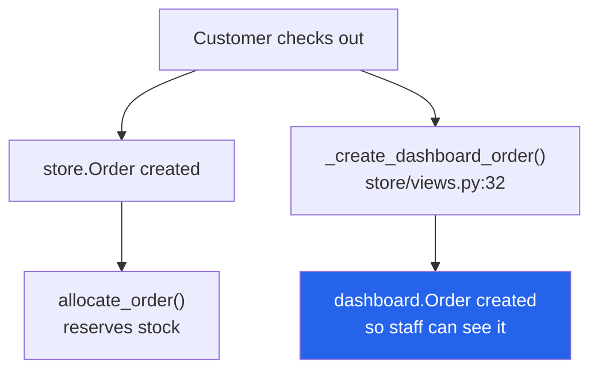

# 24 — Storefront

The customer-facing shop, mounted at `/store/`. Entirely separate from the admin dashboard.

---

## The bridge to the admin side

This is the important structural fact:



**There are two `Order` models.** `store.Order` is the customer's record;
`dashboard.Order` is the operational record staff work with. `_create_dashboard_order`
(`store/views.py:32`) creates the second from the first so store orders appear in the admin.

It also:
- finds or creates a `dashboard.Customer` **by phone** (`:41-50`)
- picks the status `Setup` row from `order_type` — an **`Inquiry`** row for inquiries
  (`:53-56`), otherwise the confirmed-order status

> The storefront is also the **only** caller of `inventory.services.allocate_order()`
> (`store/views.py:610-611` checkout, `:802-803` buy-now), and only when
> `order_type == 'confirmed'`. See [17](./17-inventory-and-stock.md).

---

## Pages

`store/urls.py`, `app_name='store'`. Public browsing needs no login; account pages use
`@login_required(login_url='/store/login/')`. **No admin permission flags apply here.**

### Browsing

| Page | URL | View | Template |
|---|---|---|---|
| Landing | `/store/` | `landing_page` | `store/landing.html` |
| Product list | `/store/products/` | `product_list` | `store/product_list.html` |
| Product detail | `/store/products/<slug>/` | `product_detail` | `store/product_detail.html` |
| Category | `/store/category/<slug>/` | `category_products` | `store/category_products.html` |
| Search results | `/store/search/` | `search_results` | `store/search_results.html` |

APIs: `/store/search/autocomplete/` (JSON), `/store/api/load-more/` (`load_more_products`,
infinite scroll).

### Cart & wishlist

| Page / action | URL | Notes |
|---|---|---|
| Cart | `/store/cart/` | `store/cart.html` |
| Add to cart | `/store/cart/add/<id>/` | `@require_POST`, JSON |
| Remove | `/store/cart/remove/<id>/` | `@require_POST`, JSON |
| Update quantity | `/store/cart/update/` | `@require_POST`, JSON |
| Wishlist | `/store/wishlist/` | `store/wishlist.html`, login required |
| Toggle wishlist | `/store/wishlist/toggle/<id>/` | POST, JSON |

### Checkout & account

| Page | URL | Template | Guard |
|---|---|---|---|
| Checkout | `/store/checkout/` | `store/checkout.html` | login |
| **Quick order** | `/store/quick-order/<id>/` | `store/quick_checkout.html` | login — one-click COD |
| My orders | `/store/orders/` | `store/orders.html` | login |
| Order detail | `/store/orders/<order_number>/` | `store/order_detail.html` | login |
| Profile | `/store/profile/` | `store/profile.html` | login |
| Login / register / logout | `/store/login/`, `/store/register/`, `/store/logout/` | `store/login.html`, `store/register.html` | public |

### Reviews and CMS pages

| Page | URL | Notes |
|---|---|---|
| Add review | `/store/review/add/<id>/` | POST, login |
| **Dynamic page** | `/store/p/<slug>/` | `store/page_detail.html` — renders a CMS `Page` created in the dashboard's *Pages* screen |

---

## Models — `store/models.py` (132 lines)

| Model | Line | Purpose |
|---|---|---|
| `ProductReview` | `:8` | Customer reviews of `dashboard.Product` |
| `Cart` | `:23` | One per user/session |
| `CartItem` | `:40` | |
| **`Order`** | `:57` | The customer's own order record |
| `OrderItem` | `:94` | |
| `Wishlist` | `:111` | |
| `Page` | `:123` | CMS page — `is_published`, feeds the landing footer's legal links |

> Products and categories are **not** duplicated — the storefront reads
> `dashboard.Product` and `dashboard.Category` directly.

`store.Order` is also the target of the WooCommerce receiver — see
[27](./27-sheets-and-woocommerce.md).

---

## Context processor

`store.context_processors.store_context` runs on **every** template render in the whole
project (`myproject/settings.py:111`), not just storefront pages. It supplies cart and
wishlist counts.

---

## Seeding demo data

```bash
python manage.py seed_data
```
`store/management/commands/seed_data.py`.

---

## Gotchas

- **Two `Order` models.** `store.Order` and `dashboard.Order` are different tables. When
  someone says "the order", ask which one.
- **`store.Order.order_number`** for WooCommerce imports is `WOO-<woo_order_id>`; native
  store orders use their own scheme.
- **The storefront reserves stock; the dashboard does not.** This asymmetry surprises people
  constantly.
- **Inquiries get a different status.** `order_type == 'inquiry'` looks up an `Inquiry`
  Setup row (`store/views.py:53-56`), which is why the on-hold orders page matches both
  "On Hold" and "Inquiry".
- Customers are matched by **phone** on the dashboard side, so a storefront user with a
  changed phone number creates a second `dashboard.Customer`.
- Storefront login is a **separate flow** from admin login, with its own `login_url`.

---

## Files that own this

- `store/views.py` — all storefront views, plus `_create_dashboard_order` at `:32`
- `store/models.py` — the storefront's own models
- `store/urls.py` — the `/store/` routes
- `store/forms.py` — checkout and registration forms
- `store/context_processors.py` — global cart/wishlist context
- `store/templates/store/` — all templates
- `dashboard/page_views.py` — where CMS `Page` rows are created
- `inventory/services.py` — stock reservation, called only from here
