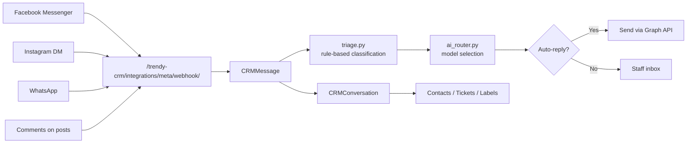
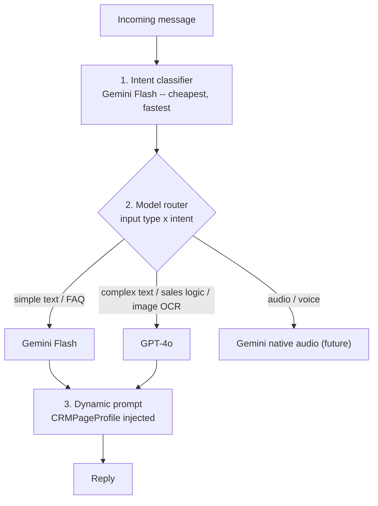

# 25 — TrendyCRM

Omnichannel customer messaging with an AI auto-reply engine. Mounted at `/trendy-crm/`,
62 URL patterns.

---

## What it does

---

## The AI router — `trendycrm/ai_router.py` (1,243 lines)

A **multi-model** routing engine, not a single-model wrapper.

**Stage 3 is the interesting one.** Every AI call has `CRMPageProfile` data injected — the
product, price, tone and checkout link — so the model always answers as *this* business
rather than generically.

### Operational hardening

The constants at the top of `ai_router.py` encode several hard-won lessons:

| Constant | Value | Why |
|---|---|---|
| `GEMINI_THINKING_BUDGET` | `1` | Newer Gemini models are "thinking" models and will burn the whole output budget on hidden reasoning before emitting visible text. `0` used to mean "disable"; the model behind `gemini-flash-latest` now rejects `0`, so `1` (minimum non-zero) is used |
| `GEMINI_MAX_RETRY_WAIT` | `65`s | Longest `retryDelay` from a 429 we'll honour. Auto-replies run on a background thread, so a pause costs nothing the customer sees |
| `GEMINI_OVERLOAD_STATUSES` | `(500, 502, 503, 504)` | Google answers 503 "high demand" when a shared model is momentarily overloaded. **Not a quota cap** — it clears in seconds, so retrying the *same* model recovers the reply |
| `GEMINI_RETRY_BACKOFF` | `(2, 5)`s | |
| `GEMINI_TIMEOUT` | `(10, 45)` | (connect, read). An unreachable host should fail fast; a model that accepted the request deserves room to finish |
| `GEMINI_VISION_TIMEOUT` | `(10, 60)` | |
| `GEMINI_TOTAL_DEADLINE` | `100`s | Ceiling on one `_post_gemini` call, so the retry schedule can't pin a thread for minutes |

Models: `gemini-flash-latest`, `gemini-pro-latest`, via
`https://generativelanguage.googleapis.com/v1beta`.

> **Quota reality:** the free-tier Gemini key allows only about 20 calls per day before
> every model returns 429. Budget accordingly when testing.

### Triage — `trendycrm/triage.py` (462 lines)

An editable, per-business **rule list** that classifies messages before (and alongside) the
AI. Cheaper and more predictable than a model call for obvious cases. Previewable from the
chatbot config screen (`chatbot/triage-preview/`).

---

## Pages

All `@login_required` — there is **no granular permission flag** for the CRM. Navigation
lives in `trendycrm/templates/trendycrm/base_crm.html`.

| Page | URL | Template |
|---|---|---|
| Home | `/trendy-crm/` | `trendycrm/home.html` |
| **Conversations (inbox)** | `/trendy-crm/conversations/` | `trendycrm/conversations.html` |
| Chatbot list | `/trendy-crm/chatbots/` | `trendycrm/chatbot_list.html` |
| Chatbot config | `/trendy-crm/chatbot/<id>/` | `trendycrm/chatbot.html` |
| Quick replies | `/trendy-crm/quick-replies/` | `trendycrm/quick_replies.html` |
| Integrations | `/trendy-crm/integrations/` | `trendycrm/integrations.html` |
| Contacts | `/trendy-crm/contacts/` | `trendycrm/contacts.html` |
| Analytics | `/trendy-crm/analytics/` | `trendycrm/analytics.html` |
| Tickets | `/trendy-crm/tickets/` | `trendycrm/tickets.html` |
| Social posts | `/trendy-crm/social/` | `trendycrm/social_posts.html` |
| Page profiles | `/trendy-crm/page-profiles/` | `trendycrm/page_profiles.html` |
| Comment automations | `/trendy-crm/comment-automations/` | `trendycrm/comment_automations.html` |

The inbox refreshes through partials: `conversations/list-ajax/` →
`trendycrm/partials/conversation_list.html`, and `conversations/ajax/` →
`trendycrm/partials/messages_list.html`.

---

## Action endpoints

**Conversations:** create, delete, send, link-contact, add-label, remove-label, add-note,
assign, resolve, toggle-ai, take-over.

**Messages:** `messages/<id>/retry-ai/`, `messages/<id>/dismiss-alert/`.

**Alerts:** `alerts/poll/` — drives the cross-page chips for unresolved leads and
complaints.

**Chatbot:** create, delete, toggle, save-knowledge, save-agent, save-triage,
triage-preview, toggle-channel, credit-history.

**Quick replies:** create, edit, delete, search.

**Social:** `action/<comment_id>/`, `post-action/<post_id>/`,
`comment/<id>/fire-automation/`.

**Comment automations:** save, delete, toggle, get.

**Page profiles:** `page-profiles/<integration_id>/save/`.

**AI:** `ai/test/`.

---

## OAuth & the Meta webhook

| URL | Purpose |
|---|---|
| `integrations/facebook\|instagram\|whatsapp\|tiktok/connect/` | Start OAuth |
| …matching `/callback/` | Finish OAuth |
| `integrations/<channel_key>/connect/` | Generic fallback |
| `integrations/<pk>/disconnect/` | Revoke |
| **`integrations/meta/webhook/`** | **`@csrf_exempt`, unauthenticated** — Meta verification + message ingestion |

> URL ordering matters: the generic `<channel_key>` route is declared **after** the named
> provider routes, so `facebook` / `instagram` / `whatsapp` / `tiktok` resolve to their
> specific views and anything else falls through.

Tokens are stored on `CRMIntegration` and encrypted via `trendycrm/crypto_utils.py`.

Settings: `META_PAGE_ACCESS_TOKEN`, `FACEBOOK_APP_ID/SECRET`, `INSTAGRAM_APP_ID/SECRET`,
`TIKTOK_CLIENT_ID/SECRET`, `FACEBOOK_WEBHOOK_VERIFY_TOKEN`
(`myproject/settings.py:261-273`).

---

## Models — `trendycrm/models.py` (850 lines)

| Model | Line | Purpose |
|---|---|---|
| `CRMContact` | `:20` | A person across channels |
| `CRMLabel` | `:45` | Tags |
| `CRMConversation` | `:56` | A thread |
| `CRMNote` | `:182` | Internal notes on a conversation |
| **`CRMMessage`** | `:195` | One message. Carries intent/triage "chips", AI-failure alerts, retry state |
| `CRMQuickReply` | `:420` | Canned responses |
| `CRMChatbotConfig` | `:435` | Per-bot knowledge, agent persona, triage rules, channel toggles |
| `CRMCreditLog` | `:573` | AI credit consumption |
| **`CRMPageProfile`** | `:595` | The centralised knowledge core per page — injected into every AI prompt |
| `CRMIntegration` | `:638` | Channel + encrypted token store |
| `CRMTicket` | `:691` | Escalated issues |
| `CRMSocialPost` | `:721` | |
| `CRMSocialComment` | `:767` | |
| `CommentAutomation` | `:799` | ManyChat-style "comment → DM" rules |

---

## Supporting modules

| File | Lines | Purpose |
|---|---|---|
| `ai_router.py` | 1,243 | Multi-model routing |
| `meta_sync.py` | 1,695 | Graph API pull/push |
| `triage.py` | 462 | Rule-based message classification |
| `crypto_utils.py` | 46 | Token encryption |

## Management commands

| Command | Does |
|---|---|
| `crm_poll_meta` | Poll Meta for new messages (webhook fallback) |
| `reclassify_crm_intents` | Re-run intent classification over stored messages |
| `seed_crm_chatbot` | Seed a starter chatbot config |

## Logging

`logging.getLogger('trendycrm')` → `logs/trendycrm.log`, UTF-8 (customer messages routinely
contain emoji and Devanagari), level INFO.

Without this logger, the reason a reply was skipped — "staff replied recently", "out of
credits", "rate limited" — was never written anywhere.

---

## Gotchas

- **No permission flag.** Any logged-in user can open the CRM.
- **The Meta webhook is unauthenticated by design.** Meta verification happens inside the
  view.
- **Gemini free-tier quota is ~20 calls/day.** Test failures that look like bugs are often
  429s.
- **A 503 from Gemini is not a quota problem** — it clears in seconds and the same model
  should be retried.
- Auto-replies run on **background threads**, so failures do not surface in the request that
  triggered them. Check `logs/trendycrm.log`.
- `CRMPageProfile` is the single source of product/price/tone for AI answers. Wrong answers
  usually mean a stale profile, not a bad model.

---

## Files that own this

- `trendycrm/ai_router.py` — model routing and retry policy
- `trendycrm/triage.py` — rule-based classification
- `trendycrm/meta_sync.py` — Graph API integration
- `trendycrm/crypto_utils.py` — token encryption
- `trendycrm/models.py` — all 14 models
- `trendycrm/views.py` — pages and action endpoints
- `trendycrm/urls.py` — the 62 routes
- `myproject/settings.py:261-273` — Meta/social credentials
