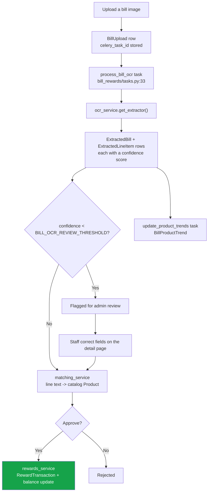

# 26 — Bill Rewards (OCR + Loyalty)

Customers upload a paper receipt; OCR reads it; line items are matched to catalog products;
loyalty points are awarded. Mounted at `/bill-rewards/`.

**This is the only app that uses Celery.**

---

## The pipeline



---

## Pages

`bill_rewards/urls.py` — all `@login_required`, **no granular permission flag**.

| Page | URL | Template | Purpose |
|---|---|---|---|
| Dashboard | `/bill-rewards/` | `bill_rewards/dashboard.html` | KPIs |
| **Upload** | `/bill-rewards/upload/` | `bill_rewards/upload.html` | Queues OCR (Celery, with a synchronous fallback) |
| Bill list | `/bill-rewards/bills/` | `bill_rewards/bill_list.html` | |
| **Bill detail** | `/bill-rewards/bills/<uuid>/` | `bill_rewards/bill_detail.html` | Review and correct the extracted fields |
| Aliases | `/bill-rewards/aliases/` | `bill_rewards/alias_list.html` | Product-name aliases |
| Reward transactions | `/bill-rewards/rewards/` | `bill_rewards/reward_transactions.html` | |
| Reward config | `/bill-rewards/rewards/config/` | `bill_rewards/reward_config.html` | Earning rules |
| Trending | `/bill-rewards/trending/` | `bill_rewards/trending.html` | Product trends from bills |

Bills are keyed by **UUID**, not integer id.

### Actions

| Action | URL |
|---|---|
| Approve / reject / reprocess | `/bill-rewards/bills/<uuid>/approve\|reject\|reprocess/` |
| Map an OCR line to a product | `/bill-rewards/line-item/<id>/set-product/` |
| Delete an alias | `/bill-rewards/aliases/<id>/delete/` |

### APIs (JSON)

| URL | Purpose |
|---|---|
| `/bill-rewards/api/bill/<uuid>/status/` | Poll OCR progress from the upload page |
| `/bill-rewards/api/search-products/` | Product picker for manual mapping |
| `/bill-rewards/api/bill/<uuid>/update-field/` | Inline correction of an extracted field |

---

## Models — `bill_rewards/models.py` (338 lines)

| Model | Line | Purpose |
|---|---|---|
| `BillUpload` | `:14` | The uploaded file. Carries `celery_task_id` so the UI can poll progress |
| `ExtractedBill` | `:106` | OCR result header — vendor, date, totals, confidence |
| `ExtractedLineItem` | `:156` | One line from the receipt, plus its matched `Product` |
| `ProductAlias` | `:197` | "the receipt calls it X, we call it Y" — the learning mechanism |
| `RewardConfig` | `:223` | Earning rules |
| `RewardTransaction` | `:256` | Points awarded for a bill |
| `CustomerRewardBalance` | `:293` | Running balance per customer |
| `BillProductTrend` | `:318` | Aggregated product popularity from bills |

---

## OCR providers — `bill_rewards/ocr_service.py` (511 lines)

`get_extractor()` (`:450`) picks a backend from `settings.BILL_OCR_PROVIDER`:

| Value | Backend | Needs |
|---|---|---|
| `aws_textract` | AWS Textract (`:100`) | `AWS_ACCESS_KEY_ID`, `AWS_SECRET_ACCESS_KEY`, `AWS_REGION` |
| `google_docai` | Google Document AI (`:201`) | `GOOGLE_DOCAI_PROJECT`, `GOOGLE_DOCAI_LOCATION`, `GOOGLE_DOCAI_PROCESSOR_ID` |
| `auto` | First configured provider | — |
| `manual` / nothing configured | **`MockExtractor`** | Logs *"Using MockExtractor – configure BILL_OCR_PROVIDER for production"* (`:497`) |

There is also an OCR.space path via `OCR_SPACE_API_KEY`.

Every extractor implements the same `extract(file_obj)` interface. Helpers `_parse_decimal`
(`:26`), `_parse_date` (`:39`) and `_extract_last_number` (`:52`) normalise the messy strings
OCR produces.

### The review threshold

`BILL_OCR_REVIEW_THRESHOLD` (default **70**, `myproject/settings.py:469`) — bills whose
extraction confidence falls below this are flagged for admin review rather than
auto-approved.

---

## Matching — `bill_rewards/matching_service.py` (120 lines)

Maps a line of receipt text to a catalog `Product`. When a match is confirmed by staff, a
`ProductAlias` is recorded, so the same receipt wording matches automatically next time.
That is the system's learning loop.

## Rewards — `bill_rewards/rewards_service.py` (96 lines)

Applies `RewardConfig` to an approved bill, writes a `RewardTransaction` and updates
`CustomerRewardBalance`.

---

## Celery — the only real async work in the project

`bill_rewards/tasks.py` (193 lines):

| Task | Line | Signature |
|---|---|---|
| `process_bill_ocr(bill_upload_id)` | `:33` | `@shared_task(bind=True, max_retries=3, default_retry_delay=30)` |
| `update_product_trends()` | `:157` | `@shared_task` |

Both **degrade to plain functions** when Celery isn't installed, so the app still works
synchronously in development.

### Running the worker

```bash
celery -A myproject worker -l info
```

Requires Redis. Configured at `myproject/settings.py:481-487`:
`CELERY_BROKER_URL` / `CELERY_RESULT_BACKEND` default to `redis://localhost:6379/0`, JSON
serializers, `CELERY_TIMEZONE = 'Asia/Kathmandu'`.

> **There is no Celery Beat.** `update_product_trends` has no schedule — it runs when
> something calls it. See [02](./02-architecture-and-conventions.md#background-work--the-honest-picture).

---

## Gotchas

- **If no OCR provider is configured, you get `MockExtractor`** and fabricated results. The
  log line is the only warning.
- **Without a Celery worker, uploads fall back to synchronous processing** — the request
  blocks until OCR finishes.
- **Bills use UUID primary keys**, unlike almost everything else in this project.
- `celery_task_id` on `BillUpload` is what the status API polls; if the worker never picked
  the task up, that poll never resolves.
- Approving a bill is what awards points — extraction alone does not.
- Aliases are the learning loop. If matching keeps failing on the same product, add the
  alias rather than re-mapping each bill.

---

## Files that own this

- `bill_rewards/models.py` — the eight models
- `bill_rewards/ocr_service.py` — provider selection and extraction
- `bill_rewards/matching_service.py` — line → product
- `bill_rewards/rewards_service.py` — points
- `bill_rewards/tasks.py` — the Celery tasks
- `bill_rewards/views.py` / `urls.py` — pages and APIs
- `myproject/celery.py` — the Celery app
- `myproject/settings.py:465-487` — OCR and Celery settings
