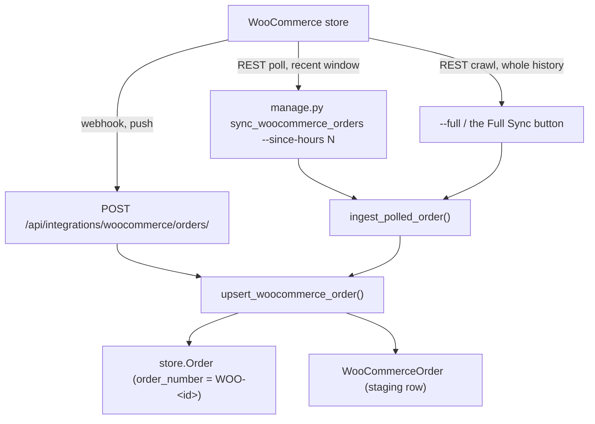

# 27 — Google Sheets & WooCommerce

Two inbound data integrations that have nothing to do with each other, grouped here because
both bring outside records into the system.

---

# Part 1 — WooCommerce

Mounted at `/api/integrations/`. A small app: **one route**, machine-to-machine only.

## The two paths in



The poll path is the **fallback** for when a webhook is missed.

### Recent window vs. whole history — the distinction that matters

The webhook and the default poll only ever deliver orders that were **recently created or
modified**. Neither one ever walks the back catalogue. A dashboard connected to an existing
store therefore starts out nearly empty and *stays* that way: it shows only the handful of
orders touched since it was switched on, which in practice means everything looks like it is
stuck in one status. Orders that were completed or cancelled months ago have no reason to be
"modified", so they are never pulled.

Backfilling is a **separate, deliberate action** — run once per store:

```bash
python manage.py sync_woocommerce_orders --full     # ignores --since-hours entirely
```

or the **Full Sync (All Orders)** button on the admin page. After that, the webhook plus the
recent-window poll keep things current.

## The receiver

**URL** `POST /api/integrations/woocommerce/orders/`
**View** `WooCommerceOrderReceiveView` — `integrations/views.py:18-92`
**Auth** `authentication_classes = []`, `permission_classes = []` (`:20-21`)

### ✅ This one *does* have real HMAC

Unlike the NCM webhook ([11](./11-ncm-webhook.md)), WooCommerce verification is genuine:

```python
# integrations/views.py:23-43
expected = base64(hmac_sha256(WOOCOMMERCE_WEBHOOK_SECRET, request.body))
hmac.compare_digest(expected, request.headers['x-wc-webhook-signature'])
```

A missing secret **or** a missing header → **401** (`:46-47`). There is no "pass if not
configured" branch.

### Validation

`WooCommerceOrderSerializer` (`integrations/serializers.py:4-21`):

| Field | Rule |
|---|---|
| `order_id` | Positive integer |
| `status` | String |
| `currency` | Default `NPR` |
| `total` | Non-negative decimal |
| `billing`, `shipping` | Dicts |
| `line_items` | List |

Invalid → **400** with `serializer.errors` (`:51-56`).

### Responses

| Outcome | Status |
|---|---|
| Order created | **201** |
| Order updated | **200** |
| Bad signature / missing header | **401** |
| Validation failure | **400** |
| Unhandled exception | **500** |

Body: `{'status', 'woo_order_id', 'internal_order_number'}`.

> Note the contrast with NCM, which answers **200** on an unhandled error. WooCommerce
> retries sanely, so a 500 here is safe.

## Status mapping — `WOO_STATUS_MAP` in `integrations/services.py`

| WooCommerce status | Internal `store.Order` status |
|---|---|
| `pending` | `pending` |
| `processing` | **`confirmed`** |
| `on-hold` | `pending` |
| `completed` | **`delivered`** |
| `delivered` * | `delivered` |
| `shipped` * | `shipped` |
| `cancelled` | `cancelled` |
| `refunded` | `cancelled` |
| `failed` | `cancelled` |

\* **Custom statuses**, registered by a plugin/theme rather than by WooCommerce core. They
arrive with the `wc-` prefix already stripped, indistinguishable in shape from the core
seven. Do not assume the core list is exhaustive: `delivered` alone accounts for roughly
2,875 of the live store's 4,954 orders.

Unknown statuses fall back to `pending`. That fallback is silent, so a status introduced by
a future plugin will quietly pile up as "awaiting payment" — when a bucket looks
implausibly large, check `WOO_STATUS_MAP` before believing it. The admin page sidesteps this
by rendering `WooCommerceOrder.status` (the raw Woo value) rather than the mapped one.

> This writes to **`store.Order`**, not `dashboard.Order`. See
> [24 — Storefront](./24-storefront.md) for why there are two.

## Upsert — `upsert_woocommerce_order()` in `integrations/services.py`

Both sides are `update_or_create`, so replays are safe:

- `store.Order` keyed on `order_number = f'WOO-{woo_order_id}'`
- `WooCommerceOrder` keyed on `woo_order_id`

Attributed to the service account **`woocommerce_webhook_system`** (`:55-73`), created with
an unusable password. This mirrors `ncm_webhook_system` in the NCM handler.

## Polling — `ingest_polled_order()` in `integrations/services.py`

Normalises WooCommerce's own REST resource shape (`id`, `billing`, `shipping`,
`line_items`) and marks `sync_source='woocommerce_api_poll'` so you can tell pushed from
pulled records apart.

```bash
python manage.py sync_woocommerce_orders --since-hours 24   # rolling window (cron)
python manage.py sync_woocommerce_orders --full             # entire history (one-off)
```

Uses `services/woocommerce_service.py` with `WOOCOMMERCE_SITE_URL`,
`WOOCOMMERCE_CONSUMER_KEY`, `WOOCOMMERCE_CONSUMER_SECRET`. **Read permission is enough** —
polling only pulls orders, it never writes back.

### Why the full sync is chunked

`fetch_orders_batch(start_page, batch_pages)` fetches a few pages and reports a `next_page`
cursor instead of running to completion. Paging a ~5,000-order store takes **minutes** — far
longer than a request should hold a worker open, and a plain gunicorn timeout would kill it
mid-crawl. So `/orders/woocommerce/sync/` handles one batch per call and the browser drives
the loop:

```
POST mode=full page=1  → {synced: 200, next_page: 5,    total_pages: 100, done: false}
POST mode=full page=5  → {synced: 200, next_page: 9,    ...}
...
POST mode=full page=99 → {synced: 54,  next_page: null,                   done: true}
```

`total_pages` / `total_count` come from WooCommerce's `X-WP-TotalPages` / `X-WP-Total`
response headers, which is what feeds the on-page progress bar. `fetch_orders_page()` returns
`(orders, headers)` for that reason — it is not a bare list.

The CLI path has no such constraint and uses `fetch_all_orders()`, which just runs to the end.

## `WooCommerceOrder` — `integrations/models.py`

A staging row keeping the full raw payload.

| Field | Notes |
|---|---|
| `woo_order_id` | `PositiveBigInteger`, unique, indexed |
| `order` | OneToOne → **`store.Order`**, `SET_NULL` |
| `status`, `currency`, `total` | `status` is the **raw Woo value**, not the mapped one |
| `customer_name`, `customer_email`, `billing_phone` | |
| `billing_data`, `shipping_data`, `line_items_json`, `raw_payload` | JSON |
| `sync_source` | `woocommerce_plugin` (webhook) vs `woocommerce_api_poll` |
| **`woo_date_created`** | When the shopper placed the order **in WooCommerce** |
| `created_at` / `updated_at` | When *we* first pulled / last touched the row |
| `is_synced` | Property |

### `woo_date_created` vs `created_at` — never mix these up

`created_at` is `auto_now_add`: it records the sync, not the sale. After a backfill it is
*the same timestamp for every order in the store*, so any list, sort, or date filter keyed
off it is meaningless — the live store's orders span 2023‑07 to 2026‑08 but would all read as
one afternoon. `woo_date_created` is the real placement time and is what the admin page
displays, sorts, and filters on.

It is parsed by `parse_woo_datetime()` from the payload's **`date_created_gmt`**, not
`date_created`: both are sent without an offset, but the latter is the shop's local wall
clock, and with `USE_TZ` a naive value would be read as Asia/Kathmandu and land the order
~5h45m adrift. When a payload carries no date at all the field is left untouched rather than
nulled, so a sparse webhook cannot erase a date an earlier poll resolved.

Migration `integrations/0002` backfills it from `raw_payload` for rows synced before the
field existed.

## The admin page

`/orders/woocommerce/` (`woocommerce_orders`, `dashboard/templates/woocommerce_orders.html`)
— **admin/superuser only**, enforced by a body check rather than a decorator.

| Control | Notes |
|---|---|
| **Refresh Recent** | One request, last 30 days |
| **Full Sync (All Orders)** | Chunked crawl of the whole history, with a progress bar |
| Status chips + dropdown | Built from the statuses **actually present**, with live counts — not a hardcoded list, which would hide the custom ones |
| Sortable columns | ID, customer, total, status, date (`WOO_SORT_FIELDS`) |
| Search / sync-state / date range / per-page | 25–200 per page |
| **Export CSV** | `/orders/woocommerce/export/`, streamed |
| Detail modal | Line items, payment method, placement + sync time, customer note, deep link into `wp-admin` |

The list and the export share `_apply_woo_order_filters()`, so "export" always means exactly
the rows on screen. Every sort is tie-broken by `woo_order_id`: thousands of these orders
share a date, and an unstable sort silently repeats or drops rows between pages.

## Logging

`logging.getLogger('integrations')` → `logs/integrations.log`.

---

# Part 2 — Google Sheets

Mounted at `/imports/`. Two-way sync between Django models and Google Sheets.

> **Not linked from the sidebar.** Reachable only by URL or from its own pages.

## Two backends, no API key

`google_sheets/services.py` (837 lines) supports two very different mechanisms:

| Backend | Direction | How |
|---|---|---|
| **Published CSV** | Read-only | `_make_published_csv_url()` (`:478`) builds a `published-to-web` CSV link; `fetch_csv_from_url()` (`:504`) pulls it |
| **Apps Script Web App** | **Two-way** | The user deploys a small Apps Script; Django calls it over HTTP |

**Neither needs Google API credentials** — that is the point of the design.
`credentials_exist()` (`:473`) reports whether the richer path is available.

### Apps Script operations

| Function | Line | Does |
|---|---|---|
| `apps_script_read` | `:535` | Read a sheet |
| `apps_script_write_all` | `:569` | Replace headers + rows |
| `apps_script_update_cell` | `:584` | Edit one cell |
| `apps_script_update_dimension` | `:591` | Resize a row or column |
| `apps_script_structure_action` | `:608` | Insert/delete rows and columns |

Helpers `extract_spreadsheet_id()` (`:486`) and `extract_gid()` (`:495`) accept a full sheet
URL or a bare id.

### Sync

| Function | Line | Direction |
|---|---|---|
| `sync_django_to_sheet(connection)` | `:655` | Push |
| `sync_sheet_to_django(connection)` | `:695` | Pull |
| `run_sync(connection, direction='from_sheet', user=None)` | `:789` | Entry point |

`_get_queryset` (`:625`) and `_serialize_obj` (`:635`) apply the connection's configured
field mapping.

## Pages

| Page | URL | View | Template |
|---|---|---|---|
| Imports | `/imports/` | `google_imports_page` | `templates/google_sheets/imports.html` |
| **Sheet view** | `/imports/connections/<id>/sheet/` | `view_connection_sheet` | `templates/google_sheets/sheet_view.html` — a full spreadsheet grid |

> Templates live in the **project-level** `templates/google_sheets/`, not in the app.

### Endpoints

Connections: `add`, `<id>/edit`, `<id>/delete`, `<id>/get`, `<id>/sync`, `<id>/data`,
`<id>/logs`, plus `test-connection/`.
Editing: `update-cell`, `update-dimension`, `update-structure`.

All `@login_required`.

## Models — `google_sheets/models.py`

| Model | Line | Purpose |
|---|---|---|
| `GoogleSheetConnection` | `:6` | Sheet URL/id, target model, field mapping, direction |
| `GoogleSheetSyncLog` | `:94` | Per-run result |

---

## Gotchas

- **WooCommerce writes to `store.Order`, not `dashboard.Order`.**
- **`processing` → `confirmed` and `completed` → `delivered`** — the Woo vocabulary does not
  match ours.
- **Neither the webhook nor the default poll ever backfills.** Both only carry recently
  touched orders. A dashboard that shows a handful of orders all in one status is almost
  certainly un-backfilled, not broken — run `--full` once. This is the single most
  misleading failure mode of this integration, because nothing errors.
- **The store uses custom statuses.** `delivered` and `shipped` are not WooCommerce core.
  Unmapped statuses fall through to `pending` silently.
- **`created_at` is the sync time, not the order date.** Use `woo_date_created` for anything
  a human reads or filters on.
- **Never use `__date` lookups on these datetimes.** `CONVERT_TZ()` returns `NULL` on this
  MySQL server (`mysql.time_zone_name` is empty), so `__date__gte` matches **zero rows with
  no error**. Use `nepali_day_start()` / `nepali_day_end_exclusive()` from
  `dashboard/timezone_utils.py`. See [A4](./A4-appendix-known-quirks.md).
- **The Woo webhook rejects hard on a bad signature**; the NCM webhook does not. Don't
  assume they behave alike.
- **Google Sheets is not in the sidebar.** Bookmark `/imports/`.
- **The published-CSV backend is read-only.** Two-way sync needs the Apps Script deployment.
- Sheet syncs are **manual** — there is no scheduler.
- Sheet templates are in the project-level `templates/` directory, which trips up template
  searches.

---

## Files that own this

- `integrations/views.py` — the WooCommerce receiver and HMAC check
- `integrations/services.py` — status map, upsert, poll ingestion
- `integrations/serializers.py` — payload validation
- `integrations/models.py` — `WooCommerceOrder`
- `integrations/migrations/0002_*` — `woo_date_created` + its backfill
- `integrations/management/commands/sync_woocommerce_orders.py` — `--since-hours` / `--full`
- `services/woocommerce_service.py` — the REST client, incl. `fetch_orders_batch()`
- `dashboard/views.py` — `woocommerce_orders_list`, `_sync`, `_export`,
  `_apply_woo_order_filters`, `WOO_STATUS_LABELS`, `WOO_SORT_FIELDS`
- `dashboard/templates/woocommerce_orders.html` and `partials/woo_sort_header.html`
- `google_sheets/services.py` — both sheet backends
- `google_sheets/models.py`, `views.py`, `urls.py`
- `templates/google_sheets/` — sheet templates
