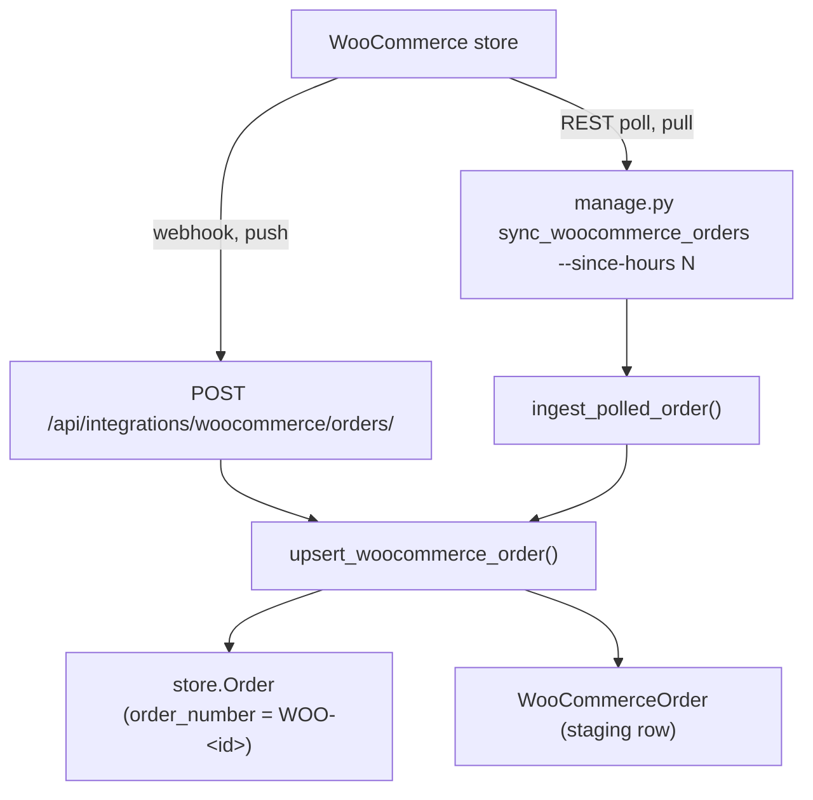

# 27 — Google Sheets & WooCommerce

Two inbound data integrations that have nothing to do with each other, grouped here because
both bring outside records into the system.

---

# Part 1 — WooCommerce

Mounted at `/api/integrations/`. A small app: **one route**, machine-to-machine only.

## The two paths in



The poll path is the **fallback** for when a webhook is missed.

## The receiver

**URL** `POST /api/integrations/woocommerce/orders/`
**View** `WooCommerceOrderReceiveView` — `integrations/views.py:18-92`
**Auth** `authentication_classes = []`, `permission_classes = []` (`:20-21`)

### ✅ This one *does* have real HMAC

Unlike the NCM webhook ([11](./11-ncm-webhook.md)), WooCommerce verification is genuine:

```python
# integrations/views.py:23-43
expected = base64(hmac_sha256(WOOCOMMERCE_WEBHOOK_SECRET, request.body))
hmac.compare_digest(expected, request.headers['x-wc-webhook-signature'])
```

A missing secret **or** a missing header → **401** (`:46-47`). There is no "pass if not
configured" branch.

### Validation

`WooCommerceOrderSerializer` (`integrations/serializers.py:4-21`):

| Field | Rule |
|---|---|
| `order_id` | Positive integer |
| `status` | String |
| `currency` | Default `NPR` |
| `total` | Non-negative decimal |
| `billing`, `shipping` | Dicts |
| `line_items` | List |

Invalid → **400** with `serializer.errors` (`:51-56`).

### Responses

| Outcome | Status |
|---|---|
| Order created | **201** |
| Order updated | **200** |
| Bad signature / missing header | **401** |
| Validation failure | **400** |
| Unhandled exception | **500** |

Body: `{'status', 'woo_order_id', 'internal_order_number'}`.

> Note the contrast with NCM, which answers **200** on an unhandled error. WooCommerce
> retries sanely, so a 500 here is safe.

## Status mapping — `integrations/services.py:13-21`

| WooCommerce status | Internal `store.Order` status |
|---|---|
| `pending` | `pending` |
| `processing` | **`confirmed`** |
| `on-hold` | `pending` |
| `completed` | **`delivered`** |
| `cancelled` | `cancelled` |
| `refunded` | `cancelled` |
| `failed` | `cancelled` |

Unknown statuses fall back to `pending` (`:59`).

> This writes to **`store.Order`**, not `dashboard.Order`. See
> [24 — Storefront](./24-storefront.md) for why there are two.

## Upsert — `integrations/services.py:45-105`

Both sides are `update_or_create`, so replays are safe:

- `store.Order` keyed on `order_number = f'WOO-{woo_order_id}'`
- `WooCommerceOrder` keyed on `woo_order_id`

Attributed to the service account **`woocommerce_webhook_system`** (`:24-42`), created with
an unusable password. This mirrors `ncm_webhook_system` in the NCM handler.

## Polling — `integrations/services.py:108-129`

`ingest_polled_order(raw)` normalises WooCommerce's own REST resource shape (`id`,
`billing`, `shipping`, `line_items`) and marks `sync_source='woocommerce_api_poll'` so you
can tell pushed from pulled records apart.

```bash
python manage.py sync_woocommerce_orders --since-hours 24
```

Uses `services/woocommerce_service.py` with `WOOCOMMERCE_SITE_URL`,
`WOOCOMMERCE_CONSUMER_KEY`, `WOOCOMMERCE_CONSUMER_SECRET`. **Read permission is enough** —
polling only pulls orders, it never writes back.

## `WooCommerceOrder` — `integrations/models.py:4-43`

A staging row keeping the full raw payload.

| Field | Notes |
|---|---|
| `woo_order_id` | `PositiveBigInteger`, unique, indexed |
| `order` | OneToOne → **`store.Order`**, `SET_NULL` |
| `status`, `currency`, `total` | |
| `customer_name`, `customer_email`, `billing_phone` | |
| `billing_data`, `shipping_data`, `line_items_json`, `raw_payload` | JSON |
| `sync_source` | `webhook` vs `woocommerce_api_poll` |
| `is_synced` | Property |

## The admin page

`/orders/woocommerce/` (`woocommerce_orders`, `dashboard/templates/woocommerce_orders.html`)
lists staged Woo orders; `/orders/woocommerce/sync/` (`views.py:24976`) triggers a sync.

## Logging

`logging.getLogger('integrations')` → `logs/integrations.log`.

---

# Part 2 — Google Sheets

Mounted at `/imports/`. Two-way sync between Django models and Google Sheets.

> **Not linked from the sidebar.** Reachable only by URL or from its own pages.

## Two backends, no API key

`google_sheets/services.py` (837 lines) supports two very different mechanisms:

| Backend | Direction | How |
|---|---|---|
| **Published CSV** | Read-only | `_make_published_csv_url()` (`:478`) builds a `published-to-web` CSV link; `fetch_csv_from_url()` (`:504`) pulls it |
| **Apps Script Web App** | **Two-way** | The user deploys a small Apps Script; Django calls it over HTTP |

**Neither needs Google API credentials** — that is the point of the design.
`credentials_exist()` (`:473`) reports whether the richer path is available.

### Apps Script operations

| Function | Line | Does |
|---|---|---|
| `apps_script_read` | `:535` | Read a sheet |
| `apps_script_write_all` | `:569` | Replace headers + rows |
| `apps_script_update_cell` | `:584` | Edit one cell |
| `apps_script_update_dimension` | `:591` | Resize a row or column |
| `apps_script_structure_action` | `:608` | Insert/delete rows and columns |

Helpers `extract_spreadsheet_id()` (`:486`) and `extract_gid()` (`:495`) accept a full sheet
URL or a bare id.

### Sync

| Function | Line | Direction |
|---|---|---|
| `sync_django_to_sheet(connection)` | `:655` | Push |
| `sync_sheet_to_django(connection)` | `:695` | Pull |
| `run_sync(connection, direction='from_sheet', user=None)` | `:789` | Entry point |

`_get_queryset` (`:625`) and `_serialize_obj` (`:635`) apply the connection's configured
field mapping.

## Pages

| Page | URL | View | Template |
|---|---|---|---|
| Imports | `/imports/` | `google_imports_page` | `templates/google_sheets/imports.html` |
| **Sheet view** | `/imports/connections/<id>/sheet/` | `view_connection_sheet` | `templates/google_sheets/sheet_view.html` — a full spreadsheet grid |

> Templates live in the **project-level** `templates/google_sheets/`, not in the app.

### Endpoints

Connections: `add`, `<id>/edit`, `<id>/delete`, `<id>/get`, `<id>/sync`, `<id>/data`,
`<id>/logs`, plus `test-connection/`.
Editing: `update-cell`, `update-dimension`, `update-structure`.

All `@login_required`.

## Models — `google_sheets/models.py`

| Model | Line | Purpose |
|---|---|---|
| `GoogleSheetConnection` | `:6` | Sheet URL/id, target model, field mapping, direction |
| `GoogleSheetSyncLog` | `:94` | Per-run result |

---

## Gotchas

- **WooCommerce writes to `store.Order`, not `dashboard.Order`.**
- **`processing` → `confirmed` and `completed` → `delivered`** — the Woo vocabulary does not
  match ours.
- **The Woo webhook rejects hard on a bad signature**; the NCM webhook does not. Don't
  assume they behave alike.
- **Google Sheets is not in the sidebar.** Bookmark `/imports/`.
- **The published-CSV backend is read-only.** Two-way sync needs the Apps Script deployment.
- Sheet syncs are **manual** — there is no scheduler.
- Sheet templates are in the project-level `templates/` directory, which trips up template
  searches.

---

## Files that own this

- `integrations/views.py` — the WooCommerce receiver and HMAC check
- `integrations/services.py` — status map, upsert, poll ingestion
- `integrations/serializers.py` — payload validation
- `integrations/models.py` — `WooCommerceOrder`
- `integrations/management/commands/sync_woocommerce_orders.py`
- `services/woocommerce_service.py` — the REST client
- `google_sheets/services.py` — both sheet backends
- `google_sheets/models.py`, `views.py`, `urls.py`
- `templates/google_sheets/` — sheet templates
