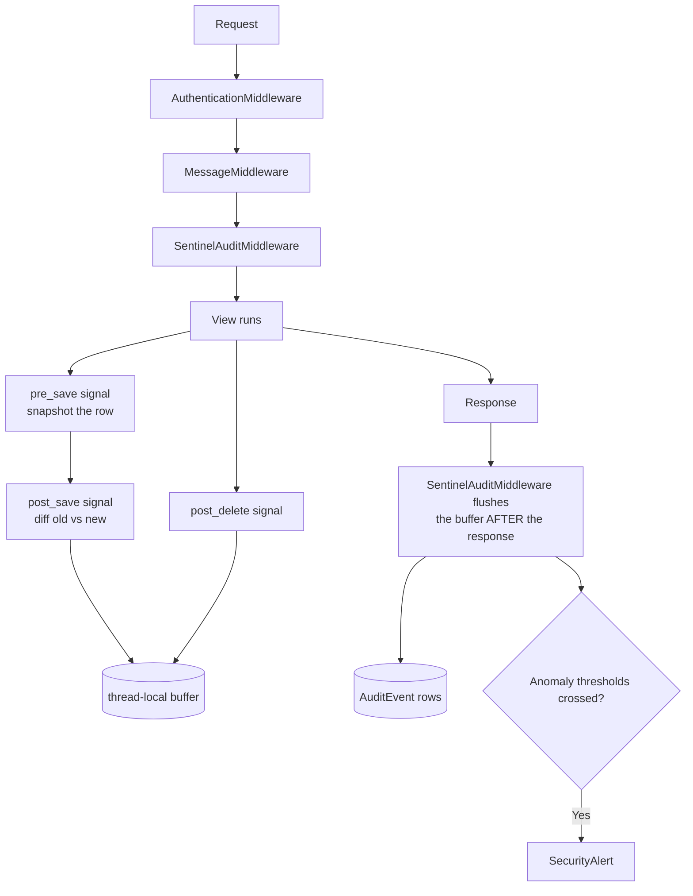

# 29 — Sentinel Vault (Audit Trail)

Who did what, from which device, and what changed. Mounted at `/sentinel/`.

> Not mentioned in `CLAUDE.md`'s app map — see [A4](./A4-appendix-known-quirks.md).

---

## How capture works



Two design details matter:

**1. Diffs are buffered and flushed after the response.** Model diffs go into a thread-local
(`sentinel/signals.py`) and are written by the middleware once the response is done. A
request that **rolls back** therefore leaves no phantom audit rows.

**2. Middleware ordering is load-bearing.** `SentinelAuditMiddleware` must sit **after**
`AuthenticationMiddleware` (it needs `request.user`) **and after** `MessageMiddleware` — it
reads the `permission_denied` message tag that `accounts/decorators.py` emits, which is how
access denials get recorded. The ordering is spelled out in a comment at
`myproject/settings.py:89-91`.

Signals wired in `SentinelConfig.ready()`: `user_logged_in`, `user_logged_out`,
`user_login_failed`, plus `pre_save` / `post_save` / `post_delete`.

---

## Pages

`sentinel/urls.py`. Guarded by `@vault_access(...)` (`sentinel/access.py:32`).

| Page | URL | Template | Required flag |
|---|---|---|---|
| **Command centre** | `/sentinel/` | `sentinel/command_center.html` | `can_view_audit_trail` |
| Activity stream | `/sentinel/stream/` | `sentinel/activity_stream.html` | `can_view_audit_trail` |
| Session monitor | `/sentinel/sessions/` | `sentinel/session_monitor.html` | `can_view_audit_trail` |
| Session detail | `/sentinel/sessions/<id>/` | `sentinel/session_detail.html` | `can_view_audit_trail` |
| Alert console | `/sentinel/alerts/` | `sentinel/alert_console.html` | `can_view_audit_trail` |
| People index | `/sentinel/people/` | `sentinel/people_index.html` | `can_view_audit_trail` |
| **User dossier** | `/sentinel/people/<user_id>/` | `sentinel/user_dossier.html` | `can_view_audit_trail` |
| Vault settings | `/sentinel/settings/` | `sentinel/vault_settings.html` | `can_configure_audit` |

### Actions

| Action | URL | Flag |
|---|---|---|
| Export the stream | `/sentinel/stream/export/` | `can_export_audit_logs` |
| Purge events | `/sentinel/stream/purge/` | `can_configure_audit` |
| Revoke one session | `/sentinel/sessions/<id>/revoke/` | `can_manage_sessions` |
| Revoke all a user's sessions | `/sentinel/users/<id>/revoke-all/` | `can_manage_sessions` |
| Device action | `/sentinel/devices/<id>/action/` | `can_manage_sessions` |
| Purge sessions | `/sentinel/sessions/purge/` | `can_configure_audit` |
| Alert action / bulk | `/sentinel/alerts/<id>/action/`, `/sentinel/alerts/bulk/` | `can_manage_sessions` |
| Storage settings | `/sentinel/settings/storage/` | `can_configure_audit` |

### Polling APIs

`/sentinel/api/event/<id>/`, `/sentinel/api/pulse/`, `/sentinel/api/sessions/` — all
`can_view_audit_trail`, and all **excluded from capture** so the audit trail doesn't record
itself.

### Scoping

`scope_to_visible()` (`sentinel/access.py`) narrows querysets for users **without**
`can_view_all_users_activity`, so a user can review their own trail without seeing everyone
else's.

---

## Models — `sentinel/models.py` (468 lines)

### Enums

**`EventType`** (`:28-45`) — 17 values:

| Auth | Data | Access | System |
|---|---|---|---|
| `login`, `login_failed`, `logout`, `session_killed` | `create`, `update`, `delete`, `view`, `export`, `import` | `denied`, `password`, `permission` | `job`, `integration`, `error`, `system` |

**`Severity`** (`:48`): `info`, `notice`, `warning`, `critical`
**`DeviceKind`** (`:55`): `desktop`, `mobile`, `tablet`, `bot`, `api`

### `VaultSettings` — `:91` (singleton runtime control panel)

Editable from the UI — no redeploy needed to dial capture up or down.

| Setting | Default | Purpose |
|---|---|---|
| `capture_page_views` | `True` | Record read-only GETs. **Turn off to log writes only** |
| `capture_field_diffs` | `True` | Record before/after values on tracked model changes |
| `capture_anonymous` | `False` | Record signed-out visitors (storefront traffic) |
| `retention_days` | 180 | Events older than this are pruned |
| `page_view_retention_days` | 30 | Low-value page views expire sooner |
| `failed_login_threshold` | 5 | Failed sign-ins from one IP within the window before an alert |
| `failed_login_window_minutes` | 15 | |
| `bulk_delete_threshold` | 10 | Deletions by one user within an hour before an alert |
| `denial_threshold` | 8 | Permission denials by one user within an hour before an alert |

Quiet-hours fields use real `time` objects, not strings.

### The rest

| Model | Line | Purpose |
|---|---|---|
| `KnownDevice` | `:171` | A recognised browser/device fingerprint |
| `DeviceSession` | `:203` | A live session, revocable from the UI |
| `AuditEventQuerySet` | `:292` | Query helpers |
| **`AuditEvent`** | `:303` | The trail itself |
| `SecurityAlert` | `:395` | Raised when a threshold is crossed |

Device recognition is helped by a client-side probe partial,
`templates/partials/sentinel_device_probe.html`.

---

## Retention

```bash
python manage.py sentinel_prune
```

Deletes events past `retention_days` (and page views past `page_view_retention_days`).

> **There is no scheduler.** Like everything else in this project, this must be run
> manually or from an external cron. See
> [02](./02-architecture-and-conventions.md#background-work--the-honest-picture).

---

## Logging

`logging.getLogger('sentinel')` → `logs/sentinel.log`, UTF-8, level INFO.

This file records **Sentinel's own failures only** — the audit trail lives in the database.
The rationale is in the settings comment (`myproject/settings.py:390-392`): *a vault that
quietly stopped capturing is worse than none*, so capture failures must never be silent.

---

## Permissions

| Flag | Grants |
|---|---|
| `can_view_audit_trail` | Access to the vault at all |
| `can_view_all_users_activity` | See everyone's activity, not just your own |
| `can_export_audit_logs` | CSV/XLSX export |
| `can_manage_sessions` | Revoke sessions, action alerts |
| `can_configure_audit` | Vault settings, purge |

---

## Gotchas

- **Middleware position is load-bearing.** Moving `SentinelAuditMiddleware` before
  `MessageMiddleware` silently stops access denials being recorded.
- **Diffs flush after the response**, so a rolled-back transaction leaves no rows — correct,
  but it means you can't rely on the trail inside the same request.
- **Page-view capture is on by default** and is the bulk of the volume. Turning it off is
  the first lever if the table grows too fast.
- **Retention only happens when you run the command.**
- Sentinel's own API endpoints are excluded from capture, so polling doesn't flood the trail.
- Sessions are database-backed (`SESSION_ENGINE`), which is what makes revocation possible.

---

## Files that own this

- `sentinel/models.py` — enums, settings, events, alerts, devices
- `sentinel/middleware.py` — capture and flush
- `sentinel/signals.py` — login/logout/save/delete hooks
- `sentinel/access.py` — `vault_access`, `scope_to_visible`
- `sentinel/services.py` — event writing and anomaly detection
- `sentinel/views.py`, `urls.py` — the console
- `sentinel/management/commands/sentinel_prune.py` — retention
- `myproject/settings.py:89-92` — middleware ordering and its rationale
