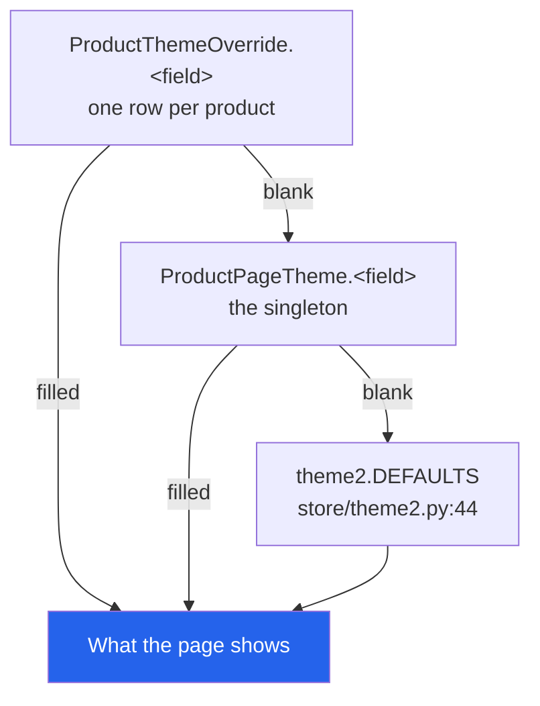
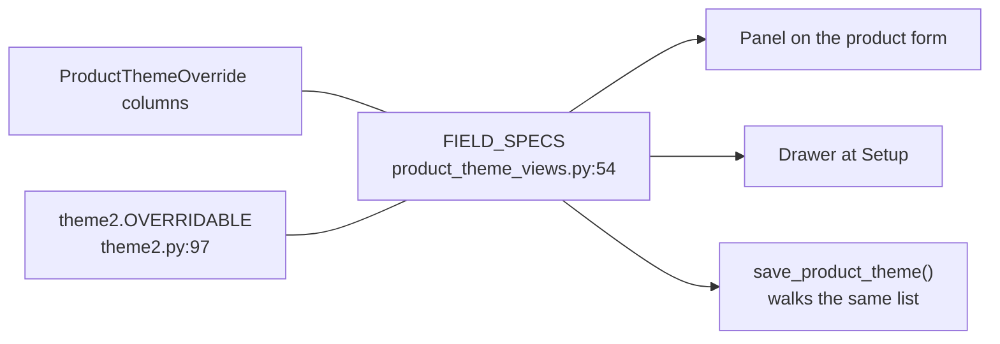

# 31 — Product page themes & the landing-page editor

The storefront ships **two product-page designs**, and every block on the second one is
content a shop owner writes — clips, photo galleries, before/after pairs, how-to steps,
ingredients, a features list. This chapter is where that content lives, who may edit it,
and the rules that keep the two editing screens from disagreeing.

Storefront behaviour is [24](./24-storefront.md); products themselves are
[18](./18-products-and-catalog.md); the rest of `/setup/` is [22](./22-settings-and-setup.md).

---

## The two designs

| | Theme 1 (classic) | Theme 2 (conversion) |
|---|---|---|
| Template | `store/product_detail.html` | `store/product_detail_conversion.html` |
| Shell | `store/base.html` — navbar, search, cart drawer | `store/base_pdp.html` — centred logo, dark footer, nothing else |
| Assets | `store.css` / `product.css` / `product.js` | `store/css/pdp-theme2.css`, `store/js/pdp-theme2.js` |
| Shape | media + sticky buy column, accordions below | three sticky columns: media & content, buy box, info rail |
| Reviews | **none** — see below | stars, histogram, helpful votes |

**Selecting Theme 1 changes nothing about how Theme 1 renders.** The switch is four lines at
the end of `store/views.py::product_detail` (`store/views.py:518-521`); everything above it
builds the context both designs share.

### What Theme 1 dropped (Sep 2026)

The classic page was trimmed at the shop's request, and all four changes are template-level
— the router and the shared context above it were not touched:

| Gone | Was |
|---|---|
| The vendor eyebrow above the title | `.pdp-vendor`, the category name in small caps — it read "CUSTOM" |
| The star line under the title, and the whole reviews section | `.pdp-rating` + `<section id="reviews">`, incl. the write-a-review form |
| The email box on the order form | `partials/order_form.html`; the mobile number took its full width |
| The availability line below the price | It is now a pill at the right of `.pdp-price-row` |

`product_detail` **still** computes `reviews`, `avg_rating` and `rating_dist` — Theme 2 draws
them, so dropping them from the context would break the other design. The dead review CSS
(`.pdp-review*`, `.pdp-star-input`, `.pdp-bar-*`, `.pdp-field`) came out of `product.css`
with it; `.pdp-section` / `.pdp-section-title` stayed, because "You may also like" uses them.

**Theme 1's buttons are also data now.** Every word on them prints `store_labels.*`, from
**Setup → Store Button Labels** ([22](./22-settings-and-setup.md#store-button-labels)) —
Theme 2 keeps its own `buy_label` field instead, resolved the usual way.

> If a change makes the two pages disagree about price, stock, or what is in the cart, the
> change is in the wrong place — it belongs **above** the router.

---

## Where a page's content comes from

Three layers, and the first non-blank one wins. **Blank means inherit** — that is the whole
precedence rule.



**It is applied in exactly one place: `store/theme2.py`.** `field()` (`:185`) walks the
three layers; `layout_for()` / `is_theme2()` (`:164`, `:179`) do the same for the design
choice. Nothing else may re-implement it.

`settings_snapshot()` (`:120`) reads one cached dictionary — `CACHE_KEY =
'store:page_theme:v1'`, **60-second TTL** (`:38-39`). Every write calls
`theme2.invalidate_cache()` (`:115`), but the cache is **LocMemCache and per process**, so
another worker keeps its snapshot until the TTL expires. See
[30](./30-ops-and-troubleshooting.md).

### The three models — `store/models.py`

| Model | Line | Holds |
|---|---|---|
| `ProductPageTheme` | `:782` | **One row** (`get_solo()`). The global design choice plus every default string the second design renders |
| `ProductThemeOverride` | `:893` | One row per product, `product` is the FK. Every field blank = inherit. The row is **deleted**, not kept empty, when the last box is cleared |
| `ThemeMedia` | `:986` | Uploaded photos and clips. Deliberately **not** `dashboard.MediaAsset`, which is an `ImageField` and would reject an MP4 |

`LAYOUT_CHOICES` is `theme1` / `theme2` (`:773`); `PRODUCT_LAYOUT_CHOICES` prepends
`('', 'Use the global setting')` (`:779`) — that empty string is how a product says
"inherit".

---

## Two places to edit it

Both draw from the same list and save through the same rules. The product form is where the
work actually happens; the setup screen is for store-wide defaults and for finding a product
you cannot remember the name of.

### The panel on the product form ← **the primary surface**

**URL** `/products/add/` and `/products/<id>/edit/` · **names** `product_add`, `product_edit`
**View** `dashboard/views.py:1420`, `dashboard/views.py:1629`
**Template** `dashboard/templates/product_form.html:500` includes
`dashboard/partials/product_theme_panel.html`
**Permission** `@permission_required('can_create_products')` / `('can_edit_products')`

The landing page is written **inside the product's own add/edit form** — same request, same
submit button — so a shop owner writes the page while they are writing the product.

Three rules hold it together, and all three are load-bearing:

| Rule | Why |
|---|---|
| **`pt_present` is the switch.** `save_product_theme()` (`dashboard/product_theme_views.py:154`) does nothing unless the post carried it | Every other dashboard path that posts a product form omits the panel's boxes. Without this, any of them would blank a live landing page **by omission** — a loss the shop would discover from a customer |
| **The inputs are `pt_`-prefixed** (`PRODUCT_FORM_PREFIX`, `:146`) | They ride in the same request as `ProductForm`, where a box called `videos` or `features` would be anyone's guess |
| **A rejected product form re-reads its own post.** `product_theme_form_context(product, request.POST)` on every error branch (`dashboard/views.py:1503, 1583, 1723`) | A page written across a dozen boxes and thrown away because the *price* field was empty is not forgiven |

**Gotcha — who can actually open the edit form.** `product_edit` turns away anyone without
`can_edit_prices` unless their role is `administrator` (`dashboard/views.py:1633`), *after*
the `can_edit_products` decorator has already let them in. A superuser whose role is `sales`
is redirected. This is a property of the product form, not of the panel.

### The drawer at Setup → Product Page Theme

**URL** `/setup/product-theme/` · **name** `product_theme_setup`
**View** `dashboard/product_theme_views.py:276` · **Template** `dashboard/product_theme_setup.html`
**Permission** `@login_required` + `@admin_only` — every page route in this file

Holds the **global** settings form, a searchable product table (filterable to *with their own
settings* / *forced to Theme 2* / *forced to Theme 1*), and a per-product drawer that loads
over fetch.

| Action | Route | Permission |
|---|---|---|
| Save global settings | `save/` | `@admin_only` |
| One product's values, as JSON | `<product_id>/` | `@admin_only` |
| Save one product | `<product_id>/save/` | `@admin_only` |
| Reset one product | `<product_id>/reset/` | `@admin_only` |
| List uploaded media | `media/` | **`can_edit_products` OR `can_create_products`** |
| Upload | `media/upload/` | same |
| Delete an upload | `media/<media_id>/delete/` | same |

---

## `FIELD_SPECS` — one list, three things that must agree

`FIELD_SPECS` (`dashboard/product_theme_views.py:54`) is the single ordered list of
everything one product may set for itself, each entry carrying the `widget` that draws it
(`text`, `textarea`, `image`, `repeater`) and the `group` it sits in.



Those three sets — **the model's columns, `FIELD_SPECS`, and `theme2.OVERRIDABLE`** — must
be identical. Any one growing alone gives you a field that draws on screen, saves to the
database, and does nothing on the storefront. `test_product_page_theme.py` asserts the
equality, so drift fails a check rather than shipping.

Groups, in the order the panel draws them (`FIELD_GROUPS`, `:135`): *Videos and photos ·
Proof · How to use, ingredients and features · Section headings · Info rail · Checkout*.

---

## The row formats

Six fields are lists of rows, each stored as one `a | b | c` line. `theme2.cells(line, n)`
(`store/theme2.py:211`) **pads short rows and truncates long ones**, so a missing trailing
cell is normal input and a stray extra pipe cannot corrupt a row.

| Field | Row format | Builder | Renders |
|---|---|---|---|
| `videos` | `video \| poster \| creator \| title \| description` | `:295` | The "See it in action" strip; `creator` draws the badge, title/description caption the clip |
| `info_media` | `image \| heading \| description` | `:321` | The description gallery, above the written copy in Product information |
| `features` | `title \| description` | `:338` | The ticked features / manual list |
| `before_after` | `before \| after \| caption` | `:371` | **Both halves required** — a before with no after is a photo of a problem |
| `steps` | `title \| instruction \| image` | `:453` | How to use; numbers come from row order |
| `ingredients` | `name \| image \| note` | `:473` | The picture-and-label grid |

**Trailing cells are how a row format grows.** The clip row's `title` and `description` were
added *after* the format shipped, and because `cells()` pads, every three-cell row written
before them still parses to exactly the card it always drew. **Add to the end of a row,
never to the middle.** A test asserts this specifically.

Every list is optional and renders **nothing at all** when empty — a store that fills none of
them gets a clean product page, not a column of empty cards.

---

## The editor: a repeater drawn over a hidden textarea

The `a | b | c` format is worth keeping — it survives a copy-paste, a per-product override
and a database dump. What is not worth keeping is making a shop owner *type* it.

So **the textarea stays the single source of truth**, hidden, with a row editor drawn on top
of it (`buildRepeater`, in `product_theme_editor_js.html`). Every edit rewrites the textarea,
which is what the plain form post carries — no extra endpoint, no second save path, and
**"Edit as text"** is one click away.

- A cell's **pipes and newlines are stripped on write**, because either would split the row
  somewhere the author did not intend.
- **Raw text and the rows are two views of one value, never both at once.** "Edit as text"
  hides the rows and the Add button (`.ptr.is-raw`): leaving them live means the next
  keystroke in any cell — or Add — rewrites the textarea from the rows and the typing is
  gone without a word.
- `window.ptRefresh(scope)` is how the drawer tells the editor it refilled its inputs; the
  repeater re-reads on a `pt:reload` event rather than polling.

### Uploads

**Photos and clips are uploaded, not pasted** — but what the theme's text fields store is the
file's **URL**, never the row id, so a pasted CDN link is equally valid input and nothing is
locked to `ThemeMedia`.

| | Images | Videos |
|---|---|---|
| Extensions | `.jpg .jpeg .png .webp .gif .avif` | `.mp4 .webm .mov .m4v` |
| Ceiling | 8 MB | 64 MB |

Refusal is **by extension** (`ThemeMedia.kind_for`, `store/models.py:1027`), never by the
browser's content type, which is trivially forged.

**The media endpoints refuse in JSON, not with a redirect** (`_media_denied`,
`dashboard/product_theme_views.py:425`). They are called by fetch from both screens;
`admin_or_permission_required` would answer a refusal with a redirect plus a queued Django
message — HTML the caller cannot parse, and a stray error toast on whatever page loads next.
They answer to `can_edit_products` / `can_create_products` rather than `admin_only`, because
the panel on the product form is one of the two places they run from.

---

## The editing chrome ships as template partials, not static files

`dashboard/templates/dashboard/partials/product_theme_editor_css.html` and
`…_editor_js.html` are `<style>` and `<script>` blocks in templates, included by both
screens. **This is not a style preference.**

The project runs with `DEBUG=False`, where WhiteNoise indexes the static tree once at
start-up: a **new** static path 404s until the process restarts, and an **edited** one keeps
serving its previous bytes. A screen whose entire editing surface is JavaScript cannot
survive that — it renders as a column of bare textareas with nothing to say why, and the same
page looks fine to whoever restarted last. A partial is read with the page.

Two related rules:

- **`window.PT_SETUP` must be defined before the JS partial is included**, and assigned to
  `window` explicitly. A top-level `const` is a lexical binding the script cannot see, so it
  would read `undefined` and fetch `undefined` as a URL.
- The script calls `enhance()` **immediately** when `document.readyState` is no longer
  `loading`. A `DOMContentLoaded` listener registered after the event has fired never runs at
  all — which looks exactly like a broken build.

> `.html`-only edits still need a dev-server restart under `DEBUG=False` (cached template
> loader). Autoreload only watches `.py` files.

---

## Folding

The panel folds with **its own few lines of JavaScript**, not Bootstrap's collapse — a fold
that stops working because a CDN script did not load is worse than no fold at all.

- The panel **arrives folded**; the product form is long enough already. Clicking the orange
  header opens it, with every section inside open.
- Clicking a section heading folds that section. Each heading carries a caret, an optional
  orange dot (this product has already said something here) and a **Hide / Show** word.
- **`is-folded` is added only by the script, never rendered into the markup.** If the script
  does not run, the panel is open and usable rather than a bar nothing can unfold.
- **Only a body is ever hidden** — `.pt-panel-body.is-folded`, `.pt-sect-body.is-folded`. The
  header and the headings carry `is-folded` too, because that is what turns their caret, so
  an unscoped rule hides the very bar that was clicked.
- Folding only hides. **A folded section still posts every one of its fields.**

---

## Money

Theme 2's one-step checkout has a single pricing authority: **`store/theme2_checkout.py::quote()`**.
It is called once to render the modal and again inside the place-order handler, and *nothing*
about price is ever read from the request — a forged total changes nothing. It refuses a
variation belonging to another product, refuses a Theme 1 product outright, and returns the
quantity **clamped**, so callers must use the returned figure rather than the one they asked
for.

`ship_fee` is parsed by **matching the first number**, never by stripping non-digits:
stripping turns `Rs. 100` into `.100`, which is ten paisa. Commas are dropped first so
`Rs. 1,000` is not cut to `1` (`theme2.parse_fee`, `:251`).

**A blank `ship_fee` is the recommended setting** — delivery then comes from
`store/services.quote_delivery()`, which knows the district and the courier branch
([22](./22-settings-and-setup.md)). A flat fee reaches the written order through
`price_order(..., delivery_override=)`; without that the modal would show one figure and the
order would be written at another.

---

## Gotchas

- **If several unrelated store suites fail at once, check
  `ProductPageTheme.get_solo().layout` before reading any further.** Switching the global
  design switches every product page, so the Theme 1 verification scripts fail wholesale
  while it is set to Theme 2. This looks like eighteen broken features and is one setting.
- **The bundle-ladder skip condition is not `has_variations`.** Theme 2 draws its own option
  cards and its own ladder from `bulk_tiers_json`; skipping the ladder for variable products
  would silently delete every variable product's quantity break.
- **The bundle rungs quote line totals, not unit prices**, and a **Buy 1** rung is prepended
  so the block is a chooser rather than a column of upsells. The rung marked selected is the
  deepest one the current quantity has *reached*, never the one whose number matches exactly
  — otherwise `?qty=5` against rungs at 1 and 3 opens with nothing selected.
  `theme2.ladder()` (`:387`) and `ladderRows()` in `pdp-theme2.js` build the same shape;
  change one and change the other.
- **`.lx-p2-buybtn` is the button; `.lx-p2-buy` is the sticky grid column.** Sharing the
  class makes the button sticky.
- **The sticky bar and the checkout modal live outside `.lx-p2-grid`** — one is fixed and the
  other covers the viewport, and nesting either inside a `position: sticky` column traps it
  in that column's stacking context.
- **`.lx-p2-tier` restates `flex-direction: row`** along with `align-items`,
  `justify-content` and `text-align`. A tier card that inherits `column` from a compact chip
  looks like a specificity problem and is a missing-property one.
- **The hover magnifier sets `background-size` in pixels**, computed from the image's own
  rendered box. A percentage is a share of the *panel*, so it only magnifies honestly when
  the panel's aspect ratio matches the photo's.
- **`ReviewVote` deduplicates on `voter_key`**, not on a pair of partial unique constraints:
  production is MySQL, which silently declines to create conditional constraints, leaving
  "one vote per visitor" a promise nothing keeps.
- **Theme 1's availability pill carries no second class.** `product.js` rewrites that
  element wholesale (`stockLine.className = 'pdp-stock in'`) when an option is picked, so its
  right-hand placement in `.pdp-price-row` comes from `margin-left: auto` on `.pdp-stock`.
  A class added in the template survives exactly until the first click.
- **Load-bearing markup contracts** (renaming these breaks the script silently): every
  `data-p2-*` attribute in `product_detail_conversion.html`, and the `data-p2-bulk-map` JSON,
  whose keys are `'0'` for a plain product and the variation id otherwise — the same shape
  `product.js` consumes for Theme 1.

### Fixed, but worth recognising if you see the symptom

| Symptom | It was |
|---|---|
| Clicking the panel header made the whole panel *disappear*, with nothing left to click | `.is-folded { display: none }` was unscoped, and the script puts that class on the header too (it turns the caret). Now scoped to the two body selectors |
| A bare red "!" bubble with no message, on every variable product's page | `.pdp-variant-alert { display: flex }` outranked the browser's `[hidden] { display: none }`, so the empty warning never hid. `product.css` now carries a scoped `[hidden]` guard with `!important` — [A4 §17](./A4-appendix-known-quirks.md) |
| The editing surface rendered as bare textareas, unstyled, on one machine and fine on another | `DEBUG=False` + WhiteNoise serving a start-up snapshot. Fixed by shipping the CSS and JS as template partials |
| Typing in "Edit as text", then touching a row or Add, silently discarded the typing | Both views were live at once. `.ptr.is-raw` now hides the rows and the Add button |
| On the setup screen, Escape closed the media picker **and** the drawer beneath it | One keydown handler with no guard. The drawer now ignores Escape while `.ptm.is-open` exists |

---

## Verification

```bash
python test_product_page_theme.py          # 137 checks
python test_store_button_labels.py         # 75 checks — Theme 1's wording and removals
```

Covers: fee parsing, the precedence rules, `quote()`'s refusals and clamping, the ladder's
shape and which rung it selects, the before/after pairing rule, the upload endpoint's
extension and size refusals and exactly who it lets through, the router, and an end-to-end
order whose total, delivery line, tier price, stock movement and untouched cart are all
asserted.

Plus, for the editor specifically: the panel drawing, saving, clearing and — **the one that
matters** — surviving a post that never carried it; that a three-cell clip row still parses
after the format grew two cells; that the model's columns, `FIELD_SPECS` and
`theme2.OVERRIDABLE` are the same set; and that the fold rule is scoped so the control cannot
hide itself.

> The suite writes to the real database and cleans up after itself, following this repo's
> standalone-script convention ([02](./02-architecture-and-conventions.md)). It needs a user
> whose role is `administrator` and at least one `Category` to post the product form with.

---

## Files that own this

- `store/theme2.py` — **resolution, and the only place precedence is applied**; every list builder
- `store/theme2_checkout.py` — `quote()`, the single pricing authority for the Theme 2 checkout
- `store/models.py:770-1052` — `LAYOUT_CHOICES`, `ProductPageTheme`, `ProductThemeOverride`, `ThemeMedia`
- `store/views.py:518-521` — the router at the end of `product_detail`
- `store/templates/store/product_detail_conversion.html` — the Theme 2 page
- `store/templates/store/base_pdp.html` — its shell
- `store/static/store/css/pdp-theme2.css`, `store/static/store/js/pdp-theme2.js`
- `dashboard/product_theme_views.py` — `FIELD_SPECS`, `save_product_theme()`, the setup screen, the media endpoints
- `dashboard/templates/dashboard/product_theme_setup.html` — Setup → Product Page Theme
- `dashboard/templates/dashboard/partials/product_theme_panel.html` — the panel on the product form, and its fold
- `dashboard/templates/dashboard/partials/product_theme_editor_css.html` / `…_editor_js.html` — the shared chrome, as partials by necessity
- `dashboard/templates/product_form.html:500` — where the panel is included (inside the `<form>`)
- `dashboard/views.py:1416-1417, 1537, 1783` — the import and the two `save_product_theme()` calls
- `dashboard/urls.py:273-280` — the eight routes
- `store/templates/store/product_detail.html` — the Theme 1 page (no reviews, labelled buttons)
- `store/labels.py`, `dashboard/store_label_views.py` — Theme 1's button wording
  ([22](./22-settings-and-setup.md#store-button-labels))
- `test_product_page_theme.py`, `test_store_button_labels.py` — the verification suites
